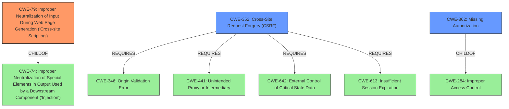

# Raw Analyzer Response for CVE-2021-24792

# Summary
| CWE ID | CWE Name | Confidence | CWE Abstraction Level | CWE Vulnerability Mapping Label | CWE-Vulnerability Mapping Notes |
|---|---|---|---|---|---|
| CWE-79 | Improper Neutralization of Input During Web Page Generation ('Cross-site Scripting') | 1.0 | Base | Allowed | Primary CWE |
| CWE-352 | Cross-Site Request Forgery (CSRF) | 0.9 | Compound | Allowed | Secondary Candidate |
| CWE-862 | Missing Authorization | 0.8 | Class | Allowed-with-Review | Secondary Candidate |

## Evidence and Confidence

*   **Confidence Score:** 0.9
*   **Evidence Strength:** HIGH

## Relationship Analysis
The primary weakness is CWE-79 [Improper Neutralization of Input During Web Page Generation ('Cross-site Scripting')], which is a base-level CWE. CWE-352 [Cross-Site Request Forgery (CSRF)] and CWE-862 [Missing Authorization] are related as contributing factors. CWE-79 is a child of CWE-74 [Improper Neutralization of Special Elements in Output Used by a Downstream Component ('Injection')]. CWE-862 is a child of CWE-284 [Improper Access Control]. CWE-352 requires other CWEs to be present, such as CWE-346 [Origin Validation Error], CWE-441 [Unintended Proxy or Intermediary], CWE-642 [External Control of Critical State Data], and CWE-613 [Insufficient Session Expiration]. The relationship analysis supports identifying both the root cause and contributing factors.

## Vulnerability Chain
The vulnerability chain starts with the **lack of authorization and CSRF protection**, allowing unauthenticated users to save malicious templates. This leads to **improper sanitization and escaping** of user inputs, resulting in stored Cross-Site Scripting (XSS) when the template is displayed in the admin dashboard.

## Summary of Analysis
The initial analysis identified the core problem as Stored Cross-Site Scripting, which occurs due to the **lack of proper input sanitization and output escaping**. This is compounded by the **absence of authorization and CSRF protection**, which allows unauthenticated attackers to inject malicious templates.

The provided evidence strongly supports the classification of CWE-79 [Improper Neutralization of Input During Web Page Generation ('Cross-site Scripting')] as the primary weakness. The vulnerability description explicitly mentions that the plugin "**does not have any authorisation and CSRF in place when saving a template... nor sanitise and escape them before outputting them in the admin dashboard, which allow unauthenticated users to add a malicious template and lead to Stored Cross-Site Scripting issues.**"

CWE-352 [Cross-Site Request Forgery (CSRF)] is selected as a secondary CWE because the vulnerability description notes the "**lack of CSRF**" protection, making it possible for an attacker to trick an administrator into performing actions unintentionally.

CWE-862 [Missing Authorization] is also selected as a secondary CWE because the vulnerability description states the "**lack of authorization**", allowing unauthenticated users to save malicious templates.

CWE-284 [Improper Access Control] was considered but rejected because while it encompasses both authorization and CSRF, it is a Pillar-level CWE and too high-level. CWE-862 and CWE-352 are more specific and therefore more appropriate.

Other CWEs considered but rejected:
*   CWE-1336 [Improper Neutralization of Special Elements Used in a Template Engine] was considered since the XSS occurs in a template, but it is not the root cause. The root cause is the lack of sanitization before outputting the data.
*   CWE-434 [Unrestricted Upload of File with Dangerous Type] was not selected as this vulnerability does not involve uploading files.
*   CWE-471 [Modification of Assumed-Immutable Data (MAID)] was not selected because the vulnerability does not involve modifying assumed-immutable data.
*   CWE-116 [Improper Encoding or Escaping of Output] was considered but is too general and is better represented by the more specific CWE-79.

The selected CWEs are at the optimal level of specificity because they accurately represent the root cause (CWE-79) and contributing factors (CWE-352, CWE-862) of the vulnerability, providing a clear and comprehensive understanding of the security issue.