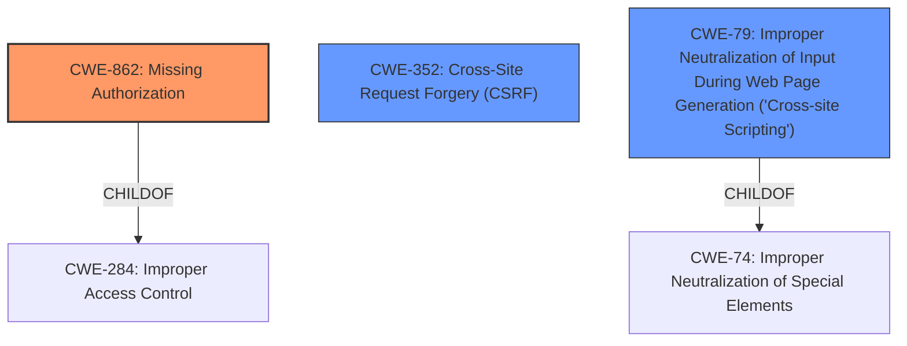

# Analysis for CVE-2021-24801

# Summary
| CWE ID | CWE Name | Confidence | CWE Abstraction Level | CWE Vulnerability Mapping Label | CWE-Vulnerability Mapping Notes |
|---|---|---|---|---|---|
| CWE-862 | Missing Authorization | 1.0 | Class | Allowed-with-Review | Primary CWE |
| CWE-352 | Cross-Site Request Forgery (CSRF) | 1.0 | Compound | Allowed | Secondary Candidate |
| CWE-79 | Improper Neutralization of Input During Web Page Generation ('Cross-site Scripting') | 1.0 | Base | Allowed | Secondary Candidate |

## Evidence and Confidence

*   **Confidence Score:** 1.0
*   **Evidence Strength:** HIGH

## Relationship Analysis
The primary weakness is **CWE-862 [Missing Authorization]**, a child of the broader **CWE-284 [Improper Access Control]**. **CWE-352 [Cross-Site Request Forgery (CSRF)]** is related because the **lack of CSRF checks** allows attackers to perform actions on behalf of users. **CWE-79 [Improper Neutralization of Input During Web Page Generation ('Cross-site Scripting')]** arises from the **lack of sanitization** of the survey title. These flaws allow attackers to inject malicious scripts, leading to XSS. The abstraction levels guide the selection of the most specific CWEs; in this case, **CWE-862 [Missing Authorization]** and **CWE-79 [Improper Neutralization of Input During Web Page Generation ('Cross-site Scripting')]** are chosen as they are more specific than their parents.

## Vulnerability Chain
The vulnerability chain starts with **missing authorization and CSRF checks**, leading to unauthorized access and potential XSS.
  - **CWE-862 [Missing Authorization]**: The plugin lacks authorization checks for AJAX actions, allowing unauthorized access.
  - **CWE-352 [Cross-Site Request Forgery (CSRF)]**: The plugin lacks CSRF checks, allowing attackers to perform actions on behalf of users.
  - **CWE-79 [Improper Neutralization of Input During Web Page Generation ('Cross-site Scripting')]**: The plugin lacks sanitization of the survey title, allowing XSS injection.

## Summary of Analysis
The initial analysis identified **CWE-862 [Missing Authorization]**, **CWE-352 [Cross-Site Request Forgery (CSRF)]**, and **CWE-79 [Improper Neutralization of Input During Web Page Generation ('Cross-site Scripting')]** as the most relevant CWEs based on the vulnerability description and retriever results.

The vulnerability description clearly states a **lack of authorization and CSRF checks** and **lack of sanitization**. The evidence for **CWE-862 [Missing Authorization]** is "The WP Survey Plus WordPress plugin through 1.0 does not have any authorisation". The evidence for **CWE-352 [Cross-Site Request Forgery (CSRF)]** is "CSRF checks in place in its AJAX actions, allowing any user to call them". The evidence for **CWE-79 [Improper Neutralization of Input During Web Page Generation ('Cross-site Scripting')]** is "due to the **lack of sanitization** in the Surveys Title, this could also lead to Stored Cross-Site Scripting issues".

The hierarchical relationships and mapping guidance support the selection of these CWEs. **CWE-862 [Missing Authorization]** is more specific than its parent **CWE-284 [Improper Access Control]**, making it a better fit. **CWE-79 [Improper Neutralization of Input During Web Page Generation ('Cross-site Scripting')]** is a base-level CWE that accurately describes the XSS vulnerability.

The final decision is based on a thorough analysis of the evidence, relationship analysis, and mapping guidance, resulting in the selection of **CWE-862 [Missing Authorization]**, **CWE-352 [Cross-Site Request Forgery (CSRF)]**, and **CWE-79 [Improper Neutralization of Input During Web Page Generation ('Cross-site Scripting')]** as the most appropriate CWEs.

Relevant CWE Information:

# Enhanced Context (25 CWEs)

## CWE-80: Improper Neutralization of Script-Related HTML Tags in a Web Page (Basic XSS)
**Abstraction Level**: Variant
**Similarity Score**: 0.79
**Source**: dense

**Description**:
The product receives input from an upstream component, but it does not neutralize or incorrectly neutralizes special characters such as "<", ">", and "&" that could be interpreted as web-scripting elements when they are sent to a downstream component that processes web pages.

**Mapping Guidance**:
- Usage: Allowed
- Rationale: This CWE entry is at the Variant level of abstraction, which is a preferred level of abstraction for mapping to the root causes of vulnerabilities.

*Not selected:* This is a variant of **CWE-79 [Improper Neutralization of Input During Web Page Generation ('Cross-site Scripting')]**, but **CWE-79 [Improper Neutralization of Input During Web Page Generation ('Cross-site Scripting')]** is a better fit because it's at the base level, which is more general.

## CWE-472: External Control of Assumed-Immutable Web Parameter
**Abstraction Level**: Base
**Similarity Score**: 0.78
**Source**: dense

**Description**:
The web application does not sufficiently verify inputs that are assumed to be immutable but are actually externally controllable, such as hidden form fields.

**Mapping Guidance**:
- Usage: Allowed
- Rationale: This CWE entry is at the Base level of abstraction, which is a preferred level of abstraction for mapping to the root causes of vulnerabilities.

*Not selected:* Not directly applicable because the vulnerability isn't about modifying assumed-immutable parameters, but rather about **lack of authorization and sanitization**.

## CWE-116: Improper Encoding or Escaping of Output
**Abstraction Level**: Class
**Similarity Score**: 0.76
**Source**: dense

**Description**:
The product prepares a structured message for communication with another component, but encoding or escaping of the data is either missing or done incorrectly. As a result, the intended structure of the message is not preserved.

**Mapping Guidance**:
- Usage: Allowed-with-Review
- Rationale: This CWE entry is a Class and might have Base-level children that would be more appropriate

*Not selected:* **CWE-79 [Improper Neutralization of Input During Web Page Generation ('Cross-site Scripting')]** is more specific in this context, as the vulnerability directly leads to XSS due to missing sanitization.

## CWE-639: Authorization Bypass Through User-Controlled Key
**Abstraction Level**: Base
**Similarity Score**: 0.76
**Source**: dense

**Description**:
The system's authorization functionality does not prevent one user from gaining access to another user's data or record by modifying the key value identifying the data.

**Mapping Guidance**:
- Usage: Allowed
- Rationale: This CWE entry is at the Base level of abstraction, which is a preferred level of abstraction for mapping to the root causes of vulnerabilities.

*Not selected:* This is related to authorization, but **CWE-862 [Missing Authorization]** is a direct fit since there is a complete **lack of authorization checks**, rather than a bypass through a user-controlled key.

## CWE-74: Improper Neutralization of Special Elements in Output Used by a Downstream Component ('Injection')
**Abstraction Level**: Class
**Similarity Score**: 0.76
**Source**: dense

**Description**:
The product constructs all or part of a command, data structure, or record using externally-influenced input from an upstream component, but it does not neutralize or incorrectly neutralizes special elements that could modify how it is parsed or interpreted when it is sent to a downstream component.

**Mapping Guidance**:
- Usage: Discouraged
- Rationale: CWE-74 is high-level and often misused when lower-level weaknesses are more appropriate.

*Not selected:* This is too general. **CWE-79 [Improper Neutralization of Input During Web Page Generation ('Cross-site Scripting')]** is a more specific instance of injection