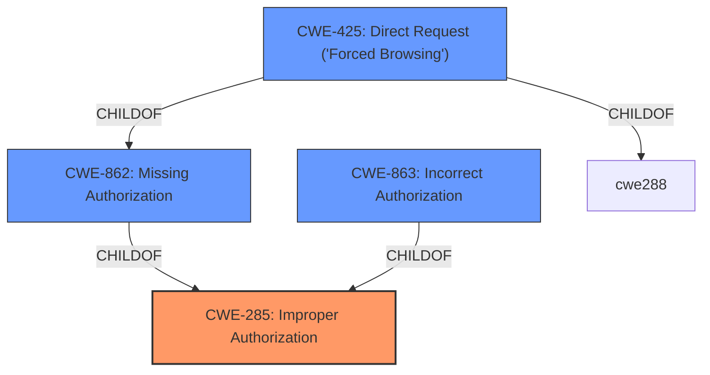

# Analysis for CVE-2021-24819

# Summary
| CWE ID | CWE Name | Confidence | CWE Abstraction Level | CWE Vulnerability Mapping Label | CWE-Vulnerability Mapping Notes |
|---|---|---|---|---|---|
| CWE-285 | Improper Authorization | 0.85 | Class | Primary | Allowed-with-Review |
| CWE-862 | Missing Authorization | 0.75 | Class | Secondary | Allowed-with-Review |
| CWE-863 | Incorrect Authorization | 0.70 | Class | Secondary | Allowed-with-Review |
| CWE-425 | Direct Request ('Forced Browsing') | 0.60 | Base | Secondary | Allowed |

## Evidence and Confidence

*   **Confidence Score:** 0.80
*   **Evidence Strength:** HIGH

## Relationship Analysis
The primary relationship is that CWE-285, **Improper Authorization**, is a parent Class of both CWE-862, **Missing Authorization**, and CWE-863, **Incorrect Authorization**. The vulnerability description indicates a problem with authorization, and while it could be argued that authorization is completely missing (CWE-862), it's more accurate to say the authorization is **improper** (CWE-285) as users with contributor roles are granted access they should not have.  CWE-425, **Direct Request ('Forced Browsing')**, is also a related Base CWE that applies when authorization is not adequately enforced on restricted URLs, scripts, or files, such as accessing draft posts.

## Vulnerability Chain
The vulnerability chain starts with the **improper authorization** implementation in the WordPress plugin. This leads to the impact of unauthorized access to draft, private, password-protected, and trashed posts/pages by users with contributor roles. The ability for low-level users to bypass intended restrictions results in information disclosure.

## Summary of Analysis
The initial assessment identified the **rootcause** as an **improper authorization**, leading to unauthorized access to restricted content. The evidence from the vulnerability description is clear: "The Page/Post Content Shortcode WordPress plugin through 1.0 does not have proper authorisation in place, allowing users with a role as low as contributor to access draft/private/password protected/trashed posts/pages they should not be allowed to...". This maps directly to CWE-285 **Improper Authorization**, as the authorization checks are not correctly implemented, leading to unintended access.

The retriever results suggested CWE-863 (**Incorrect Authorization**) and CWE-862 (**Missing Authorization**). While both are related, the vulnerability description suggests that authorization is present but flawed, making CWE-285 a more accurate representation than **Missing Authorization**. If authorization was entirely absent, CWE-862 would be more appropriate. Similarly, the authorization logic is present but incorrect, suggesting CWE-863 could apply. CWE-425 (**Direct Request ('Forced Browsing')**) is applicable because the plugin does not adequately enforce authorization on all restricted content.

The final decision prioritizes CWE-285 (**Improper Authorization**) as the primary CWE because it is a Class CWE that encompasses both **missing** and **incorrect** authorization scenarios. Since the plugin has some level of authorization in place, but it is flawed, CWE-863 (**Incorrect Authorization**) is also applicable. CWE-862 (**Missing Authorization**) is less applicable because authorization is not completely missing, but the retriever result suggests it should be considered. CWE-425 (**Direct Request ('Forced Browsing')**) applies because the plugin allows direct access to content that should be restricted. These selections provide the optimal level of specificity.

Relevant CWE Information:
- CWE-285: Improper Authorization
  - Description: The product does not perform or incorrectly performs an authorization check when an actor attempts to access a resource or perform an action.
  - Usage: Discouraged, but selected due to being a good top level description.
- CWE-862: Missing Authorization
  - Description: The product does not perform an authorization check when an actor attempts to access a resource or perform an action.
  - Usage: Allowed-with-Review, but less descriptive as authorization is in place.
- CWE-863: Incorrect Authorization
  - Description: The product performs an authorization check when an actor attempts to access a resource or perform an action, but it does not correctly perform the check.
  - Usage: Allowed-with-Review, good descritption.
- CWE-425: Direct Request ('Forced Browsing')
  - Description: The web application does not adequately enforce appropriate authorization on all restricted URLs, scripts, or files.
  - Usage: Allowed, relevant because authorization is not adequately enforced on restricted content.