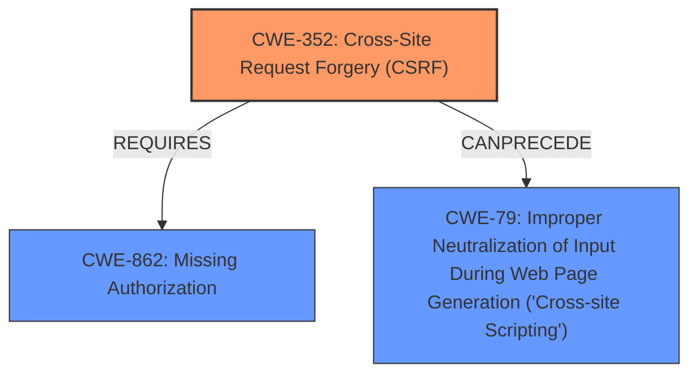

# Analysis Report for CVE-2021-24822

# Vulnerability Analysis Report: CVE-2021-24822

## Description


## Analysis (with Relationship Data)

# Summary
| CWE ID | CWE Name | Confidence | CWE Abstraction Level | CWE Vulnerability Mapping Label | CWE-Vulnerability Mapping Notes |
|---|---|---|---|---|---|
| CWE-352 | Cross-Site Request Forgery (CSRF) | 0.9 | Compound | Allowed | Primary CWE |
| CWE-862 | Missing Authorization | 0.9 | Class | Allowed-with-Review | Secondary Candidate |
| CWE-79 | Improper Neutralization of Input During Web Page Generation ('Cross-site Scripting') | 0.8 | Base | Allowed | Secondary Candidate |

## Evidence and Confidence

*   **Confidence Score:** 0.9
*   **Evidence Strength:** HIGH

## Relationship Analysis
The primary relationship impacting my decision is that CWE-352 [Cross-Site Request Forgery (CSRF)] requires both **lack of CSRF checks** and that the application can't sufficiently verify that the request was intentionally sent. The description shows this condition is true.

CWE-862 [Missing Authorization] is a class-level CWE, and is being considered because the vulnerability description indicates that AJAX actions lack authorization checks. While related, the **lack of CSRF protection** is a more specific issue.

CWE-79 [Improper Neutralization of Input During Web Page Generation ('Cross-site Scripting')] is included because the vulnerability allows for Stored Cross-Site Scripting (XSS) attacks due to the **lack of sanitization and escaping in some parameters.** This can follow CWE-352.



## Vulnerability Chain
The vulnerability chain starts with the **lack of authorization and CSRF checks**, which leads to the ability for authenticated users (even those with low privileges like subscribers) to access and manipulate AJAX actions. This, coupled with the **lack of sanitization and escaping**, results in stored XSS vulnerabilities.

## Summary of Analysis
The initial analysis identified several potential CWEs based on the vulnerability description, **lack of authorization and CSRF checks** on some of its AJAX actions, which could allow any authenticated users, such as subscriber to call them, and perform Stored Cross-Site Scripting attacks against logged in admin, as well as frontend users due to the **lack of sanitisation and escaping in some parameters**.

The primary focus of the analysis was to determine the root cause and map it to the most appropriate CWE. After considering the relationships between the identified CWEs, it became clear that CWE-352 [Cross-Site Request Forgery (CSRF)] is the most accurate primary classification because the description explicitly mentions the **lack of CSRF checks** and the ability for authenticated users to perform actions without proper validation.

The selection of CWE-352 [Cross-Site Request Forgery (CSRF)] is further justified by the MITRE mapping guidance, which allows for its usage and acknowledges it as a well-known composite of multiple weaknesses that must occur simultaneously.

The evidence from the vulnerability description supports this classification. The "Vulnerability Description Key Phrases" section highlights the **lack of authorisation and CSRF checks**, and the "CVE Reference Links Content Summary" section confirms that the plugin lacks both authorization and CSRF protection on certain AJAX actions.

CWE-862 [Missing Authorization] is included as a secondary candidate because it is a closely related issue, as there is a **lack of authorization** on AJAX actions.

CWE-79 [Improper Neutralization of Input During Web Page Generation ('Cross-site Scripting')] is included as a secondary candidate because the **lack of sanitisation and escaping** leads to Stored Cross-Site Scripting (XSS) attacks.

Relevant CWE Information:
## CWE-352: Cross-Site Request Forgery (CSRF)
**Abstraction:** Compound
**Status:** Stable

### Description
The web application does not, or can not, sufficiently verify whether a well-formed, valid, consistent request was intentionally provided by the user who submitted the request.

### Extended Description
When a web server is designed to receive a request from a client without any mechanism for verifying that it was intentionally sent, then it might be possible for an attacker to trick a client into making an unintentional request to the web server which will be treated as an authentic request. This can be done via a URL, image load, XMLHttpRequest, etc. and can result in exposure of data or unintended code execution.

### Observed Examples
- **CVE-2004-1703:** Add user accounts via a URL in an img tag
- **CVE-2004-1995:** Add user accounts via a URL in an img tag
- **CVE-2004-1967:** Arbitrary code execution by specifying the code in a crafted img tag or URL

## CWE-862: Missing Authorization
**Abstraction:** Class
**Status:** Incomplete

### Description
The product does not perform an authorization check when an actor attempts to access a resource or perform an action.

### Observed Examples
- **CVE-2022-24730:** Go-based continuous deployment product does not check that a user has certain privileges to update or create an app, allowing adversaries to read sensitive repository information
- **CVE-2009-3168:** Web application does not restrict access to admin scripts, allowing authenticated users to reset administrative passwords.
- **CVE-2009-3597:** Web application stores database file under the web root with insufficient access control (CWE-219), allowing direct request.

## CWE-79: Improper Neutralization of Input During Web Page Generation ('Cross-site Scripting')
**Abstraction:** Base
**Status:** Stable

### Description
The product does not neutralize or incorrectly neutralizes user-controllable input before it is placed in output that is used as a web page that is served to other users.

### Extended Description
Cross-site scripting (XSS) vulnerabilities occur when:

1.  Untrusted data enters a web application, typically from a web request.
2.  The web application dynamically generates a web page that contains this untrusted data.
3.  During page generation, the application does not prevent the data from containing content that is executable by a web browser, such as JavaScript, HTML tags, HTML attributes, mouse events, Flash, ActiveX, etc.
4.  A victim visits the generated web page through a web browser, which contains malicious script that was injected using the untrusted data.
5.  Since the script comes from a web page that was sent by the web server, the victim's web browser executes the malicious script in the context of the web server's domain.
6.  This effectively violates the intention of the web browser's same-origin policy, which states that scripts in one domain should not be able to access resources or run code in a different domain.

There are three main kinds of XSS:

*   **Type 1: Reflected XSS (or Non-Persistent)** \- The server reads data directly from the HTTP request and reflects it back in the HTTP response. Reflected XSS exploits occur when an attacker causes a victim to supply dangerous content to a vulnerable web application, which is then reflected back to the victim and executed by the web browser. The most common mechanism for delivering malicious content is to include it as a parameter in a URL that is posted publicly or e-mailed directly to the victim. URLs constructed in this manner constitute the core of many phishing schemes, whereby an attacker convinces a victim to visit a URL that refers to a vulnerable site. After the site reflects the attacker's content back to the victim, the content is executed by the victim's browser.

*   **Type 2: Stored XSS (or Persistent)** \- The application stores dangerous data in a database, message forum, visitor log, or other trusted data store. At a later time, the dangerous data is subsequently read back into the application and included in dynamic content. From an attacker's perspective, the optimal place to inject malicious content is in an area that is displayed to either many users or particularly interesting users. Interesting users typically have elevated privileges in the application or interact with sensitive data that is valuable to the attacker. If one of these users executes malicious content, the attacker may be able to perform privileged operations on behalf of the user or gain access to sensitive data belonging to the user. For example, the attacker might inject XSS into a log message, which might not be handled properly when an administrator views the logs.

*   **Type 0: DOM-Based XSS** \- In DOM-based XSS, the client performs the injection of XSS into the page; in the other types, the server performs the injection. DOM-


## CWE Relationship Analysis

Current CWEs represent these abstraction levels: .


### Vulnerability Chain Analysis

**Chain starting from CWE-352:**
- 352 (Cross-Site Request Forgery (CSRF)) - ROOT


**Chain starting from CWE-79:**
- 79 (Improper Neutralization of Input During Web Page Generation ('Cross-site Scripting')) - ROOT


### CWE Relationship Diagram

```mermaid
graph TD
    classDef primary fill:#f96,stroke:#333,stroke-width:2px
    classDef secondary fill:#69f,stroke:#333
    classDef tertiary fill:#9e9,stroke:#333
```


*Report generated on 2025-04-02 00:07:26*
