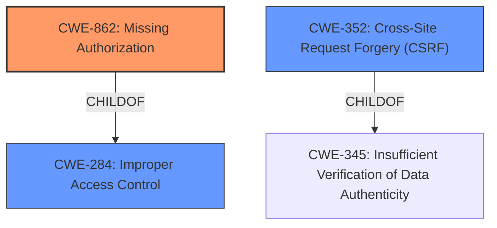

# Raw Analyzer Response for CVE-2021-24839

# Summary
| CWE ID | CWE Name | Confidence | CWE Abstraction Level | CWE Vulnerability Mapping Label | CWE-Vulnerability Mapping Notes |
|---|---|---|---|---|---|
| CWE-862 | Missing Authorization | 1.0 | Class | Primary | Allowed-with-Review |
| CWE-352 | Cross-Site Request Forgery (CSRF) | 0.9 | Compound | Secondary | Allowed |

## Evidence and Confidence

*   **Confidence Score:** 0.95
*   **Evidence Strength:** HIGH

## Relationship Analysis
The primary weakness is the **lack of authorization (CWE-862)**, which is a child of **Improper Access Control (CWE-284)**. The vulnerability also involves a **Cross-Site Request Forgery (CSRF) (CWE-352)**, which requires other CWEs to occur simultaneously. **CWE-352** is a compound weakness. **CWE-862** is a more specific class than its parent **CWE-284**, making it a better fit.

## Vulnerability Chain
The vulnerability chain begins with the **lack of authorization and CSRF checks**. This allows an unauthenticated user to call the `wpsc_tickets` AJAX action and delete arbitrary tickets.

`Missing Authorization/CSRF` -> `Unauthenticated Access` -> `Arbitrary Ticket Deletion`

## Summary of Analysis
The initial assessment identified the **lack of authorization (CWE-862)** as a primary weakness due to the **missing authorization checks**. The presence of **missing CSRF checks** further enables the exploit by allowing unauthenticated users to perform actions without proper verification. The retriever results support this assessment.

The vulnerability description clearly states the **lack of authorization and CSRF checks** in the `wpsc_tickets` AJAX action, which allows unauthenticated users to delete arbitrary tickets. This is directly quoted from the "Vulnerability Description Key Phrases".

The selection of **CWE-862** is at the optimal level of specificity because it accurately describes the root cause of the vulnerability. **CWE-352** is included as it accurately depicts the **lack of CSRF checks**, which is another contributing factor.

Relevant CWE Information:

# Enhanced Context (25 CWEs)

## CWE-472: External Control of Assumed-Immutable Web Parameter
**Abstraction Level**: Base
**Similarity Score**: 0.78
**Source**: dense

**Description**:
The web application does not sufficiently verify inputs that are assumed to be immutable but are actually externally controllable, such as hidden form fields.

**Mapping Guidance**:
- Usage: Allowed
- Rationale: This CWE entry is at the Base level of abstraction, which is a preferred level of abstraction for mapping to the root causes of vulnerabilities.
*Not Used:* This is not the case here. There is a **lack of authorization checks**, which is different than improper verification of inputs.

## CWE-639: Authorization Bypass Through User-Controlled Key
**Abstraction Level**: Base
**Similarity Score**: 0.76
**Source**: dense

**Description**:
The system's authorization functionality does not prevent one user from gaining access to another user's data or record by modifying the key value identifying the data.

**Mapping Guidance**:
- Usage: Allowed
- Rationale: This CWE entry is at the Base level of abstraction, which is a preferred level of abstraction for mapping to the root causes of vulnerabilities.
*Not Used:* This is not the case here. There is a **lack of authorization checks** and not authorization bypass through user-controlled key.

## CWE-184: Incomplete List of Disallowed Inputs
**Abstraction Level**: Base
**Similarity Score**: 0.76
**Source**: dense

**Description**:
The product implements a protection mechanism that relies on a list of inputs (or properties of inputs) that are not allowed by policy or otherwise require other action to neutralize before additional processing takes place, but the list is incomplete.

**Mapping Guidance**:
- Usage: Allowed
- Rationale: This CWE entry is at the Base level of abstraction, which is a preferred level of abstraction for mapping to the root causes of vulnerabilities.
*Not Used:* This CWE does not accurately reflect the vulnerability, which stems from the **absence of authorization checks**, rather than an incomplete list of disallowed inputs.

## CWE-1289: Improper Validation of Unsafe Equivalence in Input
**Abstraction Level**: Base
**Similarity Score**: 0.76
**Source**: dense

**Description**:
The product receives an input value that is used as a resource identifier or other type of reference, but it does not validate or incorrectly validates that the input is equivalent to a potentially-unsafe value.

**Mapping Guidance**:
- Usage: Allowed
- Rationale: This CWE entry is at the Base level of abstraction, which is a preferred level of abstraction for mapping to the root causes of vulnerabilities.
*Not Used:* The vulnerability stems from the **absence of authorization checks**, rather than improper validation of input.

## CWE-807: Reliance on Untrusted Inputs in a Security Decision
**Abstraction Level**: Base
**Similarity Score**: 0.76
**Source**: dense

**Description**:
The product uses a protection mechanism that relies on the existence or values of an input, but the input can be modified by an untrusted actor in a way that bypasses the protection mechanism.

**Mapping Guidance**:
- Usage: Allowed
- Rationale: This CWE entry is at the Base level of abstraction, which is a preferred level of abstraction for mapping to the root causes of vulnerabilities.
*Not Used:* The vulnerability stems from the **absence of authorization checks**.

## CWE-74: Improper Neutralization of Special Elements in Output Used by a Downstream Component ('Injection')
**Abstraction Level**: Class
**Similarity Score**: 0.76
**Source**: dense

**Description**:
The product constructs all or part of a command, data structure, or record using externally-influenced input from an upstream component, but it does not neutralize or incorrectly neutralizes special elements that could modify how it is parsed or interpreted when it is sent to a downstream component.

**Mapping Guidance**:
- Usage: Discouraged
- Rationale: CWE-74 is high-level and often misused when lower-level weaknesses are more appropriate.
*Not Used:* The vulnerability is not due to an injection issue but rather a **lack of authorization checks**.

## CWE-116: Improper Encoding or Escaping of Output
**Abstraction Level**: Class
**Similarity Score**: 0.76
**Source**: dense

**Description**:
The product prepares a structured message for communication with another component, but encoding or escaping of the data is either missing or done incorrectly. As a result, the intended structure of the message is not preserved.

**Mapping Guidance**:
- Usage: Allowed-with-Review
- Rationale: This CWE entry is a Class and might have Base-level children that would be more appropriate
*Not Used:* The vulnerability is not due to improper encoding or escaping of output, but rather a **lack of authorization checks**.

## CWE-425: Direct Request ('Forced Browsing')
**Abstraction Level**: Base
**Similarity Score**: 0.76
**Source**: dense

**Description**:
The web application does not adequately enforce appropriate authorization on all restricted URLs, scripts, or files.

**Mapping Guidance**:
- Usage: Allowed
- Rationale: This CWE entry is at the Base level of abstraction, which is a preferred level of abstraction for mapping to the root causes of vulnerabilities.
*Not Used:* This is similar, but **CWE-862** is more specific and accurately reflects the **lack of authorization**.

## CWE-138: Improper Neutralization of Special Elements
**Abstraction Level**: Class
**Similarity Score**: 0.75
**Source**: dense

**Description**:
The product receives input from an upstream component, but it does not neutralize or incorrectly neutralizes special elements that could be interpreted as control elements or syntactic markers when they are sent to a downstream component.

**Mapping Guidance**:
- Usage: Discouraged
- Rationale: This CWE entry is a level-1 Class (i.e., a child of a Pillar). It might have lower-level children that would be more appropriate
*Not Used:* This is not related to improper neutralization of special elements.

## CWE-799: Improper Control of Interaction Frequency
**Abstraction Level**: Class
**Similarity Score**: 0.75
**Source**: dense

**Description**:
The product does not properly limit the number or frequency of