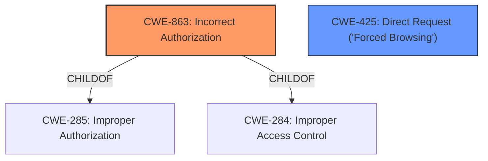

# Analysis for CVE-2021-24845

# Summary
| CWE ID | CWE Name | Confidence | CWE Abstraction Level | CWE Vulnerability Mapping Label | CWE-Vulnerability Mapping Notes |
|---|---|---|---|---|---|
| CWE-863 | Incorrect Authorization | 1.0 | Class | Allowed-with-Review | Primary CWE |
| CWE-425 | Direct Request ('Forced Browsing') | 0.7 | Base | Allowed | Secondary Candidate |

## Evidence and Confidence

*   **Confidence Score:** 0.9
*   **Evidence Strength:** HIGH

## Relationship Analysis
The primary CWE selected is CWE-863, "Incorrect Authorization," which is a Class-level CWE. It has parent-child relationships with CWE-285 "Improper Authorization" and CWE-284 "Improper Access Control." The secondary candidate is CWE-425, "Direct Request," which is a Base-level CWE.

## Vulnerability Chain
The vulnerability chain begins with the **improper implementation that allows passing shortcode attributes with post_type & post_status**. This leads to **incorrect authorization**, allowing users with Contributor roles to **retrieve arbitrary content** they are not supposed to access.

## Summary of Analysis
The initial analysis identified the vulnerability as related to authorization issues within the Improved Include Page WordPress plugin. The plugin **allows passing shortcode attributes with post_type & post_status**, which can be exploited to retrieve arbitrary content. This **incorrect authorization** allows users with Contributor roles or higher to access content they are not supposed to.

The selection of CWE-863, "Incorrect Authorization," is based on the fact that the product performs an authorization check, but it does not correctly perform the check. This is supported by the vulnerability description and the CVE Reference Links Content Summary, which state that the plugin **allows passing shortcode attributes with post_type & post_status** to retrieve arbitrary content, which demonstrates that authorization is performed but is flawed.

The retriever results also listed CWE-863 as the top result, further supporting this choice. The retriever result also lists CWE-425 "Direct Request", which is when the application does not adequately enforce authorization on all restricted URLs, scripts, or files. This could occur if the shortcode bypassed authorization checks that would normally be in place for direct access.

CWE-285 "Improper Authorization" and CWE-284 "Improper Access Control" were considered but not selected because they are higher-level (Class and Pillar, respectively) and less specific than CWE-863. While they broadly apply, CWE-863 accurately captures the **incorrect authorization** mechanism.

CWE-266 "Incorrect Privilege Assignment" and CWE-201 "Insertion of Sensitive Information Into Sent Data" were also considered but deemed less relevant. CWE-266 focuses on incorrect assignment of privileges, which isn't the primary issue here. CWE-201 focuses on the exposure of sensitive information, but this vulnerability's primary impact is unauthorized access rather than direct information exposure.

The final selection of CWE-863 is at the optimal level of specificity, as it accurately describes the **incorrect authorization** mechanism that allows unauthorized access to content. The confidence level is high (0.9) due to the clear alignment between the vulnerability description, the CVE Reference Links Content Summary, and the CWE definition.

Relevant CWE Information:

# Enhanced Context (25 CWEs)
The following CWEs were identified as potentially relevant to this vulnerability:

## CWE-434: Unrestricted Upload of File with Dangerous Type
**Abstraction Level**: Base
**Similarity Score**: 0.78
**Source**: dense

**Description**:
The product allows the upload or transfer of dangerous file types that are automatically processed within its environment.

**Mapping Guidance**:
- Usage: Allowed
- Rationale: This CWE entry is at the Base level of abstraction, which is a preferred level of abstraction for mapping to the root causes of vulnerabilities.

## CWE-184: Incomplete List of Disallowed Inputs
**Abstraction Level**: Base
**Similarity Score**: 0.76
**Source**: dense

**Description**:
The product implements a protection mechanism that relies on a list of inputs (or properties of inputs) that are not allowed by policy or otherwise require other action to neutralize before additional processing takes place, but the list is incomplete.

**Mapping Guidance**:
- Usage: Allowed
- Rationale: This CWE entry is at the Base level of abstraction, which is a preferred level of abstraction for mapping to the root causes of vulnerabilities.

## CWE-552: Files or Directories Accessible to External Parties
**Abstraction Level**: Base
**Similarity Score**: 0.76
**Source**: dense

**Description**:
The product makes files or directories accessible to unauthorized actors, even though they should not be.

**Mapping Guidance**:
- Usage: Allowed
- Rationale: This CWE entry is at the Base level of abstraction, which is a preferred level of abstraction for mapping to the root causes of vulnerabilities.

## CWE-1289: Improper Validation of Unsafe Equivalence in Input
**Abstraction Level**: Base
**Similarity Score**: 0.75
**Source**: dense

**Description**:
The product receives an input value that is used as a resource identifier or other type of reference, but it does not validate or incorrectly validates that the input is equivalent to a potentially-unsafe value.

**Mapping Guidance**:
- Usage: Allowed
- Rationale: This CWE entry is at the Base level of abstraction, which is a preferred level of abstraction for mapping to the root causes of vulnerabilities.

## CWE-41: Improper Resolution of Path Equivalence
**Abstraction Level**: Base
**Similarity Score**: 0.75
**Source**: dense

**Description**:
The product is vulnerable to file system contents disclosure through path equivalence. Path equivalence involves the use of special characters in file and directory names. The associated manipulations are intended to generate multiple names for the same object.

**Mapping Guidance**:
- Usage: Allowed
- Rationale: This CWE entry is at the Base level of abstraction, which is a preferred level of abstraction for mapping to the root causes of vulnerabilities.

## CWE-639: Authorization Bypass Through User-Controlled Key
**Abstraction Level**: Base
**Similarity Score**: 0.75
**Source**: dense

**Description**:
The system's authorization functionality does not prevent one user from gaining access to another user's data or record by modifying the key value identifying the data.

**Mapping Guidance**:
- Usage: Allowed
- Rationale: This CWE entry is at the Base level of abstraction, which is a preferred level of abstraction for mapping to the root causes of vulnerabilities.

## CWE-73: External Control of File Name or Path
**Abstraction Level**: Base
**Similarity Score**: 0.75
**Source**: dense

**Description**:
The product allows user input to control or influence paths or file names that are used in filesystem operations.

**Mapping Guidance**:
- Usage: Allowed
- Rationale: This CWE entry is at the Base level of abstraction, which is a preferred level of abstraction for mapping to the root causes of vulnerabilities.

## CWE-183: Permissive List of Allowed Inputs
**Abstraction Level**: Base
**Similarity Score**: 0.74
**Source**: dense

**Description**:
The product implements a protection mechanism that relies on a list of inputs (or properties of inputs) that are explicitly allowed by policy because the inputs are assumed to be safe, but the list is too permissive - that is, it allows an input that is unsafe, leading to resultant weaknesses.

**Mapping Guidance**:
- Usage: Allowed
- Rationale: This CWE entry is at the Base level of abstraction, which is a preferred level of abstraction for mapping to the root causes of vulnerabilities.

## CWE-829: Inclusion of Functionality from Untrusted Control Sphere
**Abstraction Level**: Base
**Similarity Score**: 0.74
**Source**: dense

**Description**:
The product imports, requires, or includes executable functionality (such as a library) from a source that is outside of the intended control sphere.

**Mapping Guidance**:
- Usage: Allowed
- Rationale: This CWE entry is at the Base level of abstraction, which is a preferred level of abstraction for mapping to the root causes of vulnerabilities.

## CWE-274: Improper Handling of Insufficient Privileges
**Abstraction Level**: Base
**Similarity Score**: 0.74
**Source**: dense

**Description**:
The product does not handle or incorrectly handles when it has insufficient privileges to perform an operation, leading to resultant weaknesses.

**Mapping Guidance**:
- Usage: Discouraged
-