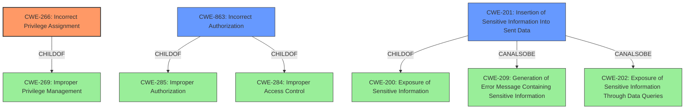

# Analysis Report for CVE-2021-24851

# Vulnerability Analysis Report: CVE-2021-24851

## Description


## Analysis (with Relationship Data)

# Summary
| CWE ID | CWE Name | Confidence | CWE Abstraction Level | CWE Vulnerability Mapping Label | CWE-Vulnerability Mapping Notes |
|---|---|---|---|---|---|
| CWE-266 | Incorrect Privilege Assignment | 0.8 | Base | Primary | Allowed |
| CWE-863 | Incorrect Authorization | 0.7 | Class | Secondary | Allowed-with-Review |
| CWE-201 | Insertion of Sensitive Information Into Sent Data | 0.5 | Base | Secondary | Allowed |

## Evidence and Confidence

*   **Confidence Score:** 0.7
*   **Evidence Strength:** HIGH

## Relationship Analysis
The primary CWE is CWE-266, which is a Base level CWE and a child of CWE-269. CWE-863 is a Class level CWE and a child of CWE-285 and CWE-284. CWE-201 is a Base level CWE and a child of CWE-200 and can also be CWE-209 and CWE-202.



## Vulnerability Chain
The vulnerability chain starts with an **incorrect privilege assignment**, leading to **broken access control**, which further leads to **information disclosure**.
  - **Root Cause:** CWE-266: Incorrect Privilege Assignment
  - **Weakness:** Broken Access Control
  - **Impact:** Information Disclosure of private posts/pages

## Summary of Analysis
The primary weakness is **Incorrect Privilege Assignment**. The vulnerability description states that "The Insert Pages WordPress plugin before 3.7.0 allows users with a role as low as Contributor to access content and metadata from arbitrary posts/pages regardless of their author and status (ie private), using a shortcode." The root cause is the plugin **incorrectly assigning privileges** to users, allowing contributors to access content they should not have access to.

CWE-266 (Incorrect Privilege Assignment) is selected because it directly addresses the **root cause** of the vulnerability, where users are granted unintended access due to misconfigured privileges. The description of CWE-266 aligns with the vulnerability where a Contributor role is incorrectly assigned the privilege to access any page, regardless of its intended access restrictions.

CWE-863 (Incorrect Authorization) is a secondary candidate because it represents a broader class of authorization issues. While the vulnerability involves incorrect authorization, the more specific **Incorrect Privilege Assignment** pinpoints the exact flaw. "The product performs an authorization check when an actor attempts to access a resource or perform an action, but it does not correctly perform the check" which occurs in this vulnerability description.

CWE-201 (Insertion of Sensitive Information Into Sent Data) is considered as a secondary CWE because the vulnerability leads to the exposure of content and metadata from private posts/pages to unauthorized users. The description of the CWE states: "The code transmits data to another actor, but a portion of the data includes sensitive information that should not be accessible to that actor" which is a result of this vulnerability.

The final selection prioritizes CWE-266 for its precise match to the **root cause**, while acknowledging the presence of broader authorization and information exposure aspects captured by CWE-863 and CWE-201 respectively.


## CWE Relationship Analysis

Current CWEs represent these abstraction levels: .


### Vulnerability Chain Analysis

**Chain starting from CWE-284:**
- 284 (Improper Access Control) - ROOT


**Chain starting from CWE-201:**
- 201 (Insertion of Sensitive Information Into Sent Data) - ROOT


### CWE Relationship Diagram

```mermaid
graph TD
    classDef primary fill:#f96,stroke:#333,stroke-width:2px
    classDef secondary fill:#69f,stroke:#333
    classDef tertiary fill:#9e9,stroke:#333
```


*Report generated on 2025-04-02 13:58:21*
