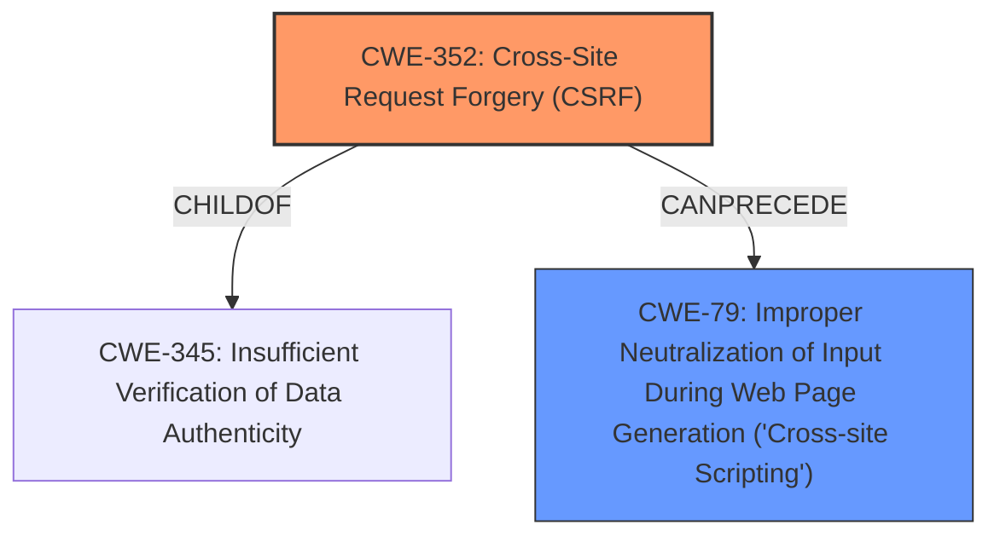

# Analysis for CVE-2021-24879

# Summary
| CWE ID | CWE Name | Confidence | CWE Abstraction Level | CWE Vulnerability Mapping Label | CWE-Vulnerability Mapping Notes |
|---|---|---|---|---|---|
| CWE-352 | Cross-Site Request Forgery (CSRF) | 1.0 | Compound | Allowed | Primary CWE |
| CWE-79 | Improper Neutralization of Input During Web Page Generation ('Cross-site Scripting') | 1.0 | Base | Allowed | Secondary CWE |

## Evidence and Confidence

*   **Confidence Score:** 1.0
*   **Evidence Strength:** HIGH

## Relationship Analysis
The primary weakness is CWE-352 [Cross-Site Request Forgery (CSRF)], a compound CWE. The vulnerability description explicitly mentions a **lack of CSRF protection** as a root cause, which aligns directly with the definition of CWE-352. The secondary weakness is CWE-79 [Improper Neutralization of Input During Web Page Generation ('Cross-site Scripting')], a base CWE. The description notes that the plugin has a **cross-site scripting vulnerability** because it fails to sanitize or escape filter fields, which matches CWE-79. CWE-352 can lead to other vulnerabilities, including XSS (CWE-79), as the attacker uses CSRF to inject malicious code. The hierarchical relationship is that CWE-352 is a compound weakness that requires other weaknesses to be exploited, and CWE-79 is a direct result of the lack of proper input handling.

## Vulnerability Chain
The chain begins with the **lack of CSRF protection** (CWE-352). This allows attackers to trick a logged-in user into performing actions they didn't intend. In this case, the attacker crafts a malicious request that injects an XSS payload into the user's filter settings. The **failure to sanitize or escape** the filter fields (CWE-79) allows the injected payload to be stored. When the user accesses the ticket list dashboard, the stored XSS payload is executed, leading to potential account compromise or data theft.

## Summary of Analysis
The initial analysis pointed to CWE-352 [Cross-Site Request Forgery (CSRF)] and CWE-79 [Improper Neutralization of Input During Web Page Generation ('Cross-site Scripting')], and this was confirmed by a deeper analysis of the vulnerability description and the provided CWE specifications. The **root cause** is the **lack of CSRF protection**, which is explicitly mentioned in the "Vulnerability Description Key Phrases" and "CVE Reference Links Content Summary." The description states: "The SupportCandy WordPress plugin before 2.2.7 does not have CSRF check in the wpsc_tickets AJAX action, nor has any sanitisation or escaping in some of the filter fields which could allow attackers to make a logged in user having access to the ticket lists dashboard set an arbitrary filter (stored in their cookies) with an XSS payload in it." This directly supports the selection of CWE-352. The vulnerability also involves a **cross-site scripting vulnerability** due to the **lack of sanitization or escaping** of filter fields, as evident in the phrase "nor has any sanitisation or escaping in some of the filter fields which could allow attackers to make a logged in user...set an arbitrary filter...with an XSS payload in it." This directly supports the selection of CWE-79. Both CWEs are at appropriate levels of specificity, with CWE-352 being a compound weakness and CWE-79 being a base weakness.

Relevant CWE Information:
CWE-116 [Improper Encoding or Escaping of Output] was considered, but CWE-79 [Improper Neutralization of Input During Web Page Generation ('Cross-site Scripting')] is a more specific and accurate fit, as it directly addresses the XSS vulnerability arising from the lack of proper output neutralization in a web page context. CWE-862 [Missing Authorization] was considered because **lack of CSRF protection** can be construed as a missing authorization check. However, CSRF is more accurately described by CWE-352, which is a compound weakness designed to capture this specific scenario.