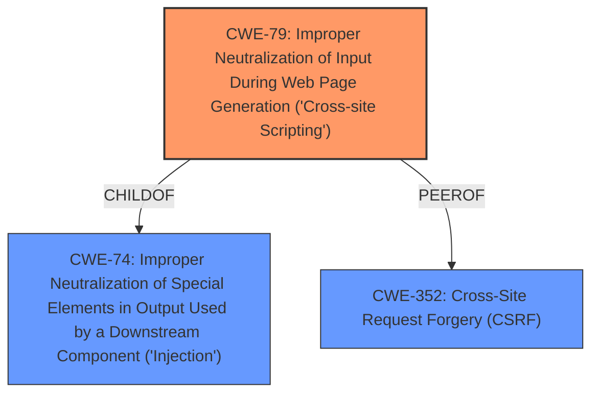

# Enhanced Analysis for CVE-2021-24884

# Summary
| CWE ID | CWE Name | Confidence | CWE Abstraction Level | CWE Vulnerability Mapping Label | CWE-Vulnerability Mapping Notes |
|---|---|---|---|---|---|
| CWE-79 | Improper Neutralization of Input During Web Page Generation ('Cross-site Scripting') | 1.0 | Base | Allowed | Primary CWE |
| CWE-352 | Cross-Site Request Forgery (CSRF) | 0.7 | Compound | Allowed | Secondary CWE |

## Evidence and Confidence

*   **Confidence Score:** 0.85
*   **Evidence Strength:** HIGH

## Relationship Analysis
The primary CWE is CWE-79 [Improper Neutralization of Input During Web Page Generation ('Cross-site Scripting')], which is a base-level CWE. This CWE is related to CWE-74 [Improper Neutralization of Special Elements in Output Used by a Downstream Component ('Injection')] as a child. The vulnerability allows for the injection of HTML tags due to **insufficient sanitization**, leading to XSS. CWE-352 [Cross-Site Request Forgery (CSRF)] is considered a secondary weakness because the XSS vulnerability can be exploited in combination with CSRF to perform actions on behalf of the user. CWE-352 is a compound CWE, representing multiple weaknesses occurring simultaneously.



## Vulnerability Chain
The vulnerability chain starts with the **insufficient sanitization** of the `data-frmverify` tag. This leads to **HTML injection**, which enables the execution of malicious JavaScript code. This can then be combined with a CSRF attack to perform actions on behalf of an authenticated user, potentially leading to account takeover or remote code execution.

1.  **Insufficient Sanitization (Root Cause):** The `data-frmverify` tag is not properly sanitized.
2.  **HTML Injection:** Malicious HTML tags and JavaScript code can be injected.
3.  **Cross-Site Scripting (XSS):** Injected script executes in the user's browser.
4.  **Cross-Site Request Forgery (CSRF):** Combined with XSS, allows unauthorized actions.
5.  **Account Takeover/Remote Code Execution (Impact):** Attacker gains control of the user's account or the system.

## Summary of Analysis
The initial analysis identified the **insufficient sanitization** of the `data-frmverify` tag as the root cause. This led to the identification of CWE-79 [Improper Neutralization of Input During Web Page Generation ('Cross-site Scripting')] as the primary weakness, due to the ability to inject and execute malicious scripts in the user's browser. The vulnerability description and CVE Reference Links Content Summary both support this: "The vulnerability is due to **insufficient sanitization** of the data-frmverify tag" and "The lack of sanitization allows an attacker to inject malicious HTML and JavaScript code into the `data-frmverify` attribute."

CWE-352 [Cross-Site Request Forgery (CSRF)] was considered as a secondary weakness because the XSS vulnerability can be exploited in combination with CSRF. The vulnerability description mentions, "A successful exploitation in combination with CSRF could allow the attacker to perform arbitrary actions."

The graph relationships influenced the final selection by highlighting the connection between XSS and CSRF, indicating a potential chain of exploitation. The selected CWEs are at the optimal level of specificity, with CWE-79 being a base-level CWE that directly addresses the root cause of the XSS vulnerability, and CWE-352 as a compound CWE representing the potential for CSRF exploitation in conjunction with XSS.

Relevant CWE Information:

# Enhanced Context (25 CWEs)
The following CWEs were identified as potentially relevant to this vulnerability:

## CWE-74: Improper Neutralization of Special Elements in Output Used by a Downstream Component ('Injection')
**Abstraction Level**: Class
**Similarity Score**: 0.80
**Source**: dense

**Description**:
The product constructs all or part of a command, data structure, or record using externally-influenced input from an upstream component, but it does not neutralize or incorrectly neutralizes special elements that could modify how it is parsed or interpreted when it is sent to a downstream component.

**Mapping Guidance**:
- Usage: Discouraged
- Rationale: CWE-74 is high-level and often misused when lower-level weaknesses are more appropriate.

## CWE-80: Improper Neutralization of Script-Related HTML Tags in a Web Page (Basic XSS)
**Abstraction Level**: Variant
**Similarity Score**: 0.79
**Source**: dense

**Description**:
The product receives input from an upstream component, but it does not neutralize or incorrectly neutralizes special characters such as "<", ">", and "&" that could be interpreted as web-scripting elements when they are sent to a downstream component that processes web pages.

**Mapping Guidance**:
- Usage: Allowed
- Rationale: This CWE entry is at the Variant level of abstraction, which is a preferred level of abstraction for mapping to the root causes of vulnerabilities.

## CWE-184: Incomplete List of Disallowed Inputs
**Abstraction Level**: Base
**Similarity Score**: 0.78
**Source**: dense

**Description**:
The product implements a protection mechanism that relies on a list of inputs (or properties of inputs) that are not allowed by policy or otherwise require other action to neutralize before additional processing takes place, but the list is incomplete.

**Mapping Guidance**:
- Usage: Allowed
- Rationale: This CWE entry is at the Base level of abstraction, which is a preferred level of abstraction for mapping to the root causes of vulnerabilities.

## CWE-138: Improper Neutralization of Special Elements
**Abstraction Level**: Class
**Similarity Score**: 0.78
**Source**: dense

**Description**:
The product receives input from an upstream component, but it does not neutralize or incorrectly neutralizes special elements that could be interpreted as control elements or syntactic markers when they are sent to a downstream component.

**Mapping Guidance**:
- Usage: Discouraged
- Rationale: This CWE entry is a level-1 Class (i.e., a child of a Pillar). It might have lower-level children that would be more appropriate

## CWE-116: Improper Encoding or Escaping of Output
**Abstraction Level**: Class
**Similarity Score**: 0.78
**Source**: dense

**Description**:
The product prepares a structured message for communication with another component, but encoding or escaping of the data is either missing or done incorrectly. As a result, the intended structure of the message is not preserved.

**Mapping Guidance**:
- Usage: Allowed-with-Review
- Rationale: This CWE entry is a Class and might have Base-level children that would be more appropriate

## CWE-41: Improper Resolution of Path Equivalence
**Abstraction Level**: Base
**Similarity Score**: 0.77
**Source**: dense

**Description**:
The product is vulnerable to file system contents disclosure through path equivalence. Path equivalence involves the use of special characters in file and directory names. The associated manipulations are intended to generate multiple names for the same object.

**Mapping Guidance**:
- Usage: Allowed
- Rationale: This CWE entry is at the Base level of abstraction, which is a preferred level of abstraction for mapping to the root causes of vulnerabilities.

## CWE-1289: Improper Validation of Unsafe Equivalence in Input
**Abstraction Level**: Base
**Similarity Score**: 0.77
**Source**: dense

**Description**:
The product receives an input value that is used as a resource identifier or other type of reference, but it does not validate or incorrectly validates that the input is equivalent to a potentially-unsafe value.

**Mapping Guidance**:
- Usage: Allowed
- Rationale: This CWE entry is at the Base level of abstraction, which is a preferred level of abstraction for mapping to the root causes of vulnerabilities.

## CWE-88: Improper Neutralization of Argument Delimiters in a Command ('Argument Injection')
**Abstraction Level**: Base
**Similarity Score**: 0.77
**Source**: dense

**Description**:
The product constructs a string for a command to be executed by a separate component
in another control sphere, but it does not properly delimit the
intended arguments, options, or switches within that command string.

**Mapping Guidance**:
- Usage: Allowed
- Rationale: This CWE entry is at the Base level of abstraction, which is a preferred level of abstraction for mapping to the root causes of vulnerabilities.

## CWE-73: External Control of File Name or Path
**Abstraction Level**: Base
**Similarity


## CWE Relationship Analysis

Current CWEs represent these abstraction levels: .


### Vulnerability Chain Analysis

**Chain starting from CWE-79:**
- 79 (Improper Neutralization of Input During Web Page Generation ('Cross-site Scripting')) - ROOT


**Chain starting from CWE-88:**
- 88 (Improper Neutralization of Argument Delimiters in a Command ('Argument Injection')) - ROOT


### CWE Relationship Diagram

```mermaid
graph TD
    classDef primary fill:#f96,stroke:#333,stroke-width:2px
    classDef secondary fill:#69f,stroke:#333
    classDef tertiary fill:#9e9,stroke:#333
```