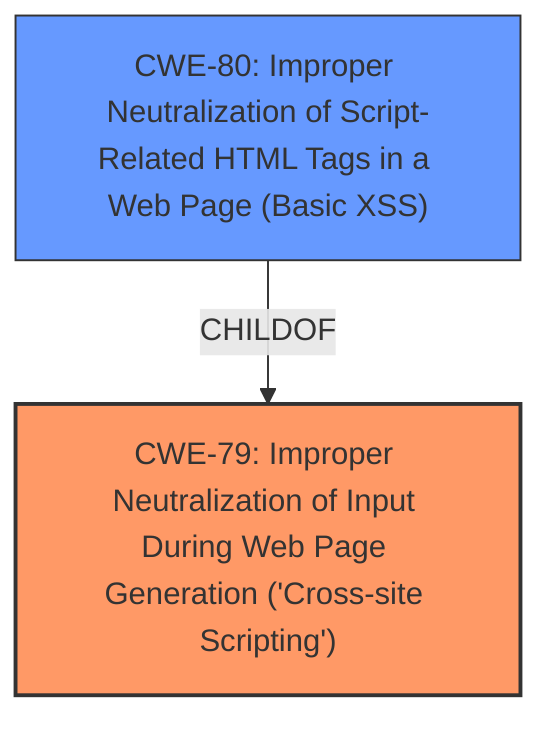

# Analysis for CVE-2021-24891

# Summary
| CWE ID | CWE Name | Confidence | CWE Abstraction Level | CWE Vulnerability Mapping Label | CWE-Vulnerability Mapping Notes |
|---|---|---|---|---|---|
| CWE-79 | Improper Neutralization of Input During Web Page Generation ('Cross-site Scripting') | 1.0 | Base | Allowed | Primary CWE |
| CWE-80 | Improper Neutralization of Script-Related HTML Tags in a Web Page (Basic XSS) | 0.8 | Variant | Allowed | Secondary Candidate |

## Evidence and Confidence

*   **Confidence Score:** 0.9
*   **Evidence Strength:** HIGH

## Relationship Analysis
The primary relationship that influenced my decision was the parent-child relationship between CWE-79 and CWE-80. CWE-80 is a variant of CWE-79, focusing specifically on the neutralization of script-related HTML tags. Since the vulnerability involves the improper handling of HTML content, CWE-80 initially appeared more specific. However, the vulnerability description focuses on the broader issue of improper neutralization of user-controllable input within a web page, which aligns more directly with CWE-79's description.

## Vulnerability Chain
The vulnerability chain starts with **improper input sanitization**, leading directly to a **DOM cross-site scripting** vulnerability. This means that the root cause is the lack of appropriate measures to clean or encode user-supplied data before it is used to generate a web page.

## Summary of Analysis
The initial analysis, based on the **improper input sanitization** and **DOM cross-site scripting** keywords, pointed towards both CWE-79 and CWE-80. The "CVE Reference Links Content Summary" section solidified this understanding by detailing how unsanitized input from the URL's `html` parameter is directly injected into the DOM, enabling arbitrary JavaScript execution.

The relationship graph helped clarify the specificity of each CWE. While CWE-80 addresses the neutralization of script-related HTML tags, the core issue is the broader failure to neutralize user-controllable input during web page generation, which is precisely what CWE-79 describes.

The decision to primarily map to CWE-79 is based on the evidence that the vulnerability stems from a general lack of input neutralization, rather than a specific failure to handle HTML tags. Although the injection occurs via HTML, the **root cause** is the absence of sanitization of user-provided input that ends up in the DOM. This justifies the selection of the more general CWE-79.

Relevant CWE Information:

# Enhanced Context (25 CWEs)

## CWE-80: Improper Neutralization of Script-Related HTML Tags in a Web Page (Basic XSS)
**Abstraction Level**: Variant
**Similarity Score**: 0.76
**Source**: dense

**Description**:
The product receives input from an upstream component, but it does not neutralize or incorrectly neutralizes special characters such as "<", ">", and "&" that could be interpreted as web-scripting elements when they are sent to a downstream component that processes web pages.

**Mapping Guidance**:
- Usage: Allowed
- Rationale: This CWE entry is at the Variant level of abstraction, which is a preferred level of abstraction for mapping to the root causes of vulnerabilities.

**Technical Explanation:**

CWE-79, Improper Neutralization of Input During Web Page Generation ('Cross-site Scripting'), accurately captures the essence of this vulnerability. The Elementor Website Builder WordPress plugin fails to properly sanitize user input within the `settings` parameter of the URL hash. Specifically, when the `type` parameter in the decoded JSON doesn't match expected values, the plugin sets the HTML content of the lightbox directly using the unsanitized `html` parameter, leading to DOM-based XSS.

The security implication is that an attacker can inject arbitrary JavaScript code into a user's browser by crafting a malicious URL. This could lead to stealing cookies, redirecting users to malicious sites, or performing actions on behalf of the user.

CWE-79 is the primary weakness because the **root cause** is the **improper neutralization** of user-controllable input before it's placed in the output of a web page.

CWE-80 was considered, but not selected as the primary CWE, because it is a more specific variant of CWE-79 that focuses on the neutralization of script-related HTML tags. While HTML tags are involved in the exploit, the overarching issue is the lack of input sanitization. The evidence supports the broader classification under CWE-79.

CWE-116, Improper Encoding or Escaping of Output, was considered because the vulnerability involves improper handling of output. However, the primary issue is the lack of neutralization rather than encoding or escaping, making CWE-79 a more accurate fit.

I am confident in this assessment because the vulnerability description and the "CVE Reference Links Content Summary" clearly point to the **improper handling** of user input leading to XSS, which aligns directly with the description of CWE-79.

CWE-80 is a secondary candidate because the **DOM cross-site scripting** arises from the injection of HTML, but the root cause is the **missing sanitization** of the input before being used to construct the HTML.