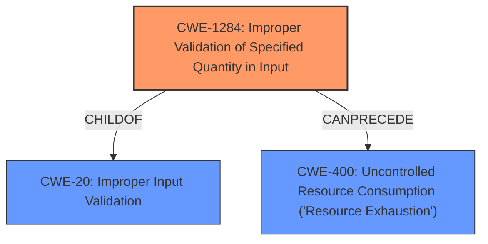

# Raw Analyzer Response for CVE-2021-24894

# Summary
| CWE ID    | CWE Name                                       | Confidence | CWE Abstraction Level | CWE Vulnerability Mapping Label | CWE-Vulnerability Mapping Notes |
| --------- | ---------------------------------------------- | ---------- | --------------------- | ------------------------------- | ------------------------------- |
| CWE-1284  | Improper Validation of Specified Quantity in Input | 0.95       | Base                  | Primary                         | Allowed                       |
| CWE-400 | Uncontrolled Resource Consumption ('Resource Exhaustion') | 0.75       | Class                 | Secondary                  | Allowed-with-Review              |

## Evidence and Confidence

*   **Confidence Score:** 0.85
*   **Evidence Strength:** HIGH

## Relationship Analysis
The primary CWE is CWE-1284, which is a base-level weakness describing **improper validation of a specified quantity**. This aligns well with the vulnerability description, which highlights the **lack of validation** of the rating value. CWE-1284 is a child of CWE-20 (Improper Input Validation), but CWE-1284 is more specific. The impact of this weakness is a denial of service, which leads to the selection of CWE-400.

## Vulnerability Chain
The vulnerability chain starts with the **lack of input validation** (CWE-1284), which allows an attacker to submit a large integer value. This leads to excessive resource consumption and ultimately results in a denial-of-service (CWE-400).

## Summary of Analysis
The initial analysis focused on identifying the root cause of the vulnerability and its resulting impact. The vulnerability description and the CVE reference summary clearly point to the **lack of input validation** as the primary issue, with the submission of a long integer as the attack vector.

The selection of CWE-1284 is strongly supported by the evidence provided: "The Reviews Plus WordPress plugin before 1.2.14 does not validate the submitted rating, allowing submission of long integer, causing a Denial of Service..." The CVE Reference Links Content Summary also states, "The vulnerability arises from the lack of proper input validation of the rating value submitted by users when posting a review. The plugin doesn't ensure that the provided rating is within the expected range (e.g., 0-5) before processing or storing it."

The graph relationships influenced the final selection by highlighting the connection between input validation and denial of service. CWE-1284 (Improper Validation of Specified Quantity in Input) directly leads to CWE-400 (Uncontrolled Resource Consumption).

The selected CWEs are at the optimal level of specificity. CWE-1284 accurately represents the **lack of validation** of the rating quantity, while CWE-400 describes the resulting denial-of-service condition.

Relevant CWE Information:

# Enhanced Context (25 CWEs)

## CWE-1289: Improper Validation of Unsafe Equivalence in Input
**Abstraction Level**: Base
**Similarity Score**: 0.80

This CWE was considered but deemed less relevant than CWE-1284 because the core issue isn't about equivalence, but the **lack of validation** of the quantity itself.

## CWE-807: Reliance on Untrusted Inputs in a Security Decision
**Abstraction Level**: Base
**Similarity Score**: 0.77

This CWE was considered but is not a direct match. The vulnerability isn't primarily about making a security decision based on untrusted input, but rather the **lack of validation** of a numerical input, which then leads to a denial-of-service.

## CWE-184: Incomplete List of Disallowed Inputs
**Abstraction Level**: Base
**Similarity Score**: 0.76

This CWE is about incomplete lists, which is not the primary weakness. The vulnerability is more directly related to **lack of validation** on the specified quantity.

## CWE-183: Permissive List of Allowed Inputs
**Abstraction Level**: Base
**Similarity Score**: 0.76

This CWE is about overly permissive lists, which is not the primary weakness. The vulnerability is more directly related to **lack of validation** on the specified quantity.

## CWE-138: Improper Neutralization of Special Elements
**Abstraction Level**: Class
**Similarity Score**: 0.75

This CWE is about special elements, but the issue is about **lack of validation** of a rating, not special elements.

## CWE-472: External Control of Assumed-Immutable Web Parameter
**Abstraction Level**: Base
**Similarity Score**: 0.75

This CWE is about assumed-immutable parameters, but the issue is simply **lack of validation** of a rating.

## CWE-1288: Improper Validation of Consistency within Input
**Abstraction Level**: Base
**Similarity Score**: 0.75

This CWE is about consistency, but the core issue is **lack of validation** of a specified quantity (the rating).

## CWE-73: External Control of File Name or Path
**Abstraction Level**: Base
**Similarity Score**: 0.75

This CWE is about file names/paths, but the issue is not related to files, instead it is **lack of validation** on rating.

## CWE-179: Incorrect Behavior Order: Early Validation
**Abstraction Level**: Base
**Similarity Score**: 0.75

This CWE is about order of validation, but there is a **lack of validation** at all.

## CWE-74: Improper Neutralization of Special Elements in Output Used by a Downstream Component ('Injection')
**Abstraction Level**: Class
**Similarity Score**: 0.74

This CWE is about injection, which is not relevant to **lack of validation** of specified quantity.

## CWE-116: Improper Encoding or Escaping of Output
**Abstraction Level**: Class
**Similarity Score**: 8055.49

This CWE is about output encoding, but the core issue is the **lack of validation** of the input.

## CWE-1284: Improper Validation of Specified Quantity in Input
**Abstraction Level**: Base
**Similarity Score**: 7854.81

This CWE is a strong match because the vulnerability stems from the **lack of validation** of the submitted rating (a specified quantity).

## CWE-863: Incorrect Authorization
**Abstraction Level**: Class
**Similarity Score**: 7777.54

This CWE is about incorrect authorization, which is not the issue here. The problem is **lack of validation** of a rating.

## CWE-22: Improper Limitation of a Pathname to a Restricted Directory ('Path Traversal')
**Abstraction Level**: Base
**Similarity Score**: 7699.32

This CWE is about path traversal, which is not relevant here. The issue is the **lack of validation** of the rating.

## CWE-285: Improper Authorization
**Abstraction Level**: Class
**Similarity Score**: 7633.60

This CWE is about improper authorization, which is not relevant here.

## CWE-430: Deployment of Wrong Handler
**Abstraction Level**: base
**Similarity Score**: 4.51

This CWE is about deployment of the wrong handler, which is not the case here.

## CWE-178: Improper Handling of Case Sensitivity
**Abstraction Level**: base
**Similarity Score**: 4.39

This CWE is about case sensitivity, which is not relevant here.

## CWE-1284: Improper Validation of Specified Quantity in Input
**Abstraction Level**: base
**Similarity Score**: 4.33

This CWE is a strong match because the vulnerability stems from the **lack of validation** of the submitted rating (a specified quantity).

## CWE-770: Allocation of Resources Without Limits or Throttling
**Abstraction Level**: base
**Similarity Score**: 4.33

This CWE is about resource allocation without limits. The issue here is a **lack of validation**, leading to excessive resource consumption.

## CWE-22: Improper Limitation of a Pathname to a Restricted Directory ('Path Traversal')
**Abstraction Level**: base
**Similarity Score**: 4.33

This CWE is about path traversal, which is not relevant here.

## CWE-190: Integer Overflow or Wraparound
**Abstraction Level**: base
**Similarity Score**: 4.33

This CWE is about integer overflows, but the primary issue is the **lack of validation** that allows a large integer to be submitted.

## CWE-59: Improper Link Resolution Before File Access ('Link Following')
**Abstraction Level**: base
**Similarity Score**: 4.33

This CWE is about