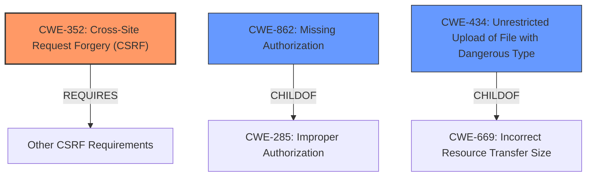

# Analysis Report for CVE-2021-24905

# Vulnerability Analysis Report: CVE-2021-24905

## Description


## Analysis (with Relationship Data)

# Summary
| CWE ID | CWE Name | Confidence | CWE Abstraction Level | CWE Vulnerability Mapping Label | CWE-Vulnerability Mapping Notes |
|---|---|---|---|---|---|
| **CWE-352** | Cross-Site Request Forgery (CSRF) | 1.0 | Compound | Primary | Allowed |
| **CWE-862** | Missing Authorization | 1.0 | Class | Secondary | Allowed-with-Review |
| CWE-434 | Unrestricted Upload of File with Dangerous Type | 0.5 | Base | Secondary | Allowed |

## Evidence and Confidence

*   **Confidence Score:** 0.9
*   **Evidence Strength:** HIGH

## Relationship Analysis
The primary weakness is CWE-352 [Cross-Site Request Forgery (CSRF)], which is a compound weakness requiring multiple conditions to be met. It Requires CWE-346, CWE-441, CWE-642 and CWE-613. The vulnerability description explicitly states the **missing CSRF checks** in the AJAX action. The secondary weakness is CWE-862 [Missing Authorization], and the vulnerability description states the **missing authorization** in the AJAX action. CWE-862 is a class-level weakness, and more specific base or variant level CWEs could exist, but the description does not provide enough information. There is also the potential for CWE-434 [Unrestricted Upload of File with Dangerous Type] since the vulnerability description key phrases indicate that the issue results in arbitrary file deletion. However, given the additional notes below and the fact that the file isn't actually uploaded, the confidence here is much lower.



## Vulnerability Chain
The vulnerability chain starts with the **missing authorization and CSRF checks** (CWE-862 and CWE-352). This leads to the ability to delete arbitrary files (impact), which could lead to more severe consequences, such as gaining administrator privileges and executing arbitrary code.

## Summary of Analysis
The initial analysis identified **missing authorization and CSRF checks** as key weaknesses, leading to the selection of CWE-352 and CWE-862. The retriever results and the vulnerability description both support this conclusion. The relationship analysis highlights that CWE-352 is a compound weakness, and CWE-862 is a class-level weakness. Given the information available, these are the most appropriate CWEs. There is the potential for CWE-434 [Unrestricted Upload of File with Dangerous Type] since the vulnerability description key phrases indicate that the issue results in arbitrary file deletion. However, given the additional notes below and the fact that the file isn't actually uploaded, the confidence here is much lower.

The vulnerability description explicitly states:
- **rootcause:** **missing authorisation and CSRF checks**

The CVE Reference Links Content Summary states:
- **Root cause of vulnerability:** The plugin lacks authorization and CSRF checks in the `acf7_db_edit_scr_file_delete` AJAX action and fails to validate the file to be deleted.
- **Weaknesses/vulnerabilities present:**
    - Missing authorization checks for the AJAX action `acf7_db_edit_scr_file_delete`.
    - Missing CSRF protection for the AJAX action `acf7_db_edit_scr_file_delete`.

CWE-352 is a well-known Compound weakness and the retriever results list this as the top hit (Rank 1).
CWE-862 is a class level weakness and the retriever results list this as the second best match (Rank 2).

I also considered CWE-434, Unrestricted Upload of File with Dangerous Type, as the vulnerability allows deleting arbitrary files on the webserver. However, the file isn't uploaded, only deleted, so this is not the best fit.

Relevant CWE Information:

# Enhanced Context (25 CWEs)
The following CWEs were identified as potentially relevant to this vulnerability:

## CWE-74: Improper Neutralization of Special Elements in Output Used by a Downstream Component ('Injection')
**Abstraction Level**: Class
**Similarity Score**: 0.78
**Source**: dense

**Description**:
The product constructs all or part of a command, data structure, or record using externally-influenced input from an upstream component, but it does not neutralize or incorrectly neutralizes special elements that could modify how it is parsed or interpreted when it is sent to a downstream component.

**Mapping Guidance**:
- Usage: Discouraged
- Rationale: CWE-74 is high-level and often misused when lower-level weaknesses are more appropriate.

## CWE-184: Incomplete List of Disallowed Inputs
**Abstraction Level**: Base
**Similarity Score**: 0.77
**Source**: dense

**Description**:
The product implements a protection mechanism that relies on a list of inputs (or properties of inputs) that are not allowed by policy or otherwise require other action to neutralize before additional processing takes place, but the list is incomplete.

**Mapping Guidance**:
- Usage: Allowed
- Rationale: This CWE entry is at the Base level of abstraction, which is a preferred level of abstraction for mapping to the root causes of vulnerabilities.

## CWE-1289: Improper Validation of Unsafe Equivalence in Input
**Abstraction Level**: Base
**Similarity Score**: 0.77
**Source**: dense

**Description**:
The product receives an input value that is used as a resource identifier or other type of reference, but it does not validate or incorrectly validates that the input is equivalent to a potentially-unsafe value.

**Mapping Guidance**:
- Usage: Allowed
- Rationale: This CWE entry is at the Base level of abstraction, which is a preferred level of abstraction for mapping to the root causes of vulnerabilities.

## CWE-116: Improper Encoding or Escaping of Output
**Abstraction Level**: Class
**Similarity Score**: 0.77
**Source**: dense

**Description**:
The product prepares a structured message for communication with another component, but encoding or escaping of the data is either missing or done incorrectly. As a result, the intended structure of the message is not preserved.

**Mapping Guidance**:
- Usage: Allowed-with-Review
- Rationale: This CWE entry is a Class and might have Base-level children that would be more appropriate

## CWE-838: Inappropriate Encoding for Output Context
**Abstraction Level**: Base
**Similarity Score**: 0.76
**Source**: dense

**Description**:
The product uses or specifies an encoding when generating output to a downstream component, but the specified encoding is not the same as the encoding that is expected by the downstream component.

**Mapping Guidance**:
- Usage: Allowed
- Rationale: This CWE entry is at the Base level of abstraction, which is a preferred level of abstraction for mapping to the root causes of vulnerabilities.

## CWE-472: External Control of Assumed-Immutable Web Parameter
**Abstraction Level**: Base
**Similarity Score**: 0.76
**Source**: dense

**Description**:
The web application does not sufficiently verify inputs that are assumed to be immutable but are actually externally controllable, such as hidden form fields.

**Mapping Guidance**:
- Usage: Allowed
- Rationale: This CWE entry is at the Base level of abstraction, which is a preferred level of abstraction for mapping to the root causes of vulnerabilities.

## CWE-425: Direct Request ('Forced Browsing')
**Abstraction Level**: Base
**Similarity Score**: 0.76
**Source**: dense

**Description**:
The web application does not adequately enforce appropriate authorization on all restricted URLs, scripts, or files.

**Mapping Guidance**:
- Usage: Allowed
- Rationale: This CWE entry is at the Base level of abstraction, which is a preferred level of abstraction for mapping to the root causes of vulnerabilities.

## CWE-80: Improper Neutralization of Script-Related HTML Tags in a Web Page (Basic XSS)
**Abstraction Level**: Variant
**Similarity Score**: 0.76
**Source**: dense

**Description**:
The product receives input from an upstream component, but it does not neutralize or incorrectly neutralizes special characters such as "<", ">", and "&" that could be interpreted as web-scripting elements when they are sent to a downstream component that processes web pages.

**Mapping Guidance**:
- Usage: Allowed
- Rationale: This CWE entry is at the Variant level


## CWE Relationship Analysis

Current CWEs represent these abstraction levels: .


### Vulnerability Chain Analysis

**Chain starting from CWE-838:**
- 838 (Inappropriate Encoding for Output Context) - ROOT


**Chain starting from CWE-862:**
- 862 (Missing Authorization) - ROOT


### CWE Relationship Diagram

```mermaid
graph TD
    classDef primary fill:#f96,stroke:#333,stroke-width:2px
    classDef secondary fill:#69f,stroke:#333
    classDef tertiary fill:#9e9,stroke:#333
```


*Report generated on 2025-04-02 14:16:53*
