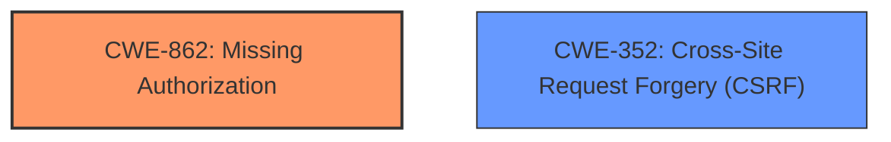

# Analysis for CVE-2021-24914

# Summary
| CWE ID | CWE Name | Confidence | CWE Abstraction Level | CWE Vulnerability Mapping Label | CWE-Vulnerability Mapping Notes |
|---|---|---|---|---|---|
| CWE-862 | Missing Authorization | 0.9 | Class | Primary | Allowed-with-Review |
| CWE-352 | Cross-Site Request Forgery (CSRF) | 0.7 | Compound | Secondary | Allowed |

## Evidence and Confidence

*   **Confidence Score:** 0.8
*   **Evidence Strength:** HIGH

## Relationship Analysis
The primary relationship impacting the decision is that CWE-862 [CWE-862: Missing Authorization] represents the **lack of authorization checks** in the AJAX actions, which allows unauthorized users to perform sensitive actions. CWE-352 [CWE-352: Cross-Site Request Forgery (CSRF)] is present due to the **lack of CSRF checks**, but it is a secondary concern because the **missing authorization** is the more direct cause of the vulnerability. While both weaknesses are present, the **missing authorization** is the more fundamental flaw.

## Vulnerability Chain
The vulnerability chain begins with the **lack of capability and CSRF checks**, leading to **low-privileged users** being able to **change parameters**. This ultimately allows them to **link the vulnerable website to their own Tawk.to instance**, **monitor the website and interact with visitors**, and **display an arbitrary Knowledge Base**.

## Summary of Analysis
The analysis is heavily based on the provided evidence, particularly the keyphrase analysis. The **lack of capability and CSRF checks** is a direct quote from the description and clearly points to **missing authorization** and potential CSRF issues.

The relationship analysis reinforces this, as CWE-862 [CWE-862: Missing Authorization] is a more fundamental flaw that enables the exploitation. The provided retriever results also support these findings, with both CWE-862 [CWE-862: Missing Authorization] and CWE-352 [CWE-352: Cross-Site Request Forgery (CSRF)] being highly ranked.

CWE-862 [CWE-862: Missing Authorization] is at the Class level, but it is the most specific and appropriate classification given the available information.

Relevant CWE Information:

# Enhanced Context (25 CWEs)
The following CWEs were identified as potentially relevant to this vulnerability:

## CWE-472: External Control of Assumed-Immutable Web Parameter
**Abstraction Level**: Base
**Similarity Score**: 0.75
**Source**: dense

**Description**:
The web application does not sufficiently verify inputs that are assumed to be immutable but are actually externally controllable, such as hidden form fields.

**Mapping Guidance**:
- Usage: Allowed
- Rationale: This CWE entry is at the Base level of abstraction, which is a preferred level of abstraction for mapping to the root causes of vulnerabilities.

## CWE-425: Direct Request ('Forced Browsing')
**Abstraction Level**: Base
**Similarity Score**: 0.73
**Source**: dense

**Description**:
The web application does not adequately enforce appropriate authorization on all restricted URLs, scripts, or files.

**Mapping Guidance**:
- Usage: Allowed
- Rationale: This CWE entry is at the Base level of abstraction, which is a preferred level of abstraction for mapping to the root causes of vulnerabilities.

## CWE-790: Improper Filtering of Special Elements
**Abstraction Level**: Class
**Similarity Score**: 0.72
**Source**: dense

**Description**:
The product receives data from an upstream component, but does not filter or incorrectly filters special elements before sending it to a downstream component.

**Mapping Guidance**:
- Usage: Allowed-with-Review
- Rationale: This CWE entry is a Class and might have Base-level children that would be more appropriate

## CWE-451: User Interface (UI) Misrepresentation of Critical Information
**Abstraction Level**: Class
**Similarity Score**: 0.71
**Source**: dense

**Description**:
The user interface (UI) does not properly represent critical information to the user, allowing the information - or its source - to be obscured or spoofed. This is often a component in phishing attacks.

**Mapping Guidance**:
- Usage: Allowed-with-Review
- Rationale: This CWE entry is a Class and might have Base-level children that would be more appropriate

## CWE-807: Reliance on Untrusted Inputs in a Security Decision
**Abstraction Level**: Base
**Similarity Score**: 0.71
**Source**: dense

**Description**:
The product uses a protection mechanism that relies on the existence or values of an input, but the input can be modified by an untrusted actor in a way that bypasses the protection mechanism.

**Mapping Guidance**:
- Usage: Allowed
- Rationale: This CWE entry is at the Base level of abstraction, which is a preferred level of abstraction for mapping to the root causes of vulnerabilities.

## CWE-74: Improper Neutralization of Special Elements in Output Used by a Downstream Component ('Injection')
**Abstraction Level**: Class
**Similarity Score**: 0.71
**Source**: dense

**Description**:
The product constructs all or part of a command, data structure, or record using externally-influenced input from an upstream component, but it does not neutralize or incorrectly neutralizes special elements that could modify how it is parsed or interpreted when it is sent to a downstream component.

**Mapping Guidance**:
- Usage: Discouraged
- Rationale: CWE-74 is high-level and often misused when lower-level weaknesses are more appropriate.

## CWE-923: Improper Restriction of Communication Channel to Intended Endpoints
**Abstraction Level**: Class
**Similarity Score**: 0.70
**Source**: dense

**Description**:
The product establishes a communication channel to (or from) an endpoint for privileged or protected operations, but it does not properly ensure that it is communicating with the correct endpoint.

**Mapping Guidance**:
- Usage: Allowed-with-Review
- Rationale: This CWE entry is a Class and might have Base-level children that would be more appropriate

## CWE-1390: Weak Authentication
**Abstraction Level**: Class
**Similarity Score**: 0.70
**Source**: dense

**Description**:
The product uses an authentication mechanism to restrict access to specific users or identities, but the mechanism does not sufficiently prove that the claimed identity is correct.

**Mapping Guidance**:
- Usage: Allowed-with-Review
- Rationale: This CWE entry is a Class and might have Base-level children that would be more appropriate

## CWE-201: Insertion of Sensitive Information Into Sent Data
**Abstraction Level**: Base
**Similarity Score**: 0.70
**Source**: dense

**Description**:
The code transmits data to another actor, but a portion of the data includes sensitive information that should not be accessible to that actor.

**Mapping Guidance**:
- Usage: Allowed
- Rationale: This CWE entry is at the Base level of abstraction, which is a preferred level of abstraction for mapping to the root causes of vulnerabilities.

## CWE-116: Improper Encoding or Escaping of Output
**Abstraction Level**: Class
**Similarity Score**: 0.70
**Source**: dense

**Description**:
The product prepares a structured message for communication with another component, but encoding or escaping of the data is either missing or done incorrectly. As a result, the intended structure of the message is not preserved.

**Mapping Guidance**:
- Usage: Allowed-with-Review
- Rationale: This CWE entry is a Class and might have Base-level children that would be more appropriate

## CWE-352: Cross-Site Request Forgery (CSRF)
**Abstraction Level**: Compound
**Similarity Score**: 3459.94
**Source**: sparse

**Description**:
The web application does not, or can not, sufficiently verify whether a well-formed, valid, consistent request was intentionally provided by the user who submitted the request.

**Mapping Guidance**:
- Usage: Allowed
- Rationale: This is a well-known Composite of multiple weaknesses that must all occur simultaneously, although it is attack-oriented in nature.

## CWE-862: Missing Authorization
**Abstraction Level**: Class
**Similarity Score**: 3118.19
**Source**: sparse

**Description**:
The product does not perform an authorization check when an actor attempts to access a resource or perform an action.

**Mapping Guidance**:
- Usage: Allowed-with-Review
- Rationale: This CWE entry is a Class and might have Base-level children that would be more appropriate

## CWE-285: Improper Authorization
**Abstraction Level**: Class
**Similarity Score**: 3052.37
**Source**: sparse

**Description**:
The product does not perform or incorrectly performs an authorization check when

# Enhanced Query for CVE-2021-24914

# Vulnerability Description

    The Tawk.To Live Chat WordPress plugin before 0.6.0 does not have capability and CSRF checks in the tawkto_setwidget and tawkto_removewidget AJAX actions, available to any authenticated user. The first one allows low-privileged users (including simple subscribers) to change the tawkto-embed-widget-page-id and tawkto-embed-widget-widget-id parameters. Any authenticated user can thus link the vulnerable website to their own Tawk.to instance. Consequently, they will be able to monitor the vulnerable website and interact with its visitors (receive contact messages, answer, ...). They will also be able to display an arbitrary Knowledge Base. The second one will remove the live chat widget from pages.

    # Keyphrase-Specific CWE Analysis
    This vulnerability contains multiple keyphrases that may map to different CWEs. 
    Please analyze each keyphrase separately and determine the most appropriate CWE(s) for each.

    ## ROOTCAUSE: 'lack of capability and CSRF checks'

Relevant CWEs for this ROOTCAUSE:

### 1. CWE-352: Cross-Site Request Forgery (CSRF) (Score: 994.78)

The web application does not, or can not, sufficiently verify whether a well-formed, valid, consistent request was intentionally provided by the user who submitted the request....

### 2. CWE-862: Missing Authorization (Score: 691.70)

The product does not perform an authorization check when an actor attempts to access a resource or perform an action....

### 3. CWE-863: Incorrect Authorization (Score: 652.13)

The product performs an authorization check when an actor attempts to access a resource or perform an action, but it does not correctly perform the check....

### 4. CWE-285: Improper Authorization (Score: 626.36)

The product does not perform or incorrectly performs an authorization check when an actor attempts to access a resource or perform an action....

### 5. CWE-79: Improper Neutralization of Input During Web Page Generation ('Cross-site Scripting') (Score: 621.29)

The product does not neutralize or incorrectly neutralizes user-controllable input before it is placed in output that is used as a web page that is served to other users....

## ROOTCAUSE: 'low-privileged users can change parameters'

Relevant CWEs for this ROOTCAUSE:

### 1. CWE-352: Cross-Site Request Forgery (CSRF) (Score: 994.78)

The web application does not, or can not, sufficiently verify whether a well-formed, valid, consistent request was intentionally provided by the user who submitted the request....

### 2. CWE-862: Missing Authorization (Score: 691.70)

The product does not perform an authorization check when an actor attempts to access a resource or perform an action....

### 3. CWE-863: Incorrect Authorization (Score: 652.13)

The product performs an authorization check when an actor attempts to access a resource or perform an action, but it does not correctly perform the check....

### 4. CWE-285: Improper Authorization (Score: 626.36)

The product does not perform or incorrectly performs an authorization check when an actor attempts to access a resource or perform an action....

### 5. CWE-79: Improper Neutralization of Input During Web Page Generation ('Cross-site Scripting') (Score: 621.29)

The product does not neutralize or incorrectly neutralizes user-controllable input before it is placed in output that is used as a web page that is served to other users....

## IMPACT: 'link vulnerable website to their own Tawk.to instance, monitor website and interact with visitors, display arbitrary Knowledge Base'

Relevant CWEs for this IMPACT:

### 1. CWE-352: Cross-Site Request Forgery (CSRF) (Score: 994.78)

The web application does not, or can not, sufficiently verify whether a well-formed, valid, consistent request was intentionally provided by the user who submitted the request....

### 2. CWE-862: Missing Authorization (Score: 691.70)

The product does not perform an authorization check when an actor attempts to access a resource or perform an action....

### 3. CWE-863: Incorrect Authorization (Score: 652.13)

The product performs an authorization check when an actor attempts to access a resource or perform an action, but it does not correctly perform the check....

### 4. CWE-79: Improper Neutralization of Input During Web Page Generation ('Cross-site Scripting') (Score: 621.29)

The product does not neutralize or incorrectly neutralizes user-controllable input before it is placed in output that is used as a web page that is served to other users....

### 5. CWE-306: Missing Authentication for Critical Function (Score: 235.38)

The product does not perform any authentication for functionality that requires a provable user identity or consumes a significant amount of resources....

## VECTOR: 'changing tawkto-embed-widget-page-id and tawkto-embed-widget-widget-id parameters'

Relevant CWEs for this VECTOR:

### 1. CWE-352: Cross-Site Request Forgery (CSRF) (Score: 994.78)

The web application does not, or can not, sufficiently verify whether a well-formed, valid, consistent request was intentionally provided by the user who submitted the request....

### 2. CWE-862: Missing Authorization (Score: 691.70)

The product does not perform an authorization check when an actor attempts to access a resource or perform an action....

### 3. CWE-863: Incorrect Authorization (Score: 652.13)

The product performs an authorization check when an actor attempts to access a resource or perform an action, but it does not correctly perform the check....

### 4. CWE-79: Improper Neutralization of Input During Web Page Generation ('Cross-site Scripting') (Score: 621.29)

The product does not neutralize or incorrectly neutralizes user-controllable input before it is placed in output that is used as a web page that is served to other users....

### 5. CWE-639: Authorization Bypass Through User-Controlled Key (Score: 202.53)

The system's authorization functionality does not prevent one user from gaining access to another user's data or record by modifying the key value identifying the data....

## ATTACKER: 'any authenticated user'

Relevant CWEs for this ATTACKER:

### 1. CWE-352: Cross-Site Request Forgery (CSRF) (Score: 994.78)

The web application does not, or can not, sufficiently verify whether a well-formed, valid, consistent request was intentionally provided by the user who submitted the request....

### 2. CWE-862: Missing Authorization (Score: 691.70)

The product does not perform an authorization check when an actor attempts to access a resource or perform an action....

### 3. CWE-863: Incorrect Authorization (Score: 652.13)

The product performs an authorization check when an actor attempts to access a resource or perform an action, but it does not correctly perform the check....

### 4. CWE-285: Improper Authorization (Score: 626.36)

The product does not perform or incorrectly performs an authorization check when an actor attempts to access a resource or perform an action....

### 5. CWE-79: Improper Neutralization of Input During Web Page Generation ('Cross-site Scripting') (Score: 621.29)

The product does not neutralize or incorrectly neutralizes user-controllable input before it is placed in output that is used as a web page that is served to other users....

## PRODUCT: 'Tawk.To Live Chat WordPress plugin'

Relevant CWEs for this PRODUCT:

### 1. CWE-352: Cross-Site Request Forgery (CSRF) (Score: 994.78)

The web application does not, or can not, sufficiently verify whether a well-formed, valid, consistent request was intentionally provided by the user who submitted the request....

### 2. CWE-862: Missing Authorization (Score: 691.70)

The product does not perform an authorization check when an actor attempts to access a resource or perform an action....

### 3. CWE-863: Incorrect Authorization (Score: 652.13)

The product performs an authorization check when an actor attempts to access a resource or perform an action, but it does not correctly perform the check....

### 4. CWE-285: Improper Authorization (Score: 626.36)

The product does not perform or incorrectly performs an authorization check when an actor attempts to access a resource or perform an action....

### 5. CWE-306: Missing Authentication for Critical Function (Score: 235.38)

The product does not perform any authentication for functionality that requires a provable user identity or consumes a significant amount of resources....

## VERSION: 'before 0.6.0'

Relevant CWEs for this VERSION:

### 1. CWE-352: Cross-Site Request Forgery (CSRF) (Score: 994.78)

The web application does not, or can not, sufficiently verify whether a well-formed, valid, consistent request was intentionally provided by the user who submitted the request....

### 2. CWE-862: Missing Authorization (Score: 691.70)

The product does not perform an authorization check when an actor attempts to access a resource or perform an action....

### 3. CWE-863: Incorrect Authorization (Score: 652.13)

The product performs an authorization check when an actor attempts to access a resource or perform an action, but it does not correctly perform the check....

### 4. CWE-285: Improper Authorization (Score: 626.36)

The product does not perform or incorrectly performs an authorization check when an actor attempts to access a resource or perform an action....

### 5. CWE-79: Improper Neutralization of Input During Web Page Generation ('Cross-site Scripting') (Score: 621.29)

The product does not neutralize or incorrectly neutralizes user-controllable input before it is placed in output that is used as a web page that is served to other users....

## COMPONENT: 'tawkto_setwidget and tawkto_removewidget AJAX actions'

Relevant CWEs for this COMPONENT:

### 1. CWE-352: Cross-Site Request Forgery (CSRF) (Score: 994.78)

The web application does not, or can not, sufficiently verify whether a well-formed, valid, consistent request was intentionally provided by the user who submitted the request....

### 2. CWE-862: Missing Authorization (Score: 691.70)

The product does not perform an authorization check when an actor attempts to access a resource or perform an action....

### 3. CWE-863: Incorrect Authorization (Score: 652.13)

The product performs an authorization check when an actor attempts to access a resource or perform an action, but it does not correctly perform the check....

### 4. CWE-285: Improper Authorization (Score: 626.36)

The product does not perform or incorrectly performs an authorization check when an actor attempts to access a resource or perform an action....

### 5. CWE-79: Improper Neutralization of Input During Web Page Generation ('Cross-site Scripting') (Score: 621.29)

The product does not neutralize or incorrectly neutralizes user-controllable input before it is placed in output that is used as a web page that is served to other users....

    # Analysis Instructions
    1. For each keyphrase, identify the most appropriate CWE(s) that represent the weakness.
    2. Consider how the different keyphrases might relate to each other in the vulnerability chain.
    3. Provide a final determination of primary CWE(s) and any secondary CWEs.
    4. Format your response using the standard analysis template.

    Please analyze how these different weaknesses interact and provide a comprehensive CWE classification.
    