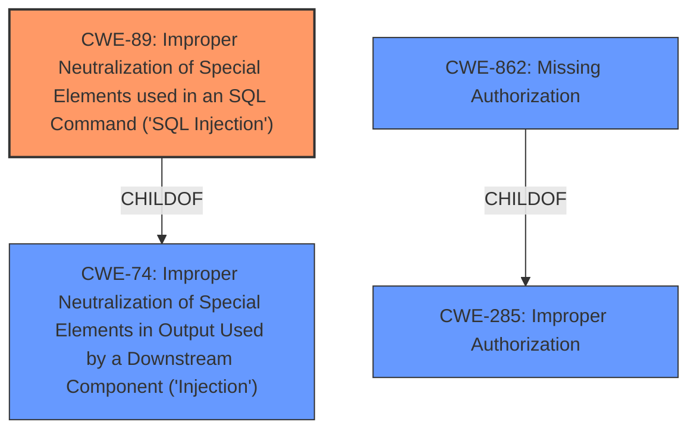

# Raw Analyzer Response for CVE-2021-24928

# Summary
| CWE ID | CWE Name | Confidence | CWE Abstraction Level | CWE Vulnerability Mapping Label | CWE-Vulnerability Mapping Notes |
|---|---|---|---|---|---|
| CWE-89 | Improper Neutralization of Special Elements used in an SQL Command ('SQL Injection') | 1.0 | Base | Allowed | Primary CWE |
| CWE-862 | Missing Authorization | 0.7 | Class | Allowed-with-Review | Secondary Candidate |

## Evidence and Confidence

*   **Confidence Score:** 0.9
*   **Evidence Strength:** HIGH

## Relationship Analysis
The primary relationship is that CWE-89 [CWE-89: Improper Neutralization of Special Elements used in an SQL Command ('SQL Injection')] is a child of CWE-74 [CWE-74: Improper Neutralization of Special Elements in Output Used by a Downstream Component ('Injection')]. CWE-862 [CWE-862: Missing Authorization] is a child of CWE-285 [CWE-285: Improper Authorization]. The selection of CWE-89 is preferred due to its base level of abstraction and direct match with the **SQL injection** vulnerability. CWE-862 is also relevant due to the **improper access controls**, but less directly related than the **SQL injection** itself. The graph relationships confirm that CWE-89 is a common weakness type, further solidifying the choice.

## Vulnerability Chain
The vulnerability chain starts with **improper access controls** and lack of validation of user input which leads to the **SQL injection**. The impact is that an attacker can modify arbitrary post content and exfiltrate data.

## Summary of Analysis
The initial analysis identified the **SQL injection** as the primary vulnerability due to the lack of validation and escaping of user-supplied data. The retriever results strongly support CWE-89 [CWE-89: Improper Neutralization of Special Elements used in an SQL Command ('SQL Injection')], with a score of 1.0. The vulnerability description also mentions **improper access controls**, which suggests a secondary weakness related to authorization.

The final decision is to map the vulnerability to CWE-89 [CWE-89: Improper Neutralization of Special Elements used in an SQL Command ('SQL Injection')] as the primary CWE, given the strong evidence and retriever score. Additionally, CWE-862 [CWE-862: Missing Authorization] is included as a secondary CWE due to the **improper access controls**.

CWE-79 [CWE-79: Improper Neutralization of Input During Web Page Generation ('Cross-site Scripting')] was considered because the impact includes the ability to inject XSS payloads, but this is a consequence of the **SQL injection**, not a separate vulnerability. CWE-352 [CWE-352: Cross-Site Request Forgery (CSRF)] was also considered but deemed not applicable because there's no mention of CSRF in the vulnerability description. CWE-434 [CWE-434: Unrestricted Upload of File with Dangerous Type] was not considered because the vulnerability description doesn't involve file uploads.

The selected CWEs are at the optimal level of specificity because CWE-89 [CWE-89: Improper Neutralization of Special Elements used in an SQL Command ('SQL Injection')] directly addresses the **SQL injection** issue, and CWE-862 [CWE-862: Missing Authorization] highlights the **improper access controls**.