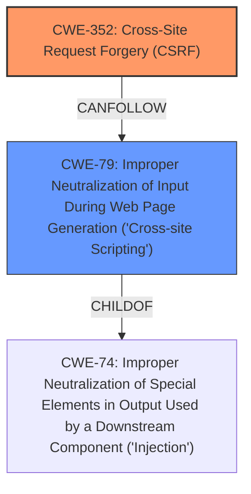

# Analysis for CVE-2021-24936

# Summary
| CWE ID | CWE Name | Confidence | CWE Abstraction Level | CWE Vulnerability Mapping Label | CWE-Vulnerability Mapping Notes |
|---|---|---|---|---|---|
| CWE-352 | Cross-Site Request Forgery (CSRF) | 1.0 | Compound | Allowed | Primary CWE |
| CWE-79 | Improper Neutralization of Input During Web Page Generation ('Cross-site Scripting') | 1.0 | Base | Allowed | Secondary CWE |

## Evidence and Confidence

*   **Confidence Score:** 1.0
*   **Evidence Strength:** HIGH

## Relationship Analysis
The primary weakness is the **lack of CSRF check**, which allows an attacker to perform actions on behalf of a logged-in user without their consent. This maps directly to CWE-352, Cross-Site Request Forgery (CSRF). The secondary weakness is the **cross-site scripting** vulnerability, which arises from the failure to sanitize and escape settings, leading to potential injection of malicious JavaScript code. This aligns with CWE-79, Improper Neutralization of Input During Web Page Generation ('Cross-site Scripting').

## Vulnerability Chain
The chain of events is as follows:
1.  **Root Cause:** **Lack of CSRF check** (CWE-352) allows unauthorized requests.
2.  **Weakness:** Settings are not sanitized or escaped, leading to potential Cross-Site Scripting (CWE-79).
3.  **Impact:** An attacker can inject malicious JavaScript code that executes in the administrator's browser, potentially leading to account compromise or further malicious actions.

## Summary of Analysis
Based on the provided evidence, the primary vulnerability is the **lack of CSRF check** (CWE-352), and the secondary vulnerability is the **cross-site scripting** (CWE-79).

The evidence is strong: "The WP Extra File Types WordPress plugin before 0.5.1 does not have CSRF check when saving its settings, nor sanitise and escape some of them, which could allow attackers to make a logged in admin change them and perform Cross-Site Scripting attacks". This directly supports the selection of CWE-352 and CWE-79.

CWE-352 is at the Compound level, which is acceptable in this case as it accurately represents the complex nature of CSRF vulnerabilities. CWE-79 is at the Base level, which is the preferred level of abstraction.

Other CWEs were considered but not selected:

*   CWE-116 (Improper Encoding or Escaping of Output): While relevant to the XSS aspect, CWE-79 is a more specific and appropriate classification.
*   CWE-862 (Missing Authorization) and CWE-863 (Incorrect Authorization): These relate to authorization issues, but the primary issue is the **lack of CSRF protection**, which is better captured by CWE-352.
*   CWE-434 (Unrestricted Upload of File with Dangerous Type): This is not applicable as the vulnerability does not involve file uploads.
*   CWE-472 (External Control of Assumed-Immutable Web Parameter) and CWE-471 (Modification of Assumed-Immutable Data (MAID)): These are related to tampering with data, but the core issue is the **lack of CSRF protection**.

The final selection of CWE-352 and CWE-79 is based on direct evidence and their specific alignment with the vulnerability's root cause and resulting weakness.