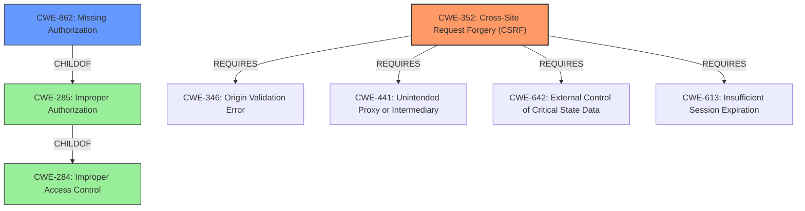

# Analysis Report for CVE-2021-24945

# Vulnerability Analysis Report: CVE-2021-24945

## Description


## Analysis (with Relationship Data)

# Summary
| CWE ID | CWE Name | Confidence | CWE Abstraction Level | CWE Vulnerability Mapping Label | CWE-Vulnerability Mapping Notes |
|---|---|---|---|---|---|
| CWE-352 | Cross-Site Request Forgery (CSRF) | 0.9 | Compound | Allowed | Primary CWE |
| CWE-862 | Missing Authorization | 0.9 | Class | Allowed-with-Review | Secondary CWE |

## Evidence and Confidence

*   **Confidence Score:** 0.9
*   **Evidence Strength:** HIGH

## Relationship Analysis
The primary CWE, CWE-352 [CWE-352: Cross-Site Request Forgery (CSRF)], requires the co-occurrence of other weaknesses, particularly a **missing** CSRF token validation. This aligns with the vulnerability description explicitly stating "**missing** CSRF checks". CWE-862 [CWE-862: Missing Authorization] (secondary) is a ChildOf CWE-285 [CWE-285: Improper Authorization] and CWE-284 [CWE-284: Improper Access Control]. The relationship highlights the lack of any authorization mechanism, which is a key component of the vulnerability. The selection of CWE-352 [CWE-352: Cross-Site Request Forgery (CSRF)] as compound, and CWE-862 [CWE-862: Missing Authorization] as Class, indicates the identification of a multi-faceted weakness.



## Vulnerability Chain
The chain begins with the **missing authorization** (CWE-862 [CWE-862: Missing Authorization]) and CSRF checks. The absence of these checks in the `likebtn_export_votes` AJAX action allows any authenticated user to trigger the export function without proper validation. This leads to the **sensitive data disclosure** of email and IP addresses.

## Summary of Analysis
The analysis is based on the provided vulnerability description, particularly the key phrases and CVE reference links content summary. The core **root cause** is the "**missing authorisation and CSRF checks**" in the specified AJAX action.

The vulnerability description explicitly mentions the lack of authorization and CSRF checks. The CVE reference links content summary confirms this, stating: "**Missing Authorization:** The AJAX action does not verify if the user is authorized to perform the export." and "**Missing CSRF Protection:** The action is vulnerable to Cross-Site Request Forgery (CSRF) attacks."

The selection of CWE-352 [CWE-352: Cross-Site Request Forgery (CSRF)] and CWE-862 [CWE-862: Missing Authorization] is based on direct evidence from the vulnerability description and the CVE reference summary. The graph relationships clarify the hierarchical structure, with CWE-862 [CWE-862: Missing Authorization] being a specific type of improper authorization (CWE-285 [CWE-285: Improper Authorization]) and access control issue (CWE-284 [CWE-284: Improper Access Control]).

CWE-863 [CWE-863: Incorrect Authorization] was considered, but not selected because the vulnerability description clearly indicates a complete **absence** of authorization checks, rather than an incorrectly implemented one. CWE-425 [CWE-425: Direct Request ('Forced Browsing')] was also considered but it is more suitable when authorization is not adequately enforced on restricted URLs and is not a primary weakness when authorization is missing.


## CWE Relationship Analysis

Current CWEs represent these abstraction levels: .


### Vulnerability Chain Analysis

**Chain starting from CWE-862:**
- 862 (Missing Authorization) - ROOT


**Chain starting from CWE-284:**
- 284 (Improper Access Control) - ROOT


### CWE Relationship Diagram

```mermaid
graph TD
    classDef primary fill:#f96,stroke:#333,stroke-width:2px
    classDef secondary fill:#69f,stroke:#333
    classDef tertiary fill:#9e9,stroke:#333
```


*Report generated on 2025-04-02 08:38:21*
