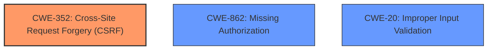

# Enhanced Analysis for CVE-2021-24947

# Summary
| CWE ID  | CWE Name                                                                                                  | Confidence | CWE Abstraction Level | CWE Vulnerability Mapping Label | CWE-Vulnerability Mapping Notes |
| :-------- | :---------------------------------------------------------------------------------------------------------- | :----------- | :---------------------- | :------------------------------ | :-------------------------------- |
| CWE-352   | Cross-Site Request Forgery (CSRF)                                                                         | 0.9          | Compound                | Primary                         | Allowed                           |
| CWE-862   | Missing Authorization                                                                                       | 0.8          | Class                   | Secondary                       | Allowed-with-Review             |
| CWE-20    | Improper Input Validation                                                                                       | 0.7          | Class                   | Secondary                       | Allowed-with-Review             |

## Evidence and Confidence

*   **Confidence Score:** 0.8
*   **Evidence Strength:** HIGH

## Relationship Analysis
The vulnerability involves **missing CSRF checks**, **improper authorization**, and **lack of validation**. CWE-352 [Cross-Site Request Forgery (CSRF)] directly addresses the **missing CSRF checks**. CWE-862 [Missing Authorization] covers the **improper authorization** aspect, and CWE-20 [Improper Input Validation] addresses the **lack of validation** on the input parameter. These issues combined allow unauthorized access to sensitive functionality, enabling reading of arbitrary files.



## Vulnerability Chain
The vulnerability chain starts with:
1.  **Missing CSRF checks** (CWE-352)
2.  **Improper authorization** (CWE-862), allowing access to the AJAX action
3.  **Lack of validation** (CWE-20) on the `rvm_upload_regions_file_path` parameter
4.  Resulting in the ability to read arbitrary files on the web server.

## Summary of Analysis
The initial assessment identified several potential CWEs, with CWE-352 [Cross-Site Request Forgery (CSRF)], CWE-862 [Missing Authorization], and CWE-20 [Improper Input Validation] being the most relevant. The vulnerability description clearly states the **lack of CSRF checks**, **improper authorization**, and **lack of validation** on the `rvm_upload_regions_file_path` parameter, directly supporting the selection of these CWEs. The ability to **read arbitrary files** is the impact, resulting from these weaknesses, specifically when any authenticated user, even a subscriber, can trigger the `rvm_import_regions AJAX` action.

The decision to include CWE-352 [Cross-Site Request Forgery (CSRF)] as the primary CWE is based on the explicit mention of **missing CSRF checks** in the vulnerability description. CWE-862 [Missing Authorization] is selected because the vulnerability description states **improper authorization**, allowing any authenticated user to access the AJAX action. CWE-20 [Improper Input Validation] is selected as a secondary CWE due to the **lack of validation** on the `rvm_upload_regions_file_path` parameter, which allows reading of arbitrary files.

The selected CWEs are at an appropriate level of specificity, with CWE-352 [Cross-Site Request Forgery (CSRF)] being a compound CWE that accurately represents the **missing CSRF check**, and CWE-862 [Missing Authorization] and CWE-20 [Improper Input Validation] being Class level CWEs that adequately describe the **improper authorization** and **lack of validation**, respectively.

Relevant CWE Information:

# Enhanced Context (25 CWEs)
The following CWEs were identified as potentially relevant to this vulnerability:

## CWE-434: Unrestricted Upload of File with Dangerous Type
**Abstraction Level**: Base
**Similarity Score**: 0.74
**Source**: dense

**Description**:
The product allows the upload or transfer of dangerous file types that are automatically processed within its environment.

**Mapping Guidance**:
- Usage: Allowed
- Rationale: This CWE entry is at the Base level of abstraction, which is a preferred level of abstraction for mapping to the root causes of vulnerabilities.


## CWE-425: Direct Request ('Forced Browsing')
**Abstraction Level**: Base
**Similarity Score**: 0.73
**Source**: dense

**Description**:
The web application does not adequately enforce appropriate authorization on all restricted URLs, scripts, or files.

**Mapping Guidance**:
- Usage: Allowed
- Rationale: This CWE entry is at the Base level of abstraction, which is a preferred level of abstraction for mapping to the root causes of vulnerabilities.


## CWE-472: External Control of Assumed-Immutable Web Parameter
**Abstraction Level**: Base
**Similarity Score**: 0.73
**Source**: dense

**Description**:
The web application does not sufficiently verify inputs that are assumed to be immutable but are actually externally controllable, such as hidden form fields.

**Mapping Guidance**:
- Usage: Allowed
- Rationale: This CWE entry is at the Base level of abstraction, which is a preferred level of abstraction for mapping to the root causes of vulnerabilities.


## CWE-352: Cross-Site Request Forgery (CSRF)
**Abstraction Level**: Compound
**Similarity Score**: 0.72
**Source**: dense

**Description**:
The web application does not, or can not, sufficiently verify whether a well-formed, valid, consistent request was intentionally provided by the user who submitted the request.

**Mapping Guidance**:
- Usage: Allowed
- Rationale: This is a well-known Composite of multiple weaknesses that must all occur simultaneously, although it is attack-oriented in nature.


## CWE-74: Improper Neutralization of Special Elements in Output Used by a Downstream Component ('Injection')
**Abstraction Level**: Class
**Similarity Score**: 0.72
**Source**: dense

**Description**:
The product constructs all or part of a command, data structure, or record using externally-influenced input from an upstream component, but it does not neutralize or incorrectly neutralizes special elements that could modify how it is parsed or interpreted when it is sent to a downstream component.

**Mapping Guidance**:
- Usage: Discouraged
- Rationale: CWE-74 is high-level and often misused when lower-level weaknesses are more appropriate.


## CWE-807: Reliance on Untrusted Inputs in a Security Decision
**Abstraction Level**: Base
**Similarity Score**: 0.71
**Source**: dense

**Description**:
The product uses a protection mechanism that relies on the existence or values of an input, but the input can be modified by an untrusted actor in a way that bypasses the protection mechanism.

**Mapping Guidance**:
- Usage: Allowed
- Rationale: This CWE entry is at the Base level of abstraction, which is a preferred level of abstraction for mapping to the root causes of vulnerabilities.


## CWE-502: Deserialization of Untrusted Data
**Abstraction Level**: Base
**Similarity Score**: 0.71
**Source**: dense

**Description**:
The product deserializes untrusted data without sufficiently ensuring that the resulting data will be valid.

**Mapping Guidance**:
- Usage: Allowed
- Rationale: This CWE entry is at the Base level of abstraction, which is a preferred level of abstraction for mapping to the root causes of vulnerabilities.


## CWE-138: Improper Neutralization of Special Elements
**Abstraction Level**: Class
**Similarity Score**: 0.71
**Source**: dense

**Description**:
The product receives input from an upstream component, but it does not neutralize or incorrectly neutralizes special elements that could be interpreted as control elements or syntactic markers when they are sent to a downstream component.

**Mapping Guidance**:
- Usage: Discouraged
- Rationale: This CWE entry is a level-1 Class (i.e., a child of a Pillar). It might have lower-level children that would be more appropriate


## CWE-116: Improper Encoding or Escaping of Output
**Abstraction Level**: Class
**Similarity Score**: 0.71
**Source**: dense

**Description**:
The product prepares a structured message for communication with another component, but encoding or escaping of the data is either missing or done incorrectly. As a result, the intended structure of the message is not preserved.

**Mapping Guidance**:
- Usage: Allowed-with-Review
- Rationale: This CWE entry is a Class and might have Base-level children that would be more appropriate


## CWE-303: Incorrect Implementation of Authentication Algorithm
**Abstraction Level**: Base
**Similarity Score**: 0.71
**Source**: dense

**Description**:
The requirements for the product dictate the use of an established authentication algorithm, but the implementation of the algorithm is incorrect.

**Mapping Guidance**:
- Usage: Allowed
- Rationale: This CWE entry is


## CWE Relationship Analysis

Current CWEs represent these abstraction levels: .


### Vulnerability Chain Analysis

**Chain starting from CWE-502:**
- 502 (Deserialization of Untrusted Data) - ROOT


**Chain starting from CWE-303:**
- 303 (Incorrect Implementation of Authentication Algorithm) - ROOT


### CWE Relationship Diagram

```mermaid
graph TD
    classDef primary fill:#f96,stroke:#333,stroke-width:2px
    classDef secondary fill:#69f,stroke:#333
    classDef tertiary fill:#9e9,stroke:#333
```