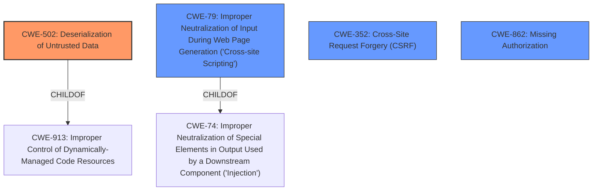

# Analysis Report for CVE-2021-24950

# Vulnerability Analysis Report: CVE-2021-24950

## Description


## Analysis (with Relationship Data)

# Summary
| CWE ID | CWE Name | Confidence | CWE Abstraction Level | CWE Vulnerability Mapping Label | CWE-Vulnerability Mapping Notes |
|---|---|---|---|---|---|
| CWE-502 | Deserialization of Untrusted Data | 1.0 | Base | Allowed | Primary CWE |
| CWE-79 | Improper Neutralization of Input During Web Page Generation ('Cross-site Scripting') | 0.9 | Base | Allowed | Secondary CWE |
| CWE-352 | Cross-Site Request Forgery (CSRF) | 0.8 | Compound | Allowed | Secondary CWE |
| CWE-862 | Missing Authorization | 0.8 | Class | Allowed-with-Review | Secondary CWE |

## Evidence and Confidence

*   **Confidence Score:** 0.9
*   **Evidence Strength:** HIGH

## Relationship Analysis
The primary weakness is **CWE-502 [Deserialization of Untrusted Data]**, which is a **Base** level CWE. This is related to **CWE-913 [Improper Control of Dynamically-Managed Code Resources]** as its child.
The secondary weakness is **CWE-79 [Improper Neutralization of Input During Web Page Generation ('Cross-site Scripting')]**, which is a **Base** level CWE.
**CWE-352 [Cross-Site Request Forgery (CSRF)]** is also present.
**CWE-862 [Missing Authorization]** is a class level CWE.



## Vulnerability Chain
The vulnerability chain starts with a **lack of authorization and CSRF checks** (**CWE-862 [Missing Authorization]** and **CWE-352 [Cross-Site Request Forgery (CSRF)]**), leading to **unvalidated user input passed to `unserialize()`** (**CWE-502 [Deserialization of Untrusted Data]**), and culminating in **improper sanitization/escaping before output** (**CWE-79 [Improper Neutralization of Input During Web Page Generation ('Cross-site Scripting')]**), which allows for Stored Cross-Site Scripting attacks.

## Summary of Analysis
The primary CWE is **CWE-502 [Deserialization of Untrusted Data]**. The vulnerability description clearly states that the plugin **does not validate user input before passing it to `unserialize()`**. The CVE Reference Links Content Summary confirms this, stating that the root cause is that the plugin "fails to validate user input before passing it to `unserialize()`." This aligns directly with the description of CWE-502, which states: "The product deserializes untrusted data without sufficiently ensuring that the resulting data will be valid."
The secondary CWEs are **CWE-79 [Improper Neutralization of Input During Web Page Generation ('Cross-site Scripting')]**, **CWE-352 [Cross-Site Request Forgery (CSRF)]**, and **CWE-862 [Missing Authorization]**. The vulnerability description indicates that the plugin **does not sanitise and escape it before outputting it in the response** allowing for Cross-Site Scripting. It also lacks any authorisation and CSRF checks which are represented by CWE-862 and CWE-352 respectively.

The chosen CWEs are at the optimal level of specificity. While **CWE-913 [Improper Control of Dynamically-Managed Code Resources]** is a parent of **CWE-502 [Deserialization of Untrusted Data]**, CWE-502 is a more precise description of the vulnerability. Similarly, while **CWE-74 [Improper Neutralization of Special Elements in Output Used by a Downstream Component ('Injection')]** is a parent of **CWE-79 [Improper Neutralization of Input During Web Page Generation ('Cross-site Scripting')]**, CWE-79 more specifically describes the Cross-Site Scripting issue. **CWE-862 [Missing Authorization]** is chosen because it is more descriptive than its parent **CWE-285 [Improper Authorization]**.
**CWE-116 [Improper Encoding or Escaping of Output]** was considered, but **CWE-79 [Improper Neutralization of Input During Web Page Generation ('Cross-site Scripting')]** is a more specific match because the lack of sanitization leads directly to XSS.
**CWE-94 [Improper Control of Generation of Code ('Code Injection')]** was considered, but is not the best fit because the **rootcause** is the deserialization of untrusted data.


## CWE Relationship Analysis

Current CWEs represent these abstraction levels: .


### Vulnerability Chain Analysis

**Chain starting from CWE-502:**
- 502 (Deserialization of Untrusted Data) - ROOT


**Chain starting from CWE-79:**
- 79 (Improper Neutralization of Input During Web Page Generation ('Cross-site Scripting')) - ROOT


### CWE Relationship Diagram

```mermaid
graph TD
    classDef primary fill:#f96,stroke:#333,stroke-width:2px
    classDef secondary fill:#69f,stroke:#333
    classDef tertiary fill:#9e9,stroke:#333
```


*Report generated on 2025-04-02 01:13:39*
