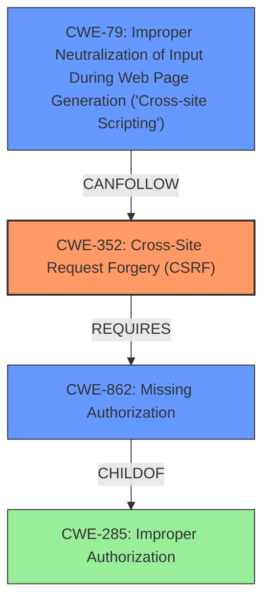

# Analysis for CVE-2021-24958

# Summary
| CWE ID | CWE Name | Confidence | CWE Abstraction Level | CWE Vulnerability Mapping Label | CWE-Vulnerability Mapping Notes |
|---|---|---|---|---|---|
| CWE-352 | Cross-Site Request Forgery (CSRF) | 0.9 | Compound | Allowed | Primary CWE |
| CWE-79 | Improper Neutralization of Input During Web Page Generation ('Cross-site Scripting') | 0.9 | Base | Allowed | Secondary CWE |
| CWE-862 | Missing Authorization | 0.8 | Class | Allowed-with-Review | Secondary CWE |

## Evidence and Confidence

*   **Confidence Score:** 0.9
*   **Evidence Strength:** HIGH

## Relationship Analysis
The vulnerability involves both a **lack of CSRF protection** and **missing authorization checks**, leading to a **cross-site scripting vulnerability**. CWE-352 (Cross-Site Request Forgery) is a Compound CWE. CWE-862 (Missing Authorization) and CWE-79 (Improper Neutralization of Input During Web Page Generation) are contributing factors, with CWE-79 leading to the **cross-site scripting** issue.

## Vulnerability Chain
The vulnerability chain starts with **missing CSRF protection** and **missing authorization checks**. This allows authenticated users, including subscribers, to modify plugin settings. These settings are not properly sanitized, leading to a **cross-site scripting vulnerability** when the settings are rendered in a web page.

## Summary of Analysis
The analysis indicates a high confidence in assigning CWE-352 (Cross-Site Request Forgery), CWE-79 (Improper Neutralization of Input During Web Page Generation), and CWE-862 (Missing Authorization). The evidence from the vulnerability description and CVE Reference Links Content Summary clearly shows the **lack of capability and CSRF checks** which allows an authenticated user to inject **cross-site scripting** payloads. This corresponds directly with the definitions and characteristics of these CWEs. The relationship analysis further supports the selection of these CWEs, highlighting the interdependencies and potential vulnerability chains.

The primary weakness is the **lack of CSRF protection** (CWE-352) as the AJAX action `meks_save_business_selected_account` does not validate the origin of the request. The secondary issues are the **missing authorization checks** (CWE-862), allowing any authenticated user (including subscribers) to modify plugin settings and **improper neutralization of input** (CWE-79), leading to the **cross-site scripting vulnerability**.

CWE-285 (Improper Authorization) was considered but not selected as the evidence points to **missing** rather than **improper** authorization. CWE-862 (Missing Authorization) is a child of CWE-285 and more accurately reflects the **lack of authorization** checks.

The selected CWEs are at the optimal level of specificity, with CWE-352 at the Compound level, and CWE-79 and CWE-862 at the Base and Class level respectively. They are well-supported by the evidence and align with the MITRE mapping guidance.