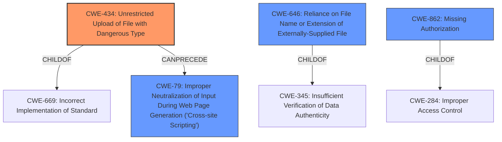

# Enhanced Analysis for CVE-2021-24960

# Summary
| CWE ID | CWE Name | Confidence | CWE Abstraction Level | CWE Vulnerability Mapping Label | CWE-Vulnerability Mapping Notes |
|---|---|---|---|---|---|
| CWE-434 | Unrestricted Upload of File with Dangerous Type | 0.9 | Base | Allowed | Primary CWE |
| CWE-79 | Improper Neutralization of Input During Web Page Generation ('Cross-site Scripting') | 0.7 | Base | Allowed | Secondary Candidate |
| CWE-646 | Reliance on File Name or Extension of Externally-Supplied File | 0.6 | Variant | Allowed | Secondary Candidate |
| CWE-862 | Missing Authorization | 0.5 | Class | Allowed-with-Review | Secondary Candidate |

## Evidence and Confidence

*   **Confidence Score:** 0.8
*   **Evidence Strength:** HIGH

## Relationship Analysis
The primary CWE is CWE-434, which is a Base level weakness. It is related to other CWEs through peer and child relationships. Specifically, CWE-434 has a peer relationship with CWE-430 (Deployment of Wrong Handler) and is a child of CWE-669 (Incorrect Implementation of Standard). CWE-79 (Improper Neutralization of Input During Web Page Generation ('Cross-site Scripting')) can be a consequence of CWE-434 if the uploaded file is not properly sanitized, leading to XSS. CWE-646 (Reliance on File Name or Extension of Externally-Supplied File) is a Variant of CWE-345 (Insufficient Verification of Data Authenticity). CWE-862 (Missing Authorization) is a Class-level weakness and parent of CWE-425 (Direct Request) and Child of CWE-284 (Improper Access Control).


## Vulnerability Chain
The vulnerability chain starts with **improper access control**, allowing a user with Contributor role to configure the upload form. This leads to **unrestricted upload of file with dangerous type** (SVG). The SVG file is then used for Cross-Site Scripting attacks. The complete chain is: **Improper Access Control** -> **Unrestricted Upload of File with Dangerous Type** -> **Cross-Site Scripting**.

## Summary of Analysis
Initially, the vulnerability allows a Contributor to configure upload settings to permit SVG file uploads. The core issue is the **unrestricted upload of a file with a dangerous type**, which directly enables the XSS vulnerability. The analysis is based on the provided evidence, especially the "CVE Reference Links Content Summary" which highlights "insufficient sanitization of user-controlled upload patterns" and "Improper Access Control."

The primary CWE is CWE-434 because the **root cause** of the vulnerability is the ability to upload a dangerous file type (SVG) without proper restrictions. This is supported by the CVE summary stating "The root cause of the vulnerability is the insufficient sanitization of upload patterns, allowing malicious SVG files containing JavaScript to be uploaded and executed. The plugin fails to properly blacklist SVG files."

CWE-79 is considered as a secondary candidate because the uploaded SVG file is used to perform Cross-Site Scripting attacks, but this is a consequence of the unrestricted upload.

CWE-646 is a secondary candidate because the application relies on the file extension to determine how to process the file. If the file extension is not properly validated, it can lead to the file being misclassified and processed in a dangerous manner.

CWE-862 is considered as a secondary candidate because the **improper access control** allows a user with Contributor role to configure upload settings to permit SVG file uploads, which they should not be able to do.

The selected CWEs are at the optimal level of specificity because they directly address the **root cause** (CWE-434) and the immediate consequences (CWE-79). Choosing a higher-level CWE would not accurately represent the specific vulnerability.

Relevant CWE Information:

# Enhanced Context (25 CWEs)

## CWE-434: Unrestricted Upload of File with Dangerous Type
**Abstraction Level**: Base
**Similarity Score**: 0.76
**Source**: dense

**Description**:
The product allows the upload or transfer of dangerous file types that are automatically processed within its environment.

**Mapping Guidance**:
- Usage: Allowed
- Rationale: This CWE entry is at the Base level of abstraction, which is a preferred level of abstraction for mapping to the root causes of vulnerabilities.

## CWE-79: Improper Neutralization of Input During Web Page Generation ('Cross-site Scripting')
**Abstraction Level**: Base
**Similarity Score**: 7149.92
**Source**: sparse

**Description**:
The product does not neutralize or incorrectly neutralizes user-controllable input before it is placed in output that is used as a web page that is served to other users.

**Mapping Guidance**:
- Usage: Allowed
- Rationale: This CWE entry is at the Base level of abstraction, which is a preferred level of abstraction for mapping to the root causes of vulnerabilities.

## CWE-646: Reliance on File Name or Extension of Externally-Supplied File
**Abstraction Level**: Variant
**Similarity Score**: 0.529
**Source**: dense

**Description**:
The product allows a file to be uploaded, but it relies on the file name or extension of the file to determine the appropriate behaviors. This could be used by attackers to cause the file to be misclassified and processed in a dangerous fashion.

**Mapping Guidance**:
- Usage: Allowed
- Rationale: This CWE entry is at the Variant level of abstraction, which is a preferred level of abstraction for mapping to the root causes of vulnerabilities.

## CWE-862: Missing Authorization
**Abstraction Level**: Class
**Similarity Score**: 0.354
**Source**: sparse

**Description**:
The product does not perform an authorization check when an actor attempts to access a resource or perform an action.

**Mapping Guidance**:
- Usage: Allowed-with-Review
- Rationale: This CWE entry is a Class and might have Base-level children that would be more appropriate


## CWE Relationship Analysis

Current CWEs represent these abstraction levels: .


### Vulnerability Chain Analysis

**Chain starting from CWE-646:**
- 646 (Reliance on File Name or Extension of Externally-Supplied File) - ROOT


**Chain starting from CWE-79:**
- 79 (Improper Neutralization of Input During Web Page Generation ('Cross-site Scripting')) - ROOT


### CWE Relationship Diagram

```mermaid
graph TD
    classDef primary fill:#f96,stroke:#333,stroke-width:2px
    classDef secondary fill:#69f,stroke:#333
    classDef tertiary fill:#9e9,stroke:#333
```