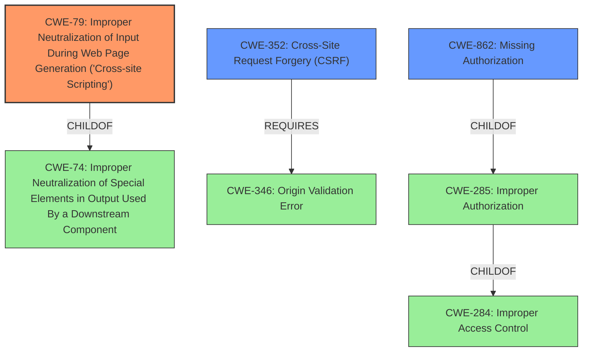

# Analysis for CVE-2021-24965

# Summary
| CWE ID | CWE Name | Confidence | CWE Abstraction Level | CWE Vulnerability Mapping Label | CWE-Vulnerability Mapping Notes |
|---|---|---|---|---|---|
| CWE-79 | Improper Neutralization of Input During Web Page Generation ('Cross-site Scripting') | 1.0 | Base | Primary | Allowed |
| CWE-352 | Cross-Site Request Forgery (CSRF) | 0.9 | Compound | Secondary | Allowed |
| CWE-862 | Missing Authorization | 0.8 | Class | Secondary | Allowed-with-Review |

## Evidence and Confidence

*   **Confidence Score:** 0.9
*   **Evidence Strength:** HIGH

## Relationship Analysis
The primary weakness is CWE-79 [Improper Neutralization of Input During Web Page Generation ('Cross-site Scripting')] because the plugin does not properly sanitize or escape user-provided input, allowing for XSS attacks. CWE-79 [Improper Neutralization of Input During Web Page Generation ('Cross-site Scripting')] is a child of CWE-74 [Improper Neutralization of Special Elements in Output Used By a Downstream Component]. There is also a secondary weakness of CWE-352 [Cross-Site Request Forgery (CSRF)] due to the **lack of CSRF checks** in the `rtb_welcome_set_schedule` AJAX action. CWE-352 [Cross-Site Request Forgery (CSRF)] requires CWE-346 [Origin Validation Error]. Another weakness is CWE-862 [Missing Authorization] due to the **lack of capability checks** in the `rtb_welcome_set_schedule` AJAX action, allowing any authenticated user to call it. CWE-862 [Missing Authorization] is a child of CWE-285 [Improper Authorization] and CWE-284 [Improper Access Control].

## Vulnerability Chain
The vulnerability chain starts with the **lack of sanitisation and escaping** of user-provided input, leading to CWE-79 [Improper Neutralization of Input During Web Page Generation ('Cross-site Scripting')]. The **lack of CSRF checks** leads to CWE-352 [Cross-Site Request Forgery (CSRF)]. The **lack of capability checks** leads to CWE-862 [Missing Authorization], allowing low-privileged users to trigger the vulnerable function.

## Summary of Analysis
The analysis is based on the provided vulnerability description and the CVE Reference Links Content Summary. The primary weakness is CWE-79 [Improper Neutralization of Input During Web Page Generation ('Cross-site Scripting')] due to the **lack of sanitisation and escaping**. The supporting evidence is: "Due to the **lack of sanitisation and escaping**, users with a role as low as subscriber could perform Cross-Site Scripting attacks against logged in admins". The secondary weaknesses are CWE-352 [Cross-Site Request Forgery (CSRF)] and CWE-862 [Missing Authorization] because of the **lack of CSRF and capability checks**, respectively. The supporting evidence is: "The `rtb_welcome_set_schedule` AJAX action in the Five Star Restaurant Reservations plugin lacks capability and CSRF checks, allowing any authenticated user to call it".

The selected CWEs are at the optimal level of specificity because they accurately represent the weaknesses described in the vulnerability description. CWE-79 [Improper Neutralization of Input During Web Page Generation ('Cross-site Scripting')] is a base CWE, and it directly addresses the **lack of sanitisation and escaping**. CWE-352 [Cross-Site Request Forgery (CSRF)] is a compound CWE that represents the **lack of CSRF checks**. CWE-862 [Missing Authorization] is a class CWE that represents the **lack of capability checks**.

Relevant CWE Information:

*   **CWE-79 [Improper Neutralization of Input During Web Page Generation ('Cross-site Scripting')]**: The product does not neutralize or incorrectly neutralizes user-controllable input before it is placed in output that is used as a web page that is served to other users. This matches the vulnerability description because the plugin does not sanitize or escape user-provided input before storing it.
*   **CWE-352 [Cross-Site Request Forgery (CSRF)]**: The web application does not, or can not, sufficiently verify whether a well-formed, valid, consistent request was intentionally provided by the user who submitted the request. This matches the vulnerability description because the plugin lacks CSRF checks in the `rtb_welcome_set_schedule` AJAX action.
*   **CWE-862 [Missing Authorization]**: The product does not perform an authorization check when an actor attempts to access a resource or perform an action. This matches the vulnerability description because the plugin lacks capability checks in the `rtb_welcome_set_schedule` AJAX action, allowing any authenticated user to call it.