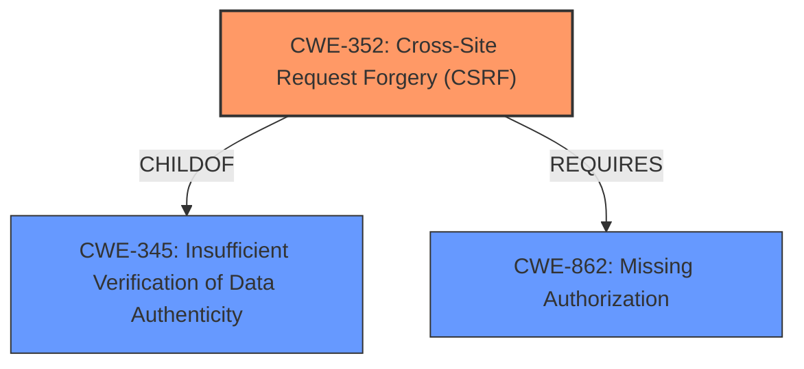

# Analysis for CVE-2021-24968

# Summary
| CWE ID | CWE Name | Confidence | CWE Abstraction Level | CWE Vulnerability Mapping Label | CWE-Vulnerability Mapping Notes |
|---|---|---|---|---|---|
| CWE-352 | Cross-Site Request Forgery (CSRF) | 1.0 | Compound | Allowed | Primary CWE |
| CWE-862 | Missing Authorization | 1.0 | Class | Allowed-with-Review | Secondary Candidate |

## Evidence and Confidence

*   **Confidence Score:** 1.0
*   **Evidence Strength:** HIGH

## Relationship Analysis
The analysis focuses on the relationship between **CWE-352 (Cross-Site Request Forgery)** and **CWE-862 (Missing Authorization)**.

**CWE-352** is a compound weakness that requires multiple conditions to be met, indicating a complex vulnerability.
**CWE-862** is a class-level weakness, representing a more general category of missing authorization checks.

The primary relationship is that **CWE-352** often involves a **missing authorization check (CWE-862)**, as the request is not properly validated to ensure it originates from a legitimate user action.

## Vulnerability Chain
The vulnerability chain begins with the **lack of capability and CSRF checks**, leading to the ability for low-privilege users to create FAQ and FAQ questions.

1.  **Root Cause:** Missing capability and CSRF checks in AJAX actions.
2.  **Weakness:** **CWE-352 (Cross-Site Request Forgery)** due to **lack of CSRF checks**.
3.  **Weakness:** **CWE-862 (Missing Authorization)** due to **lack of capability checks**.
4.  **Impact:** Unauthorized users can create FAQ and FAQ questions.

## Summary of Analysis
The initial analysis identified the **lack of capability and CSRF checks** as the primary issue. The evidence from the vulnerability description key phrases and CVE reference links content summary strongly supports this.

The relationship analysis highlights that **CWE-352** and **CWE-862** are closely related, with **CWE-352** often requiring a missing authorization check.

The final decision is based on the evidence from the vulnerability description, which explicitly mentions the **lack of capability and CSRF checks**.

*   **CWE-352 (Cross-Site Request Forgery)** is selected as the primary CWE because the vulnerability description and CVE summary both clearly state the **lack of CSRF checks** as a root cause. This allows any authenticated user to perform actions on behalf of another user without their consent.
*   **CWE-862 (Missing Authorization)** is selected as a secondary CWE because the vulnerability also highlights the **lack of capability checks**. This means the system does not properly verify if the user has the necessary permissions to perform the requested action (creating FAQs and FAQ pages).

The selected CWEs are at the optimal level of specificity, with **CWE-352** being a compound weakness that accurately reflects the combination of factors contributing to the vulnerability, and **CWE-862** representing the specific authorization flaw.

Relevant CWE Information:

# Enhanced Context (25 CWEs)

## CWE-472: External Control of Assumed-Immutable Web Parameter
**Abstraction Level**: Base
**Similarity Score**: 0.77
**Source**: dense

**Description**:
The web application does not sufficiently verify inputs that are assumed to be immutable but are actually externally controllable, such as hidden form fields.

**Mapping Guidance**:
- Usage: Allowed
- Rationale: This CWE entry is at the Base level of abstraction, which is a preferred level of abstraction for mapping to the root causes of vulnerabilities.

**Not Used:** While this CWE could be considered, the primary issue is the **lack of CSRF and capability checks**, not the tampering of assumed-immutable parameters.

## CWE-1289: Improper Validation of Unsafe Equivalence in Input
**Abstraction Level**: Base
**Similarity Score**: 0.77
**Source**: dense

**Description**:
The product receives an input value that is used as a resource identifier or other type of reference, but it does not validate or incorrectly validates that the input is equivalent to a potentially-unsafe value.

**Mapping Guidance**:
- Usage: Allowed
- Rationale: This CWE entry is at the Base level of abstraction, which is a preferred level of abstraction for mapping to the root causes of vulnerabilities.

**Not Used:** This CWE doesn't directly apply as the issue isn't about validating equivalence to an unsafe value, but about **missing CSRF and capability checks**.

## CWE-74: Improper Neutralization of Special Elements in Output Used by a Downstream Component ('Injection')
**Abstraction Level**: Class
**Similarity Score**: 0.77
**Source**: dense

**Description**:
The product constructs all or part of a command, data structure, or record using externally-influenced input from an upstream component, but it does not neutralize or incorrectly neutralizes special elements that could modify how it is parsed or interpreted when it is sent to a downstream component.

**Mapping Guidance**:
- Usage: Discouraged
- Rationale: CWE-74 is high-level and often misused when lower-level weaknesses are more appropriate.

**Not Used:** This CWE is related to injection vulnerabilities, which are not the primary issue in this case. The **lack of CSRF and capability checks** is the root cause.

## CWE-639: Authorization Bypass Through User-Controlled Key
**Abstraction Level**: Base
**Similarity Score**: 0.76
**Source**: dense

**Description**:
The system's authorization functionality does not prevent one user from gaining access to another user's data or record by modifying the key value identifying the data.

**Mapping Guidance**:
- Usage: Allowed
- Rationale: This CWE entry is at the Base level of abstraction, which is a preferred level of abstraction for mapping to the root causes of vulnerabilities.

**Not Used**: The vulnerability is not about modifying a key to access another user's data, but rather about performing actions without proper authorization checks.

## CWE-116: Improper Encoding or Escaping of Output
**Abstraction Level**: Class
**Similarity Score**: 0.76
**Source**: dense

**Description**:
The product prepares a structured message for communication with another component, but encoding or escaping of the data is either missing or done incorrectly. As a result, the intended structure of the message is not preserved.

**Mapping Guidance**:
- Usage: Allowed-with-Review
- Rationale: This CWE entry is a Class and might have Base-level children that would be more appropriate

**Not Used**: This CWE is related to encoding/escaping issues, which are not the primary issue in this case. The **lack of CSRF and capability checks** is the root cause.

## CWE-184: Incomplete List of Disallowed Inputs
**Abstraction Level**: Base
**Similarity Score**: 0.76
**Source**: dense

**Description**:
The product implements a protection mechanism that relies on a list of inputs (or properties of inputs) that are not allowed by policy or otherwise require other action to neutralize before additional processing takes place, but the list is incomplete.

**Mapping Guidance**:
- Usage: Allowed
- Rationale: This CWE entry is at the Base level of abstraction, which is a preferred level of abstraction for mapping to the root causes of vulnerabilities.

**Not Used**: This CWE is about incomplete lists of disallowed inputs, not about **missing CSRF and capability checks**.

## CWE-807: Reliance on Untrusted Inputs in a Security Decision
**Abstraction Level**: Base
**Similarity Score**: 0.76
**Source**: dense

**Description**:
The product uses a protection mechanism that relies on the existence or values of an input, but the input can be modified by an untrusted actor in a way that bypasses the protection mechanism.

**Mapping Guidance**:
- Usage: Allowed
- Rationale: This CWE entry is at the Base level of abstraction, which is a preferred level of abstraction for mapping to the root causes of vulnerabilities.

**Not Used**: This CWE is about relying on untrusted inputs for security decisions, not about **missing CSRF and capability checks**.

## CWE-80: Improper Neutralization of Script-Related HTML Tags in a Web Page (Basic XSS)
**Abstraction Level**: Variant
**Similarity Score**: 0.75
**Source**: dense

**Description**:
The product receives input from an upstream component, but it does not neutralize or incorrectly neutralizes special characters such as "<", ">", and "&" that could be interpreted as web