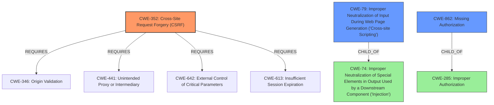

# Analysis for CVE-2021-24969

# Summary
| CWE ID  | CWE Name                                                                          | Confidence | CWE Abstraction Level | CWE Vulnerability Mapping Label | CWE-Vulnerability Mapping Notes |
| :-------- | :---------------------------------------------------------------------------------- | :---------- | :---------------------- | :-------------------------------- | :---------------------------------- |
| CWE-352   | Cross-Site Request Forgery (CSRF)                                                 | 0.9         | Compound                | Primary                           | Allowed                               |
| CWE-79    | Improper Neutralization of Input During Web Page Generation ('Cross-site Scripting') | 0.9         | Base                    | Secondary                         | Allowed                               |
| CWE-862   | Missing Authorization                                                             | 0.8         | Class                   | Secondary                         | Allowed-with-Review                   |

## Evidence and Confidence

*   **Confidence Score:** 0.9
*   **Evidence Strength:** HIGH

## Relationship Analysis
The primary CWE is CWE-352, which is a Compound weakness requiring multiple conditions to be met, including the **lack of CSRF checks**. CWE-79 (Cross-Site Scripting) arises because of the **lack of sanitization and escaping of output**. CWE-862 (Missing Authorization) is present because any authenticated user can access the AJAX action, highlighting an authorization issue.

The relationships are as follows:
- CWE-352 is a compound weakness that can be mitigated by implementing proper CSRF protections (e.g., tokens).
- CWE-79 is a base weakness that can be mitigated by proper output encoding/escaping.
- CWE-862 is a class weakness indicating a broad authorization issue.

## Vulnerability Chain
The vulnerability chain starts with:
1.  **Lack of CSRF checks** in the `wpdm_save_template` AJAX action (CWE-352).
2.  **Lack of authorization** allows any authenticated user to call the AJAX action (CWE-862).
3.  **Lack of sanitization and escaping** of template data (CWE-79) allows for XSS.
4.  The XSS vulnerability allows an attacker to inject malicious JavaScript code.

## Summary of Analysis
The analysis identifies CWE-352, CWE-79, and CWE-862 as relevant weaknesses based on the vulnerability description and supporting evidence. The primary root cause is the **lack of authorization and CSRF checks**, leading to the exploitation of the Cross-Site Scripting vulnerability.

The vulnerability description explicitly states the **lack of authorization and CSRF checks** in the `wpdm_save_template` AJAX action. "The WordPress Download Manager WordPress plugin before 3.2.22 does not sanitise and escape Template data before outputting it in various pages (such as admin dashboard and frontend). Due to the **lack of authorisation and CSRF checks** in the wpdm_save_template AJAX action, any authenticated users such as subscriber is able to call it and perform Cross-Site Scripting attacks"

The graph relationships highlight the interconnectedness of these weaknesses. The selection of CWEs is at the optimal level of specificity, with CWE-352 being a Compound type capturing the combined weaknesses related to CSRF, CWE-79 being a Base weakness detailing the XSS issue, and CWE-862 being a Class weakness providing a general categorization of the authorization problem.

Relevant CWE Information:

# Enhanced Context (25 CWEs)
The following CWEs were identified as potentially relevant to this vulnerability:

## CWE-472: External Control of Assumed-Immutable Web Parameter
**Abstraction Level**: Base
**Similarity Score**: 0.76
**Source**: dense

**Description**:
The web application does not sufficiently verify inputs that are assumed to be immutable but are actually externally controllable, such as hidden form fields.

**Mapping Guidance**:
- Usage: Allowed
- Rationale: This CWE entry is at the Base level of abstraction, which is a preferred level of abstraction for mapping to the root causes of vulnerabilities.

**Why Not Used**: This CWE is not directly applicable as the primary issue is not about assumed immutable parameters, but the **lack of CSRF and authorization checks**.

## CWE-639: Authorization Bypass Through User-Controlled Key
**Abstraction Level**: Base
**Similarity Score**: 0.75
**Source**: dense

**Description**:
The system's authorization functionality does not prevent one user from gaining access to another user's data or record by modifying the key value identifying the data.

**Mapping Guidance**:
- Usage: Allowed
- Rationale: This CWE entry is at the Base level of abstraction, which is a preferred level of abstraction for mapping to the root causes of vulnerabilities.

**Why Not Used**: This CWE is not the best fit because the issue is not about modifying a key value to access another user's data but the **lack of authorization** to access the AJAX action.

## CWE-807: Reliance on Untrusted Inputs in a Security Decision
**Abstraction Level**: Base
**Similarity Score**: 0.75
**Source**: dense

**Description**:
The product uses a protection mechanism that relies on the existence or values of an input, but the input can be modified by an untrusted actor in a way that bypasses the protection mechanism.

**Mapping Guidance**:
- Usage: Allowed
- Rationale: This CWE entry is at the Base level of abstraction, which is a preferred level of abstraction for mapping to the root causes of vulnerabilities.

**Why Not Used**: The primary issue is not related to relying on untrusted inputs for a security decision but the **lack of authorization and CSRF protection**.

## CWE-184: Incomplete List of Disallowed Inputs
**Abstraction Level**: Base
**Similarity Score**: 0.75
**Source**: dense

**Description**:
The product implements a protection mechanism that relies on a list of inputs (or properties of inputs) that are not allowed by policy or otherwise require other action to neutralize before additional processing takes place, but the list is incomplete.

**Mapping Guidance**:
- Usage: Allowed
- Rationale: This CWE entry is at the Base level of abstraction, which is a preferred level of abstraction for mapping to the root causes of vulnerabilities.

**Why Not Used**: This CWE is not applicable as the vulnerability is not due to an incomplete list of disallowed inputs but the **lack of input validation** and **output sanitization** leading to XSS.

## CWE-1289: Improper Validation of Unsafe Equivalence in Input
**Abstraction Level**: Base
**Similarity Score**: 0.74
**Source**: dense

**Description**:
The product receives an input value that is used as a resource identifier or other type of reference, but it does not validate or incorrectly validates that the input is equivalent to a potentially-unsafe value.

**Mapping Guidance**:
- Usage: Allowed
- Rationale: This CWE entry is at the Base level of abstraction, which is a preferred level of abstraction for mapping to the root causes of vulnerabilities.

**Why Not Used**: This CWE is not the best fit because the issue is not related to validating the equivalence of input to unsafe values. The main issue is the **lack of CSRF and authorization checks** and **improper output handling**.

## CWE-425: Direct Request ('Forced Browsing')
**Abstraction Level**: Base
**Similarity Score**: 0.74
**Source**: dense

**Description**:
The web application does not adequately enforce appropriate authorization on all restricted URLs, scripts, or files.

**Mapping Guidance**:
- Usage: Allowed
- Rationale: This CWE entry is at the Base level of abstraction, which is a preferred level of abstraction for mapping to the root causes of vulnerabilities.

**Why Not Used**: Although related, CWE-862 (Missing Authorization) is a better