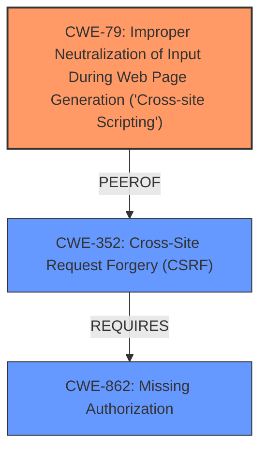

# Analysis for CVE-2021-24988

# Summary
| CWE ID | CWE Name | Confidence | CWE Abstraction Level | CWE Vulnerability Mapping Label | CWE-Vulnerability Mapping Notes |
|---|---|---|---|---|---|
| CWE-79 | Improper Neutralization of Input During Web Page Generation ('Cross-site Scripting') | 1.0 | Base | Allowed | Primary CWE |
| CWE-352 | Cross-Site Request Forgery (CSRF) | 0.9 | Compound | Allowed | Secondary CWE |
| CWE-862 | Missing Authorization | 0.8 | Class | Allowed-with-Review | Secondary CWE |

## Evidence and Confidence

*   **Confidence Score:** 0.9
*   **Evidence Strength:** HIGH

## Relationship Analysis
The primary weakness is CWE-79 [Improper Neutralization of Input During Web Page Generation ('Cross-site Scripting')], which is a base-level CWE. The vulnerability description details a stored XSS vulnerability due to the **lack of sanitisation and escaping of data** before outputting it. This directly aligns with the description of CWE-79. Additionally, the **lack of authorisation and CSRF checks** on the AJAX action contributes to the exploitability of the XSS. CWE-352 [Cross-Site Request Forgery (CSRF)] and CWE-862 [Missing Authorization] are therefore secondary contributing factors. CWE-352 is a compound weakness that REQUIRES other weaknesses to be present. CWE-862 is a class-level weakness, and as such is less specific.

## Vulnerability Chain
The vulnerability chain starts with the **lack of authorization and CSRF checks** on the `wprss_dismiss_addon_notice` AJAX action. This allows an attacker to inject malicious code, leading to **improper neutralization of input**, and finally resulting in a Stored XSS vulnerability.
  - **Root Cause 1**: Missing Authorization (CWE-862)
  - **Root Cause 2**: Missing CSRF Checks (CWE-352)
  - **Weakness**: Improper Neutralization of Input (CWE-79)
  - **Impact**: Stored XSS

## Summary of Analysis
The initial analysis identified CWE-79 [Improper Neutralization of Input During Web Page Generation ('Cross-site Scripting')] as the primary weakness due to the **lack of sanitisation and escaping of data** before output. This is a direct cause of the stored XSS vulnerability.

The presence of **lack of authorisation and CSRF checks** on the AJAX action was also noted, leading to the inclusion of CWE-352 [Cross-Site Request Forgery (CSRF)] and CWE-862 [Missing Authorization] as secondary contributing factors. The evidence directly supports these mappings, as the vulnerability description explicitly mentions these missing checks.

The graph relationships highlight how these weaknesses are interconnected, with CWE-352 [Cross-Site Request Forgery (CSRF)] and CWE-862 [Missing Authorization] contributing to the exploitability of CWE-79 [Improper Neutralization of Input During Web Page Generation ('Cross-site Scripting')].

The selected CWEs are at the optimal level of specificity, with CWE-79 [Improper Neutralization of Input During Web Page Generation ('Cross-site Scripting')] being a base-level CWE that directly describes the vulnerability, and CWE-352 [Cross-Site Request Forgery (CSRF)] and CWE-862 [Missing Authorization] providing additional context.

CWE-116 [Improper Encoding or Escaping of Output] was considered, but CWE-79 [Improper Neutralization of Input During Web Page Generation ('Cross-site Scripting')] is a more specific match for XSS vulnerabilities.

CWE-863 [Incorrect Authorization] was considered, but CWE-862 [Missing Authorization] better captures the scenario where there is a total **lack of authorization**, rather than an incorrect implementation.