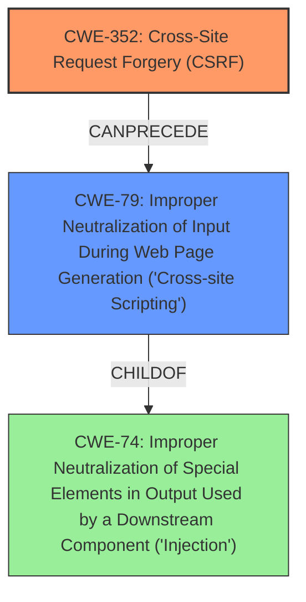

# Analysis Report for CVE-2021-25010

# Vulnerability Analysis Report: CVE-2021-25010

## Description


## Analysis (with Relationship Data)

# Summary
| CWE ID | CWE Name | Confidence | CWE Abstraction Level | CWE Vulnerability Mapping Label | CWE-Vulnerability Mapping Notes |
|---|---|---|---|---|---|
| CWE-352 | Cross-Site Request Forgery (CSRF) | 1.0 | Compound | Primary | Allowed |
| CWE-79 | Improper Neutralization of Input During Web Page Generation ('Cross-site Scripting') | 1.0 | Base | Secondary | Allowed |

## Evidence and Confidence

*   **Confidence Score:** 1.0
*   **Evidence Strength:** HIGH

## Relationship Analysis
The primary weakness is **CWE-352 [Cross-Site Request Forgery (CSRF)]** because the plugin **lacks CSRF protection** during file imports. This leads to a secondary weakness, **CWE-79 [Improper Neutralization of Input During Web Page Generation ('Cross-site Scripting')]**, because the imported snippets are not sanitized or escaped, leading to Stored Cross-Site Scripting. **CWE-352 [Cross-Site Request Forgery (CSRF)]** requires specific conditions (CWE-346, CWE-441, CWE-642, CWE-613). **CWE-79 [Improper Neutralization of Input During Web Page Generation ('Cross-site Scripting')]** can be caused by **CWE-352 [Cross-Site Request Forgery (CSRF)]** in certain scenarios where the CSRF vulnerability allows an attacker to inject malicious scripts. The choice of **CWE-352 [Cross-Site Request Forgery (CSRF)]** as primary and **CWE-79 [Improper Neutralization of Input During Web Page Generation ('Cross-site Scripting')]** as secondary reflects the order of exploitation. First, the attacker bypasses CSRF protection, then they exploit the lack of sanitization.



## Vulnerability Chain
The vulnerability chain starts with the **lack of CSRF protection** (CWE-352), allowing an attacker to make a logged-in administrator import arbitrary snippets. Because these snippets are not sanitized or escaped, this leads to Stored Cross-Site Scripting issues (CWE-79). The chain is:
1.  **Missing CSRF protection (CWE-352)**: The root cause is the **lack of CSRF protection**.
2.  **Import of arbitrary snippets:** The attacker exploits the missing CSRF protection to import malicious snippets.
3.  **Lack of sanitization/escaping:** The imported snippets are not sanitized or escaped.
4.  **Stored Cross-Site Scripting (CWE-79)**: The lack of sanitization leads to XSS vulnerability.

## Summary of Analysis
The initial analysis and criticism focused on identifying the root cause and subsequent weaknesses. The primary assessment, based on provided evidence, points to **CWE-352 [Cross-Site Request Forgery (CSRF)]** as the root cause due to the **lack of CSRF protection** during file imports. The secondary weakness is **CWE-79 [Improper Neutralization of Input During Web Page Generation ('Cross-site Scripting')]**, resulting from the **failure to sanitize/escape** the imported snippets.

The graph relationships helped clarify the exploitation flow from **CWE-352 [Cross-Site Request Forgery (CSRF)]** to **CWE-79 [Improper Neutralization of Input During Web Page Generation ('Cross-site Scripting')]**.

The selected CWEs are at the optimal level of specificity because **CWE-352 [Cross-Site Request Forgery (CSRF)]** accurately describes the missing protection mechanism, and **CWE-79 [Improper Neutralization of Input During Web Page Generation ('Cross-site Scripting')]** directly addresses the **lack of output sanitization**, leading to XSS.

Evidence:

*   "The Post Snippets WordPress plugin before 3.1.4 does not have CSRF check when importing files, allowing attacker to make a logged In admin import arbitrary snippets."
*   "Furthermore, imported snippers are not sanitised and escaped, which could lead to Stored Cross-Site Scripting issues"
*   "root_cause": "The plugin lacks CSRF protection during file imports and fails to sanitize/escape imported snippets.",
*   "weaknesses": ["CSRF vulnerability during file imports", "Stored Cross-Site Scripting (XSS) vulnerability due to lack of sanitization/escaping"]

Other CWEs Considered:

*   CWE-116: Improper Encoding or Escaping of Output - Considered, but **CWE-79 [Improper Neutralization of Input During Web Page Generation ('Cross-site Scripting')]** is more specific to XSS in web page generation.
*   CWE-434: Unrestricted Upload of File with Dangerous Type - Considered, but the core issue is not merely unrestricted upload, but the **lack of CSRF protection** that allows arbitrary file imports.
*   CWE-862: Missing Authorization - Authorization is present, but the CSRF check is missing. Thus **CWE-352 [Cross-Site Request Forgery (CSRF)]** is a better fit.
*   CWE-96: Improper Neutralization of Directives in Statically Saved Code ('Static Code Injection') - While applicable, the more direct issue is the XSS vulnerability.
*   CWE-73: External Control of File Name or Path - This might be a contributing factor, but the main issue is the **lack of CSRF protection**.


## CWE Relationship Analysis

Current CWEs represent these abstraction levels: .


### Vulnerability Chain Analysis

**Chain starting from CWE-79:**
- 79 (Improper Neutralization of Input During Web Page Generation ('Cross-site Scripting')) - ROOT


**Chain starting from CWE-862:**
- 862 (Missing Authorization) - ROOT


### CWE Relationship Diagram

```mermaid
graph TD
    classDef primary fill:#f96,stroke:#333,stroke-width:2px
    classDef secondary fill:#69f,stroke:#333
    classDef tertiary fill:#9e9,stroke:#333
```


*Report generated on 2025-04-02 06:04:18*
