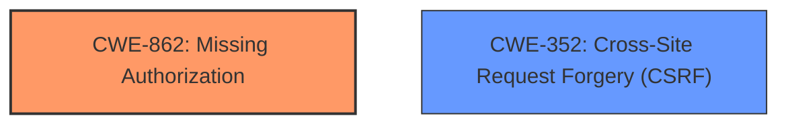

# Analysis for CVE-2021-25013

# Summary
| CWE ID  | CWE Name | Confidence | CWE Abstraction Level | CWE Vulnerability Mapping Label | CWE-Vulnerability Mapping Notes |
|--------------|-------------------------------------------------------------------------------------------------|------------|-------------------------|-----------------------------------|-----------------------------------------------------------------------------------------------------------------------------|
| CWE-862  | Missing Authorization | 1.0 | Class | Primary | Allowed-with-Review |
| CWE-352  | Cross-Site Request Forgery (CSRF) | 1.0 | Compound | Secondary | Allowed |

## Evidence and Confidence

*   **Confidence Score:** 1.0
*   **Evidence Strength:** HIGH

## Relationship Analysis
The primary weakness is the **missing authorization**, which allows unauthorized access to resources.  A secondary weakness is the **missing CSRF check**, which allows an attacker to perform actions on behalf of a user without their consent. CWE-862 is a class-level CWE, and a more specific base-level CWE might exist, but the description focuses on the complete absence of authorization. CWE-352 is a compound CWE representing a combination of weaknesses.

## Vulnerability Chain
The vulnerability chain starts with the **missing authorization** and **missing CSRF check** on the `qubely_delete_saved_block` AJAX action. This leads to the impact of any authenticated user being able to **delete arbitrary posts**.

## Summary of Analysis
The analysis identified two key **weaknesses**: **missing authorization** and **missing CSRF check**. The primary CWE is CWE-862 because the description explicitly states that there is **no authorization** check on the AJAX action. CWE-352 is selected as a secondary CWE because there is also a **missing CSRF check**. Both weaknesses combined allow unauthorized users to delete arbitrary posts.

The selection of CWE-862 and CWE-352 is directly supported by the vulnerability description, which highlights the **missing authorization** and **missing CSRF check**.

Relevant CWE Information:

# Enhanced Context (25 CWEs)
The following CWEs were identified as potentially relevant to this vulnerability:

## CWE-352: Cross-Site Request Forgery (CSRF)
**Abstraction Level**: Compound
**Similarity Score**: 0.72
**Source**: dense

**Description**:
The web application does not, or can not, sufficiently verify whether a well-formed, valid, consistent request was intentionally provided by the user who submitted the request.

**Mapping Guidance**:
- Usage: Allowed
- Rationale: This is a well-known Composite of multiple weaknesses that must all occur simultaneously, although it is attack-oriented in nature.

## CWE-425: Direct Request ('Forced Browsing')
**Abstraction Level**: Base
**Similarity Score**: 0.72
**Source**: dense

**Description**:
The web application does not adequately enforce appropriate authorization on all restricted URLs, scripts, or files.

**Mapping Guidance**:
- Usage: Allowed
- Rationale: This CWE entry is at the Base level of abstraction, which is a preferred level of abstraction for mapping to the root causes of vulnerabilities.

## CWE-434: Unrestricted Upload of File with Dangerous Type
**Abstraction Level**: Base
**Similarity Score**: 0.70
**Source**: dense

**Description**:
The product allows the upload or transfer of dangerous file types that are automatically processed within its environment.

**Mapping Guidance**:
- Usage: Allowed
- Rationale: This CWE entry is at the Base level of abstraction, which is a preferred level of abstraction for mapping to the root causes of vulnerabilities.

## CWE-472: External Control of Assumed-Immutable Web Parameter
**Abstraction Level**: Base
**Similarity Score**: 0.70
**Source**: dense

**Description**:
The web application does not sufficiently verify inputs that are assumed to be immutable but are actually externally controllable, such as hidden form fields.

**Mapping Guidance**:
- Usage: Allowed
- Rationale: This CWE entry is at the Base level of abstraction, which is a preferred level of abstraction for mapping to the root causes of vulnerabilities.

## CWE-639: Authorization Bypass Through User-Controlled Key
**Abstraction Level**: Base
**Similarity Score**: 0.70
**Source**: dense

**Description**:
The system's authorization functionality does not prevent one user from gaining access to another user's data or record by modifying the key value identifying the data.

**Mapping Guidance**:
- Usage: Allowed
- Rationale: This CWE entry is at the Base level of abstraction, which is a preferred level of abstraction for mapping to the root causes of vulnerabilities.

## CWE-184: Incomplete List of Disallowed Inputs
**Abstraction Level**: Base
**Similarity Score**: 0.69
**Source**: dense

**Description**:
The product implements a protection mechanism that relies on a list of inputs (or properties of inputs) that are not allowed by policy or otherwise require other action to neutralize before additional processing takes place, but the list is incomplete.

**Mapping Guidance**:
- Usage: Allowed
- Rationale: This CWE entry is at the Base level of abstraction, which is a preferred level of abstraction for mapping to the root causes of vulnerabilities.

## CWE-862: Missing Authorization
**Abstraction Level**: Class
**Similarity Score**: 0.68
**Source**: dense

**Description**:
The product does not perform an authorization check when an actor attempts to access a resource or perform an action.

**Mapping Guidance**:
- Usage: Allowed-with-Review
- Rationale: This CWE entry is a Class and might have Base-level children that would be more appropriate

## CWE-1390: Weak Authentication
**Abstraction Level**: Class
**Similarity Score**: 0.68
**Source**: dense

**Description**:
The product uses an authentication mechanism to restrict access to specific users or identities, but the mechanism does not sufficiently prove that the claimed identity is correct.

**Mapping Guidance**:
- Usage: Allowed-with-Review
- Rationale: This CWE entry is a Class and might have Base-level children that would be more appropriate

## CWE-799: Improper Control of Interaction Frequency
**Abstraction Level**: Class
**Similarity Score**: 0.68
**Source**: dense

**Description**:
The product does not properly limit the number or frequency of interactions that it has with an actor, such as the number of incoming requests.

**Mapping Guidance**:
- Usage: Allowed-with-Review
- Rationale: This CWE entry is a Class and might have Base-level children that would be more appropriate

## CWE-693: Protection Mechanism Failure
**Abstraction Level**: Pillar
**Similarity Score**: 0.68
**Source**: dense

**Description**:
The product does not use or incorrectly uses a protection mechanism that provides sufficient defense against directed attacks against the product.

**Mapping Guidance**:
- Usage: Discouraged
- Rationale: This CWE entry is extremely high-level, a Pillar.

## CWE-352: Cross-Site Request Forgery (CSRF)
**Abstraction Level**: Compound
**Similarity Score**: 2540.49
**Source**: sparse

**Description**:
The web application does not, or can not, sufficiently verify whether a well-formed, valid, consistent request was intentionally provided by the user who submitted the request.

**Mapping Guidance**:
- Usage: Allowed
- Rationale: This is a well-known Composite of multiple weaknesses that must all occur simultaneously, although it is attack-oriented in nature.

## CWE-862: Missing Authorization
**Abstraction Level**: Class
**Similarity Score**: 2422.70
**Source**: sparse

**Description**:
The product does not perform an authorization check when an actor attempts to access a resource or perform an action.

**Mapping Guidance**:
- Usage: Allowed-with-Review
- Rationale: This CWE entry is a Class and might have Base-level children that would be more appropriate

## CWE-285: Improper Authorization
**Abstraction Level**: Class
**Similarity Score**: 2388.23
**Source**: sparse

**Description**:
The product does not perform or incorrectly performs an authorization check when an actor attempts to access a resource or perform an action.

**Mapping Guidance**:
- Usage: Discouraged
- Rationale: CWE-285 is high-level and lower-level CWEs can frequently be used instead. It is a level-1 Class (i.e., a child of a Pillar).

## CWE-863: Incorrect Authorization
**Abstraction Level**: Class
**Similarity Score**: 2379.51
**Source**: sparse

**Description**:
The product performs an authorization check when an actor attempts to access a resource or perform an action, but it does not correctly perform the check.

**Mapping Guidance**:
- Usage: Allowed-with-Review
- Rationale: This CWE entry

# Enhanced Query for CVE-2021-25013

# Vulnerability Description

    The Qubely WordPress plugin before 1.7.8 does not have authorisation and CSRF check on the qubely_delete_saved_block AJAX action, and does not ensure that the block to be deleted belong to the plugin, as a result, any authenticated users, such as subscriber can delete arbitrary posts

    # Keyphrase-Specific CWE Analysis
    This vulnerability contains multiple keyphrases that may map to different CWEs. 
    Please analyze each keyphrase separately and determine the most appropriate CWE(s) for each.

    ## ROOTCAUSE: 'missing authorisation'

Relevant CWEs for this ROOTCAUSE:

### 1. CWE-352: Cross-Site Request Forgery (CSRF) (Score: 483.08)

The web application does not, or can not, sufficiently verify whether a well-formed, valid, consistent request was intentionally provided by the user who submitted the request....

### 2. CWE-862: Missing Authorization (Score: 463.80)

The product does not perform an authorization check when an actor attempts to access a resource or perform an action....

### 3. CWE-863: Incorrect Authorization (Score: 380.89)

The product performs an authorization check when an actor attempts to access a resource or perform an action, but it does not correctly perform the check....

### 4. CWE-425: Direct Request ('Forced Browsing') (Score: 344.49)

The web application does not adequately enforce appropriate authorization on all restricted URLs, scripts, or files....

### 5. CWE-285: Improper Authorization (Score: 343.92)

The product does not perform or incorrectly performs an authorization check when an actor attempts to access a resource or perform an action....

## ROOTCAUSE: 'missing CSRF check'

Relevant CWEs for this ROOTCAUSE:

### 1. CWE-352: Cross-Site Request Forgery (CSRF) (Score: 483.08)

The web application does not, or can not, sufficiently verify whether a well-formed, valid, consistent request was intentionally provided by the user who submitted the request....

### 2. CWE-862: Missing Authorization (Score: 463.80)

The product does not perform an authorization check when an actor attempts to access a resource or perform an action....

### 3. CWE-863: Incorrect Authorization (Score: 380.89)

The product performs an authorization check when an actor attempts to access a resource or perform an action, but it does not correctly perform the check....

### 4. CWE-434: Unrestricted Upload of File with Dangerous Type (Score: 363.96)

The product allows the upload or transfer of dangerous file types that are automatically processed within its environment....

### 5. CWE-285: Improper Authorization (Score: 343.92)

The product does not perform or incorrectly performs an authorization check when an actor attempts to access a resource or perform an action....

## IMPACT: 'delete arbitrary posts'

Relevant CWEs for this IMPACT:

### 1. CWE-352: Cross-Site Request Forgery (CSRF) (Score: 483.08)

The web application does not, or can not, sufficiently verify whether a well-formed, valid, consistent request was intentionally provided by the user who submitted the request....

### 2. CWE-862: Missing Authorization (Score: 463.80)

The product does not perform an authorization check when an actor attempts to access a resource or perform an action....

### 3. CWE-863: Incorrect Authorization (Score: 380.89)

The product performs an authorization check when an actor attempts to access a resource or perform an action, but it does not correctly perform the check....

### 4. CWE-425: Direct Request ('Forced Browsing') (Score: 344.49)

The web application does not adequately enforce appropriate authorization on all restricted URLs, scripts, or files....

### 5. CWE-285: Improper Authorization (Score: 343.92)

The product does not perform or incorrectly performs an authorization check when an actor attempts to access a resource or perform an action....

## VECTOR: 'qubely_delete_saved_block AJAX action'

Relevant CWEs for this VECTOR:

### 1. CWE-352: Cross-Site Request Forgery (CSRF) (Score: 483.08)

The web application does not, or can not, sufficiently verify whether a well-formed, valid, consistent request was intentionally provided by the user who submitted the request....

### 2. CWE-862: Missing Authorization (Score: 463.80)

The product does not perform an authorization check when an actor attempts to access a resource or perform an action....

### 3. CWE-863: Incorrect Authorization (Score: 380.89)

The product performs an authorization check when an actor attempts to access a resource or perform an action, but it does not correctly perform the check....

### 4. CWE-425: Direct Request ('Forced Browsing') (Score: 344.49)

The web application does not adequately enforce appropriate authorization on all restricted URLs, scripts, or files....

### 5. CWE-285: Improper Authorization (Score: 343.92)

The product does not perform or incorrectly performs an authorization check when an actor attempts to access a resource or perform an action....

## ATTACKER: 'any authenticated users'

Relevant CWEs for this ATTACKER:

### 1. CWE-352: Cross-Site Request Forgery (CSRF) (Score: 483.08)

The web application does not, or can not, sufficiently verify whether a well-formed, valid, consistent request was intentionally provided by the user who submitted the request....

### 2. CWE-862: Missing Authorization (Score: 463.80)

The product does not perform an authorization check when an actor attempts to access a resource or perform an action....

### 3. CWE-863: Incorrect Authorization (Score: 380.89)

The product performs an authorization check when an actor attempts to access a resource or perform an action, but it does not correctly perform the check....

### 4. CWE-425: Direct Request ('Forced Browsing') (Score: 344.49)

The web application does not adequately enforce appropriate authorization on all restricted URLs, scripts, or files....

### 5. CWE-285: Improper Authorization (Score: 343.92)

The product does not perform or incorrectly performs an authorization check when an actor attempts to access a resource or perform an action....

## PRODUCT: 'Qubely WordPress plugin'

Relevant CWEs for this PRODUCT:

### 1. CWE-352: Cross-Site Request Forgery (CSRF) (Score: 483.08)

The web application does not, or can not, sufficiently verify whether a well-formed, valid, consistent request was intentionally provided by the user who submitted the request....

### 2. CWE-862: Missing Authorization (Score: 463.80)

The product does not perform an authorization check when an actor attempts to access a resource or perform an action....

### 3. CWE-863: Incorrect Authorization (Score: 380.89)

The product performs an authorization check when an actor attempts to access a resource or perform an action, but it does not correctly perform the check....

### 4. CWE-425: Direct Request ('Forced Browsing') (Score: 344.49)

The web application does not adequately enforce appropriate authorization on all restricted URLs, scripts, or files....

### 5. CWE-285: Improper Authorization (Score: 343.92)

The product does not perform or incorrectly performs an authorization check when an actor attempts to access a resource or perform an action....

## VERSION: 'before 1.7.8'

Relevant CWEs for this VERSION:

### 1. CWE-352: Cross-Site Request Forgery (CSRF) (Score: 483.08)

The web application does not, or can not, sufficiently verify whether a well-formed, valid, consistent request was intentionally provided by the user who submitted the request....

### 2. CWE-862: Missing Authorization (Score: 463.80)

The product does not perform an authorization check when an actor attempts to access a resource or perform an action....

### 3. CWE-863: Incorrect Authorization (Score: 380.89)

The product performs an authorization check when an actor attempts to access a resource or perform an action, but it does not correctly perform the check....

### 4. CWE-425: Direct Request ('Forced Browsing') (Score: 344.49)

The web application does not adequately enforce appropriate authorization on all restricted URLs, scripts, or files....

### 5. CWE-285: Improper Authorization (Score: 343.92)

The product does not perform or incorrectly performs an authorization check when an actor attempts to access a resource or perform an action....

    # Analysis Instructions
    1. For each keyphrase, identify the most appropriate CWE(s) that represent the weakness.
    2. Consider how the different keyphrases might relate to each other in the vulnerability chain.
    3. Provide a final determination of primary CWE(s) and any secondary CWEs.
    4. Format your response using the standard analysis template.

    Please analyze how these different weaknesses interact and provide a comprehensive CWE classification.
    