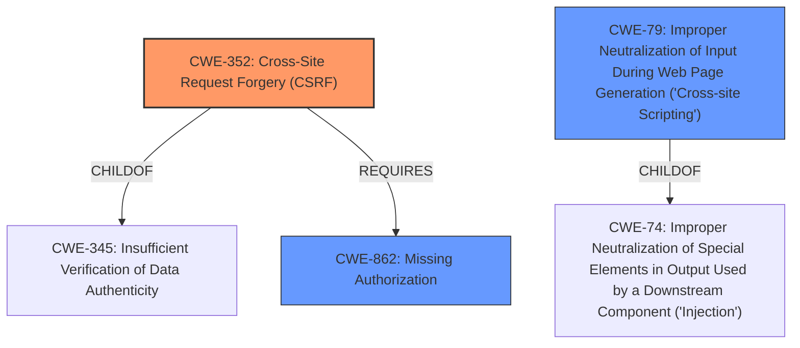

# Analysis Report for CVE-2021-25018

# Vulnerability Analysis Report: CVE-2021-25018

## Description


## Analysis (with Relationship Data)

# Summary
| CWE ID  | CWE Name                                                                            | Confidence | CWE Abstraction Level | CWE Vulnerability Mapping Label | CWE-Vulnerability Mapping Notes |
| :-------- | :---------------------------------------------------------------------------------- | :--------- | :---------------------- | :------------------------------ | :------------------------------ |
| CWE-352   | Cross-Site Request Forgery (CSRF)                                                 | 0.9        | Compound                | Primary                         | Allowed                       |
| CWE-79    | Improper Neutralization of Input During Web Page Generation ('Cross-site Scripting') | 0.8        | Base                    | Secondary                       | Allowed                       |
| CWE-862   | Missing Authorization                                                             | 0.8        | Class                   | Secondary                       | Allowed-with-Review           |

## Evidence and Confidence

*   **Confidence Score:** 0.8
*   **Evidence Strength:** HIGH

## Relationship Analysis
The primary weakness is CWE-352 [Cross-Site Request Forgery (CSRF)], a compound weakness that requires missing CSRF protection. CWE-79 [Improper Neutralization of Input During Web Page Generation ('Cross-site Scripting')] is a secondary weakness due to lack of sanitization. CWE-862 [Missing Authorization] is also a secondary weakness, as the AJAX action lacks authorization checks. The hierarchical relationships show that CWE-352 is a compound weakness, while CWE-79 and CWE-862 are more specific base and class level weaknesses respectively that contribute to the overall vulnerability.



## Vulnerability Chain
The vulnerability chain starts with **lack of authorization and CSRF checks** in the `ppom_settings_panel_action` AJAX action. This **root cause** allows any authenticated user to call the action and set arbitrary settings. The **weakness** of **cross-site scripting** arises due to the lack of sanitization and escaping, leading to Stored XSS issues, the **impact**.

## Summary of Analysis
The initial assessment identifies the **lack of authorization and CSRF checks** as the primary **root cause**, leading to a cross-site scripting vulnerability.

The evidence from the "Vulnerability Description Key Phrases" confirms the **lack of authorisation and CSRF checks**, the **weakness** of **cross-site scripting**, and the resulting impact of Stored XSS issues.

The "CVE Reference Links Content Summary" provides further support:
*   "root_cause": "The plugin lacks authorization and CSRF checks in the `ppom_settings_panel_action` AJAX action."
*   "weaknesses": ["Missing authorization checks", "Missing CSRF protection", "Lack of sanitization and escaping of user-supplied input"]

Based on the evidence, CWE-352 [Cross-Site Request Forgery (CSRF)] is the most appropriate primary CWE due to the **lack of CSRF checks**. CWE-79 [Improper Neutralization of Input During Web Page Generation ('Cross-site Scripting')] is a contributing factor due to the **lack of sanitization and escaping**, leading to Stored XSS. CWE-862 [Missing Authorization] is also selected because of the **lack of authorization checks**. These CWEs are at the optimal level of specificity, with CWE-352 being a compound weakness and CWE-79 and CWE-862 being base and class level weaknesses respectively.

# Relevant CWE Information:

# Enhanced Context (25 CWEs)

## CWE-80: Improper Neutralization of Script-Related HTML Tags in a Web Page (Basic XSS)
**Abstraction Level**: Variant
**Similarity Score**: 0.77
**Source**: dense

**Description**:
The product receives input from an upstream component, but it does not neutralize or incorrectly neutralizes special characters such as "<", ">", and "&" that could be interpreted as web-scripting elements when they are sent to a downstream component that processes web pages.

**Mapping Guidance**:
- Usage: Allowed
- Rationale: This CWE entry is at the Variant level of abstraction, which is a preferred level of abstraction for mapping to the root causes of vulnerabilities.

## CWE-74: Improper Neutralization of Special Elements in Output Used by a Downstream Component ('Injection')
**Abstraction Level**: Class
**Similarity Score**: 0.77
**Source**: dense

**Description**:
The product constructs all or part of a command, data structure, or record using externally-influenced input from an upstream component, but it does not neutralize or incorrectly neutralizes special elements that could modify how it is parsed or interpreted when it is sent to a downstream component.

**Mapping Guidance**:
- Usage: Discouraged
- Rationale: CWE-74 is high-level and often misused when lower-level weaknesses are more appropriate.

## CWE-472: External Control of Assumed-Immutable Web Parameter
**Abstraction Level**: Base
**Similarity Score**: 0.75
**Source**: dense

**Description**:
The web application does not sufficiently verify inputs that are assumed to be immutable but are actually externally controllable, such as hidden form fields.

**Mapping Guidance**:
- Usage: Allowed
- Rationale: This CWE entry is at the Base level of abstraction, which is a preferred level of abstraction for mapping to the root causes of vulnerabilities.

## CWE-943: Improper Neutralization of Special Elements in Data Query Logic
**Abstraction Level**: Class
**Similarity Score**: 0.75
**Source**: dense

**Description**:
The product generates a query intended to access or manipulate data in a data store such as a database, but it does not neutralize or incorrectly neutralizes special elements that can modify the intended logic of the query.

**Mapping Guidance**:
- Usage: Allowed-with-Review
- Rationale: This CWE entry is a Class and might have Base-level children that would be more appropriate

## CWE-1289: Improper Validation of Unsafe Equivalence in Input
**Abstraction Level**: Base
**Similarity Score**: 0.75
**Source**: dense

**Description**:
The product receives an input value that is used as a resource identifier or other type of reference, but it does not validate or incorrectly validates that the input is equivalent to a potentially-unsafe value.

**Mapping Guidance**:
- Usage: Allowed
- Rationale: This CWE entry is at the Base level of abstraction, which is a preferred level of abstraction for mapping to the root causes of vulnerabilities.

## CWE-116: Improper Encoding or Escaping of Output
**Abstraction Level**: Class
**Similarity Score**: 0.75
**Source**: dense

**Description**:
The product prepares a structured message for communication with another component, but encoding or escaping of the data is either missing or done incorrectly. As a result, the intended structure of the message is not preserved.

**Mapping Guidance**:
- Usage: Allowed-with-Review
- Rationale: This CWE entry is a Class and might have Base-level children that would be more appropriate

## CWE-184: Incomplete List of Disallowed Inputs
**Abstraction Level**: Base
**Similarity Score**: 0.74
**Source**: dense

**Description**:
The product implements a protection mechanism that relies on a list of inputs (or properties of inputs) that are not allowed by policy or otherwise require other action to neutralize before additional processing takes place, but the list is incomplete.

**Mapping Guidance**:
- Usage: Allowed
- Rationale: This CWE entry is at the Base level of abstraction, which is a preferred level of abstraction for mapping to the root causes of vulnerabilities.

## CWE-639: Authorization Bypass Through User-Controlled Key
**Abstraction Level**: Base
**Similarity Score**: 0.74
**Source**: dense

**Description**:
The system's authorization functionality does not prevent one user from gaining access to another user's data or record by modifying the key value identifying the data.

**Mapping Guidance**:
- Usage: Allowed
- Rationale: This CWE entry is at the Base level of abstraction, which is a preferred level of abstraction for mapping to the root causes of vulnerabilities.

## CWE-807: Reliance on Untrusted Inputs in a Security Decision
**Abstraction Level**: Base
**Similarity Score**: 0.74
**Source**: dense

**Description**:
The


## CWE Relationship Analysis

Current CWEs represent these abstraction levels: .


### Vulnerability Chain Analysis

**Chain starting from CWE-79:**
- 79 (Improper Neutralization of Input During Web Page Generation ('Cross-site Scripting')) - ROOT


**Chain starting from CWE-862:**
- 862 (Missing Authorization) - ROOT


### CWE Relationship Diagram

```mermaid
graph TD
    classDef primary fill:#f96,stroke:#333,stroke-width:2px
    classDef secondary fill:#69f,stroke:#333
    classDef tertiary fill:#9e9,stroke:#333
```


*Report generated on 2025-04-02 06:29:23*
