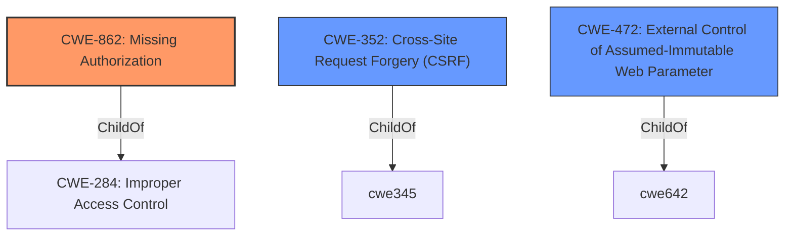

# Raw Analyzer Response for CVE-2021-25032

```markdown
# Summary 
| CWE ID    | CWE Name                                                        | Confidence | CWE Abstraction Level | CWE Vulnerability Mapping Label | CWE-Vulnerability Mapping Notes |
|-----------|-----------------------------------------------------------------|------------|-----------------------|---------------------------------|-----------------------------------|
| CWE-862   | Missing Authorization                                           | 0.9        | Class                 | Allowed-with-Review               | Primary CWE                       |
| CWE-352   | Cross-Site Request Forgery (CSRF)                               | 0.7        | Compound                | Allowed                         | Secondary Candidate             |
| CWE-472   | External Control of Assumed-Immutable Web Parameter             | 0.6        | Base                  | Allowed                         | Secondary Candidate             |

## Evidence and Confidence

*   **Confidence Score:** 0.8
*   **Evidence Strength:** HIGH

## Relationship Analysis
The primary relationship influencing the selection was the ChildOf relationship between CWE-862 (Missing Authorization) and CWE-284 (Improper Access Control). Given the **lack of authorization** checks as the root cause, CWE-862, being a more specific Class-level CWE, was preferred over the more general Pillar-level CWE-284. CWE-352 (Cross-Site Request Forgery) was considered due to the **lack of CSRF checks**, although the vulnerability is unauthenticated, so its relevance is secondary. CWE-472 (External Control of Assumed-Immutable Web Parameter) was considered because the plugin doesn't check if the options to be updated belong to the plugin, so arbitrary options can be updated, but this is a consequence of the missing authorization.



## Vulnerability Chain
The vulnerability chain starts with the **lack of authorization and CSRF checks**. This leads to the ability for unauthenticated attackers to update arbitrary blog options. A critical consequence is privilege escalation, where attackers can create new administrator accounts, leading to complete site compromise. The chain is: Missing Authorization/CSRF -> Arbitrary Option Update -> Privilege Escalation -> Site Compromise.

## Summary of Analysis
The initial assessment focused on the **lack of authorization and CSRF checks** as the primary weakness. The CVE Reference Links Content Summary confirms that the plugin "**fails to verify if the user performing the settings update has the necessary permissions to do so**" and that there is "**no protection against Cross-Site Request Forgery (CSRF) attacks**".

The graph relationships influenced the decision to prioritize CWE-862 due to its direct link to the **missing authorization** and its higher specificity compared to CWE-284 (Improper Access Control).

The selected CWEs are at the optimal level of specificity because they directly address the root causes identified in the vulnerability description and CVE summary. CWE-862 accurately represents the **missing authorization** check, while CWE-352 highlights the **lack of CSRF protection**, although its relevance is secondary since the attack is unauthenticated. CWE-472 identifies that the plugin **does not check if the option to be updated belongs to the plugin**, enabling arbitrary option updates.

Relevant CWE Information:

# Enhanced Context (25 CWEs)

## CWE-472: External Control of Assumed-Immutable Web Parameter
**Abstraction Level**: Base
**Similarity Score**: 0.78
**Source**: dense

**Description**:
The web application does not sufficiently verify inputs that are assumed to be immutable but are actually externally controllable, such as hidden form fields.

**Mapping Guidance**:
- Usage: Allowed
- Rationale: This CWE entry is at the Base level of abstraction, which is a preferred level of abstraction for mapping to the root causes of vulnerabilities.

## CWE-639: Authorization Bypass Through User-Controlled Key
**Abstraction Level**: Base
**Similarity Score**: 0.77
**Source**: dense

**Description**:
The system's authorization functionality does not prevent one user from gaining access to another user's data or record by modifying the key value identifying the data.

**Mapping Guidance**:
- Usage: Allowed
- Rationale: This CWE entry is at the Base level of abstraction, which is a preferred level of abstraction for mapping to the root causes of vulnerabilities.

## CWE-807: Reliance on Untrusted Inputs in a Security Decision
**Abstraction Level**: Base
**Similarity Score**: 0.76
**Source**: dense

**Description**:
The product uses a protection mechanism that relies on the existence or values of an input, but the input can be modified by an untrusted actor in a way that bypasses the protection mechanism.

**Mapping Guidance**:
- Usage: Allowed
- Rationale: This CWE entry is at the Base level of abstraction, which is a preferred level of abstraction for mapping to the root causes of vulnerabilities.

## CWE-425: Direct Request ('Forced Browsing')
**Abstraction Level**: Base
**Similarity Score**: 0.76
**Source**: dense

**Description**:
The web application does not adequately enforce appropriate authorization on all restricted URLs, scripts, or files.

**Mapping Guidance**:
- Usage: Allowed
- Rationale: This CWE entry is at the Base level of abstraction, which is a preferred level of abstraction for mapping to the root causes of vulnerabilities.

## CWE-1220: Insufficient Granularity of Access Control
**Abstraction Level**: Base
**Similarity Score**: 0.75
**Source**: dense

**Description**:
The product implements access controls via a policy or other feature with the intention to disable or restrict accesses (reads and/or writes) to assets in a system from untrusted agents. However, implemented access controls lack required granularity, which renders the control policy too broad because it allows accesses from unauthorized agents to the security-sensitive assets.

**Mapping Guidance**:
- Usage: Allowed
- Rationale: This CWE entry is at the Base level of abstraction, which is a preferred level of abstraction for mapping to the root causes of vulnerabilities.

## CWE-552: Files or Directories Accessible to External Parties
**Abstraction Level**: Base
**Similarity Score**: 0.75
**Source**: dense

**Description**:
The product makes files or directories accessible to unauthorized actors, even though they should not be.

**Mapping Guidance**:
- Usage: Allowed
- Rationale: This CWE entry is at the Base level of abstraction, which is a preferred level of abstraction for mapping to the root causes of vulnerabilities.

## CWE-184: Incomplete List of Disallowed Inputs
**Abstraction Level**: Base
**Similarity Score**: 0.75
**Source**: dense

**Description**:
The product implements a protection mechanism that relies on a list of inputs (or properties of inputs) that are not allowed by policy or otherwise require other action to neutralize before additional processing takes place, but the list is incomplete.

**Mapping Guidance**:
- Usage: Allowed
- Rationale: This CWE entry is at the Base level of abstraction, which is a preferred level of abstraction for mapping to the root causes of vulnerabilities.

## CWE-1390: Weak Authentication
**Abstraction Level**: Class
**Similarity Score**: 0.75
**Source**: dense

**Description**:
The product uses an authentication mechanism to restrict access to specific users or identities, but the mechanism does not sufficiently prove that the claimed identity is correct.

**Mapping Guidance**:
- Usage: Allowed-with-Review
- Rationale: This CWE entry is a Class and might have Base-level children that would be more appropriate

## CWE-41: Improper Resolution of Path Equivalence
**Abstraction Level**: Base
**Similarity Score**: 0.74
**Source**: dense

**Description**:
The product is vulnerable to file system contents disclosure through path equivalence. Path equivalence involves the use of special characters in file and directory names. The associated manipulations are intended to generate multiple names for the same object.

**Mapping Guidance**:
- Usage: Allowed
- Rationale: This CWE entry is at the Base level of abstraction, which is a preferred level of abstraction for mapping to the root causes of vulnerabilities.

## CWE-23: Relative Path Traversal
**Abstraction Level**: Base
**Similarity Score**: 0.74
**Source**: dense

**Description**:
The product uses external input to construct a pathname that should be within a restricted directory, but it does not properly neutralize sequences such as ".." that can resolve to a location that is outside of that directory.

**Mapping Guidance**:
- Usage: Allowed
- Rationale: This CWE entry