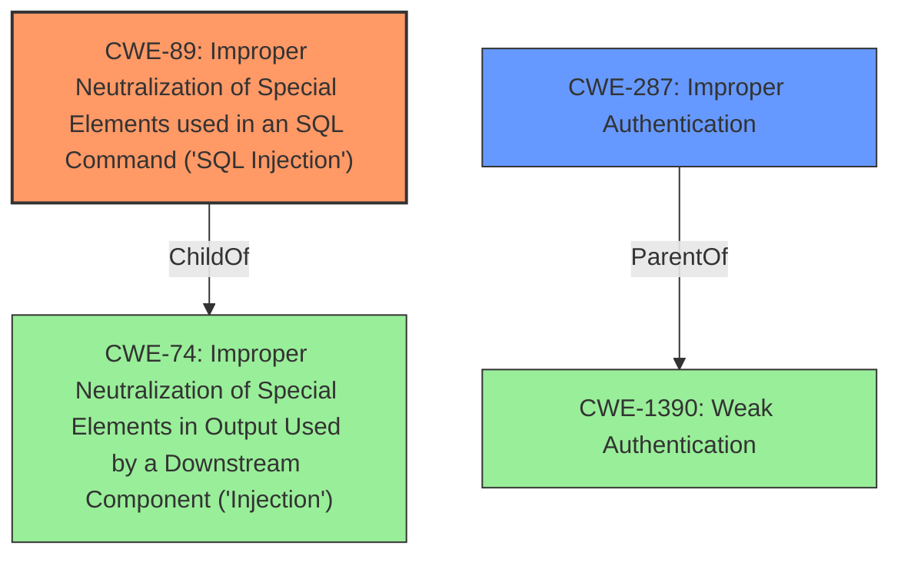

# Raw Analyzer Response for CVE-2021-25037

# Summary
| CWE ID | CWE Name | Confidence | CWE Abstraction Level | CWE Vulnerability Mapping Label | CWE-Vulnerability Mapping Notes |
|---|---|---|---|---|---|
| CWE-89 | Improper Neutralization of Special Elements used in an SQL Command ('SQL Injection') | 1.0 | Base | Allowed | Primary CWE. This directly addresses the **SQL injection** vulnerability. |
| CWE-287 | Improper Authentication | 0.5 | Class | Discouraged | Secondary CWE. Although the vulnerability is triggered by an authenticated user, it highlights a broader authentication issue. |

## Evidence and Confidence

*   **Confidence Score:** 1.0
*   **Evidence Strength:** HIGH

## Relationship Analysis
The primary relationship is that CWE-89 is a specific type of **injection** vulnerability, while CWE-287 represents a broader class of **authentication** issues that might contribute to the exploitability or impact of the **SQL injection**. The vulnerability requires authentication, which is why CWE-287 is a relevant consideration.

## Vulnerability Chain
The chain of events is as follows:
1.  An authenticated user makes a request with a crafted **SQL injection** payload.
2.  The application **fails to properly sanitize** the input.
3.  The database executes the malicious SQL code.
4.  The attacker gains access to privileged information.

## Summary of Analysis
The primary weakness is CWE-89, as the core issue is the improper neutralization of special elements in an SQL command. The vulnerability description clearly states the presence of an **SQL injection** issue, discovered during an internal audit, and could grant attackers access to privileged information. The CVE Reference Links Content Summary section confirms that the root cause is a lack of proper sanitization of user-supplied input. The use of `esc_like` is not suitable for database queries and should be used within `LIKE` clauses, thus allowing an attacker to inject arbitrary SQL code into the database query. This directly aligns with the description of CWE-89, which states that the product constructs an SQL command using externally-influenced input but does not neutralize special elements that could modify the intended SQL command.

CWE-287 was considered as a secondary weakness due to the requirement of an authenticated user. Although the **SQL injection** vulnerability is triggered by an authenticated user, it highlights a broader authentication issue. However, CWE-89 is the more direct and specific cause of the vulnerability.

Relevant CWE Information:

# Enhanced Context (25 CWEs)

## CWE-807: Reliance on Untrusted Inputs in a Security Decision
**Abstraction Level**: Base
**Similarity Score**: 0.76
**Source**: dense

This CWE was not selected because the core issue is not about the reliance on untrusted inputs in a security decision, but rather the improper sanitization of inputs leading to **SQL injection**.

## CWE-639: Authorization Bypass Through User-Controlled Key
**Abstraction Level**: Base
**Similarity Score**: 0.76
**Source**: dense

This CWE was not selected because the vulnerability doesn't involve bypassing authorization through user-controlled keys, but rather the **SQL injection** is the primary issue.

## CWE-472: External Control of Assumed-Immutable Web Parameter
**Abstraction Level**: Base
**Similarity Score**: 0.76
**Source**: dense

This CWE was not selected because the core of the vulnerability is the **SQL injection** due to improper input sanitization, rather than the external control of assumed immutable parameters.

## CWE-74: Improper Neutralization of Special Elements in Output Used by a Downstream Component ('Injection')
**Abstraction Level**: Class
**Similarity Score**: 0.75
**Source**: dense

While CWE-74 is a broader category that includes **SQL injection**, CWE-89 is a more specific and appropriate match for the vulnerability.

## CWE-1390: Weak Authentication
**Abstraction Level**: Class
**Similarity Score**: 0.75
**Source**: dense

This was considered but not chosen as primary because while the attacker needs to be authenticated to exploit the vulnerability, the actual flaw lies in the **SQL injection**, not a fundamentally **weak authentication** mechanism.

## CWE-1220: Insufficient Granularity of Access Control
**Abstraction Level**: Base
**Similarity Score**: 0.75
**Source**: dense

This CWE does not fit the vulnerability because the issue is not about insufficient granularity of access control, but rather the **SQL injection** caused by improper sanitization.

## CWE-1289: Improper Validation of Unsafe Equivalence in Input
**Abstraction Level**: Base
**Similarity Score**: 0.75
**Source**: dense

This was not selected because the core issue is not the validation of unsafe equivalence in input, but the improper handling and sanitization of input leading to **SQL injection**.

## CWE-41: Improper Resolution of Path Equivalence
**Abstraction Level**: Base
**Similarity Score**: 0.75
**Source**: dense

This CWE does not apply because the vulnerability does not involve path equivalence issues.

## CWE-668: Exposure of Resource to Wrong Sphere
**Abstraction Level**: Class
**Similarity Score**: 0.75
**Source**: dense

This CWE is too broad and does not directly address the **SQL injection** vulnerability.

## CWE-274: Improper Handling of Insufficient Privileges
**Abstraction Level**: Base
**Similarity Score**: 0.75
**Source**: dense

This CWE is not relevant because the vulnerability does not involve the improper handling of insufficient privileges.

## CWE-79: Improper Neutralization of Input During Web Page Generation ('Cross-site Scripting')
**Abstraction Level**: Base
**Similarity Score**: 6727.93
**Source**: sparse

This CWE is not applicable because the vulnerability is an **SQL injection**, not a cross-site scripting (XSS) issue.

## CWE-116: Improper Encoding or Escaping of Output
**Abstraction Level**: Class
**Similarity Score**: 6359.85
**Source**: sparse

This CWE is related to encoding issues, but the core of the vulnerability is the **SQL injection** resulting from improper sanitization.

## CWE-178: Improper Handling of Case Sensitivity
**Abstraction Level**: Base
**Similarity Score**: 6219.20
**Source**: sparse

Case sensitivity is not the issue in this vulnerability.

## CWE-352: Cross-Site Request Forgery (CSRF)
**Abstraction Level**: Compound
**Similarity Score**: 6218.01
**Source**: sparse

This vulnerability is not related to cross-site request forgery (CSRF).

## CWE-502: Deserialization of Untrusted Data
**Abstraction Level**: Base
**Similarity Score**: 6208.91
**Source**: sparse

This CWE is not applicable because the vulnerability does not involve deserialization of untrusted data.

## CWE-494: Download of Code Without Integrity Check
**Abstraction Level**: base
**Similarity Score**: 4.33
**Source**: graph

This vulnerability does not involve downloading code without integrity checks.

## CWE-613: Insufficient Session Expiration
**Abstraction Level**: base
**Similarity Score**: 4.33
**Source**: graph

Session expiration is not relevant to this **SQL injection** vulnerability.

## CWE-915: Improperly Controlled Modification of Dynamically-Determined Object Attributes
**Abstraction Level**: base
**Similarity Score**: 3.64
**Source**: graph

The vulnerability does not involve the modification of dynamically-determined object attributes.

## CWE-433: Unparsed Raw Web Content Delivery
**Abstraction Level**: variant
**Similarity Score**: 3.24
**Source**: graph

This CWE does not apply as the vulnerability is not related to unparsed web content delivery.

## CWE-183: Permissive List of Allowed Inputs
**Abstraction Level**: base
**Similarity Score**: 3.21
**Source**: graph

The vulnerability is not related to a permissive list of allowed inputs.