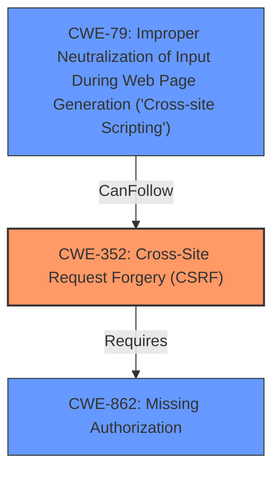

# Analysis for CVE-2021-25042

# Summary
| CWE ID | CWE Name | Confidence | CWE Abstraction Level | CWE Vulnerability Mapping Label | CWE-Vulnerability Mapping Notes |
|---|---|---|---|---|---|
| CWE-352 | Cross-Site Request Forgery (CSRF) | 0.9 | Compound | Allowed | Primary CWE. The `updateIpAddress` AJAX action lacks CSRF checks, allowing an attacker to induce a logged-in user to perform actions against their will. |
| CWE-862 | Missing Authorization | 0.9 | Class | Allowed-with-Review | Secondary CWE. The `updateIpAddress` AJAX action lacks authorization checks, allowing any authenticated user to call it. While a Class, it directly reflects the **lack of authorization**, which is a core aspect of this vulnerability. |
| CWE-79 | Improper Neutralization of Input During Web Page Generation ('Cross-site Scripting') | 0.8 | Base | Allowed | Secondary CWE. Due to the **lack of validation, sanitisation and escaping**, users could set a malicious value and perform Cross-Site Scripting attacks against logged in admin. |

## Evidence and Confidence

*   **Confidence Score:** 0.9
*   **Evidence Strength:** HIGH

## Relationship Analysis
The relationship analysis for this vulnerability reveals a combination of authorization issues and input validation flaws leading to CSRF and XSS.

*   **CWE-352 (Cross-Site Request Forgery)** is a compound weakness that highlights the **lack of CSRF checks**. It requires an attacker to trick a user into making unintended requests.
*   **CWE-862 (Missing Authorization)**, a Class-level CWE, is a contributing factor, indicating that the `updateIpAddress` action lacks proper authorization checks.
*   **CWE-79 (Improper Neutralization of Input During Web Page Generation ('Cross-site Scripting'))** stems from the **lack of validation, sanitization, and escaping**, allowing for XSS attacks.

The relationships between these CWEs are not strictly hierarchical but interconnected. The missing authorization and CSRF vulnerabilities enable an attacker to potentially inject malicious code, leading to XSS. The Mermaid diagram below illustrates these connections:

## Vulnerability Chain
The vulnerability chain for this WordPress plugin flaw can be described as follows:

1.  **Root Cause 1:** **Lack of CSRF checks** in the `updateIpAddress` AJAX action (CWE-352).
2.  **Root Cause 2:** **Missing authorization** for the `updateIpAddress` AJAX action (CWE-862).
3.  **Root Cause 3:** **Lack of validation, sanitization, and escaping** of the IP address input (CWE-79).
4.  **Impact 1:** Any authenticated user can call the `updateIpAddress` action.
5.  **Impact 2:** A logged-in user can be tricked into adding an arbitrary IP address to the exclusion list via a CSRF attack.
6.  **Impact 3:** An attacker can inject malicious JavaScript code via the IP address field, leading to stored XSS.

## Summary of Analysis
The initial analysis and subsequent refinement focused on identifying the root causes and impacts of the vulnerability. The primary driver for this classification was based on the provided evidence from the vulnerability description and CVE reference links content summary.

The initial analysis identified:

*   **Lack of authorization and CSRF checks** as primary root causes.
*   **Cross-site scripting** as a secondary weakness due to input validation flaws.

The graph relationships further emphasized the interconnectedness of these weaknesses. The **missing authorization** and **CSRF** vulnerabilities pave the way for potential XSS attacks by allowing malicious input to be processed.

The final decision to map the vulnerability to CWE-352, CWE-862, and CWE-79 was based on the following justifications:

*   CWE-352 is the primary CWE due to the **lack of CSRF checks** being a significant factor in the vulnerability. The vulnerability description explicitly mentions the absence of CSRF checks in the `updateIpAddress` AJAX action.
*   CWE-862 highlights the **missing authorization** for the AJAX action, allowing any authenticated user to call it. This is a direct consequence of the **lack of authorization checks**, as stated in the vulnerability description.
*   CWE-79 is a result of the **lack of validation, sanitization, and escaping**, which allows for XSS attacks. The vulnerability description explicitly mentions this weakness.

These CWEs are at the optimal level of specificity because they directly represent the root causes and contributing factors of the vulnerability, aligning with the evidence provided.

Relevant CWE Information: