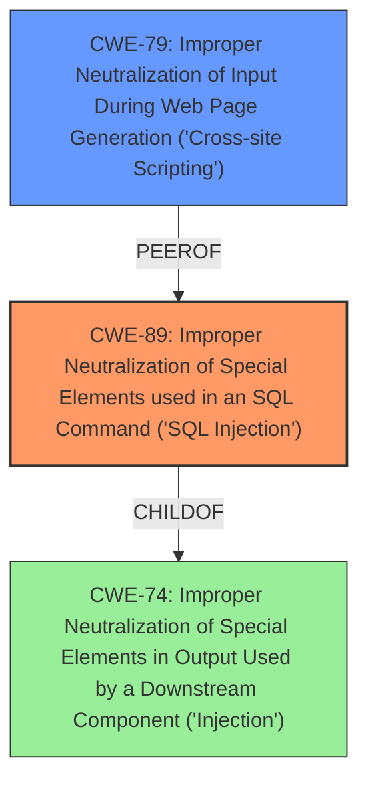

# Raw Analyzer Response for CVE-2021-25069

# Summary

| CWE ID | CWE Name | Confidence | CWE Abstraction Level | CWE Vulnerability Mapping Label | CWE-Vulnerability Mapping Notes |
|---|---|---|---|---|---|
| CWE-89 | Improper Neutralization of Special Elements used in an SQL Command ('SQL Injection') | 1.0 | Base | Allowed | Primary CWE. The vulnerability stems from **improper input sanitization and escaping** leading to **SQL injection**. |
| CWE-79 | Improper Neutralization of Input During Web Page Generation ('Cross-site Scripting') | 0.8 | Base | Allowed | Secondary CWE. The **SQL injection** can also be exploited to cause a Reflected Cross-Site Scripting issue. |

## Evidence and Confidence

*   **Confidence Score:** 0.9
*   **Evidence Strength:** HIGH

## Relationship Analysis

The primary relationship influencing the CWE selection is the parent-child relationship between CWE-74 (Improper Neutralization of Special Elements in Output Used by a Downstream Component ('Injection')) and CWE-89, as well as the peer relationship between CWE-79 (Improper Neutralization of Input During Web Page Generation ('Cross-site Scripting')) and CWE-89. The vulnerability's root cause is **improper input sanitization and escaping** leading to **SQL injection** (CWE-89), which can then be exploited to cause reflected Cross-Site Scripting (CWE-79). CWE-89 is the more specific Base level weakness that accurately describes the SQL Injection vulnerability, making it the primary CWE.

## Vulnerability Chain

The vulnerability chain starts with the **improper input sanitization and escaping**, leading to an **SQL injection** vulnerability. This **SQL injection** can then be further exploited to cause a reflected Cross-Site Scripting issue.

Root Cause: **Improper input sanitization and escaping** (CWE-89) -> Impact: Reflected Cross-Site Scripting (CWE-79)

## Summary of Analysis

The initial analysis identified CWE-89 as the primary weakness, due to the vulnerability description explicitly stating an **SQL injection** caused by **improper input sanitization and escaping** of the `package_ids` parameter. The CVE Reference Links Content Summary confirms this, stating the root cause as the lack of sanitization and escaping of the `package_ids` parameter before it's used in an SQL query. This aligns perfectly with the description of CWE-89: "The product constructs all or part of an SQL command using externally-influenced input from an upstream component, but it does not neutralize or incorrectly neutralizes special elements that could modify the intended SQL command when it is sent to a downstream component."

The analysis considered the retriever results and related CWEs like CWE-79, CWE-116 and CWE-352. CWE-79 was added as a secondary weakness because the **SQL injection** vulnerability can also be exploited to cause a reflected Cross-Site Scripting issue. This is supported by the vulnerability description and CVE Reference Links Content Summary which states that the **SQL injection** can be used to inject malicious JavaScript code that is reflected back to the user in the browser.

CWE-116 (Improper Encoding or Escaping of Output) was considered, but it's a Class-level CWE, and CWE-89 is a more specific Base-level CWE that directly addresses the SQL Injection. CWE-352 (Cross-Site Request Forgery (CSRF)) was also considered, but there is no evidence in the provided description to support this. The vulnerability description focuses on the lack of input sanitization leading to **SQL injection** and XSS, not on the lack of CSRF protection.

The final CWE selections are at the optimal level of specificity because they directly address the root cause (**improper input sanitization and escaping** leading to **SQL injection**) and a secondary impact (reflected Cross-Site Scripting).

Relevant CWE Information: