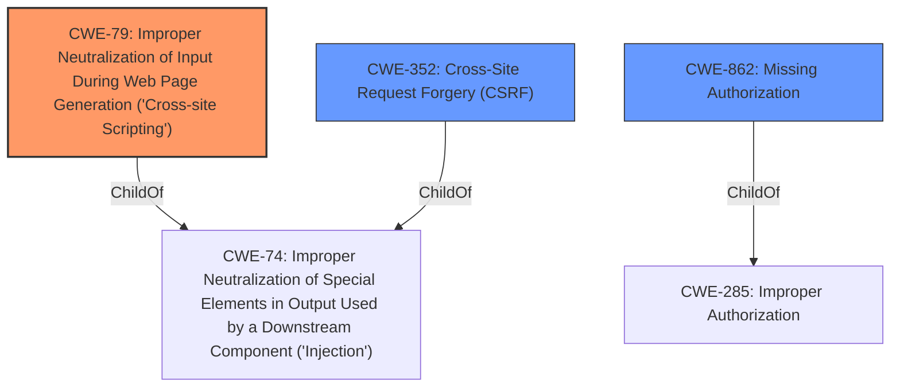

# Raw Analyzer Response for CVE-2021-25075

# Summary
| CWE ID | CWE Name | Confidence | CWE Abstraction Level | CWE Vulnerability Mapping Label | CWE-Vulnerability Mapping Notes |
|---|---|---|---|---|---|
| CWE-79 | Improper Neutralization of Input During Web Page Generation ('Cross-site Scripting') | 1.0 | Base | Allowed | Primary CWE |
| CWE-352 | Cross-Site Request Forgery (CSRF) | 0.9 | Compound | Allowed | Secondary CWE |
| CWE-862 | Missing Authorization | 0.7 | Class | Allowed-with-Review | Secondary CWE |

## Evidence and Confidence

*   **Confidence Score:** 0.9
*   **Evidence Strength:** HIGH

## Relationship Analysis
The primary weakness is **CWE-79 [Improper Neutralization of Input During Web Page Generation ('Cross-site Scripting')]**, a Base level CWE that directly addresses the **lack of escaping** leading to stored XSS. **CWE-352 [Cross-Site Request Forgery (CSRF)]** and **CWE-862 [Missing Authorization]** are also relevant due to the flawed CSRF check and **missing authorization** on the AJAX action. **CWE-79 [Improper Neutralization of Input During Web Page Generation ('Cross-site Scripting')]** can be exploited through CSRF, making **CWE-352 [Cross-Site Request Forgery (CSRF)]** a contributing factor. **CWE-862 [Missing Authorization]** contributes by allowing unauthorized users to trigger the vulnerable action.

## Vulnerability Chain
1.  **Missing Authorization (CWE-862 [Missing Authorization])**: Any authenticated user can access the AJAX action.
2.  **Flawed CSRF Check (CWE-352 [Cross-Site Request Forgery (CSRF)])**: Allows attackers to bypass CSRF protection.
3.  **Lack of Escaping (CWE-79 [Improper Neutralization of Input During Web Page Generation ('Cross-site Scripting')])**: User input is not properly neutralized.
4.  **Stored XSS (CWE-79 [Improper Neutralization of Input During Web Page Generation ('Cross-site Scripting')])**: Malicious script is stored and executed, leading to account takeover or other malicious actions.

## Summary of Analysis
The analysis is based on the vulnerability description and the CVE Reference Links Content Summary. The key evidence for **CWE-79 [Improper Neutralization of Input During Web Page Generation ('Cross-site Scripting')]** is the "**lack of escaping**" which directly leads to Stored Cross-Site Scripting issues. The description states: "Furthermore, due to the **lack of escaping**, this could lead to Stored Cross-Site Scripting issues." **CWE-352 [Cross-Site Request Forgery (CSRF)]** is chosen because the plugin has a "flawed CSRF check" in the AJAX action. **CWE-862 [Missing Authorization]** is chosen because the plugin does not have any authorization in the AJAX action, which allows any authenticated user to call it and change the plugin's settings. The graph relationships show how these vulnerabilities are related, with **CWE-79 [Improper Neutralization of Input During Web Page Generation ('Cross-site Scripting')]** being the primary issue, facilitated by **CWE-352 [Cross-Site Request Forgery (CSRF)]** and **CWE-862 [Missing Authorization]**.

The selected CWEs are at the optimal level of specificity. **CWE-79 [Improper Neutralization of Input During Web Page Generation ('Cross-site Scripting')]** is a Base CWE that directly describes the **lack of escaping** and resulting XSS. **CWE-352 [Cross-Site Request Forgery (CSRF)]** is a Compound CWE that describes the flawed CSRF check. **CWE-862 [Missing Authorization]** is a Class CWE that describes the **missing authorization**.

Relevant CWE Information:

# Enhanced Context (25 CWEs)

## CWE-80: Improper Neutralization of Script-Related HTML Tags in a Web Page (Basic XSS)
**Abstraction Level**: Variant
**Similarity Score**: 0.80
**Source**: dense

**Description**:
The product receives input from an upstream component, but it does not neutralize or incorrectly neutralizes special characters such as "<", ">", and "&" that could be interpreted as web-scripting elements when they are sent to a downstream component that processes web pages.

**Mapping Guidance**:
- Usage: Allowed
- Rationale: This CWE entry is at the Variant level of abstraction, which is a preferred level of abstraction for mapping to the root causes of vulnerabilities.

## CWE-472: External Control of Assumed-Immutable Web Parameter
**Abstraction Level**: Base
**Similarity Score**: 0.78
**Source**: dense

**Description**:
The web application does not sufficiently verify inputs that are assumed to be immutable but are actually externally controllable, such as hidden form fields.

**Mapping Guidance**:
- Usage: Allowed
- Rationale: This CWE entry is at the Base level of abstraction, which is a preferred level of abstraction for mapping to the root causes of vulnerabilities.

## CWE-74: Improper Neutralization of Special Elements in Output Used by a Downstream Component ('Injection')
**Abstraction Level**: Class
**Similarity Score**: 0.77
**Source**: dense

**Description**:
The product constructs all or part of a command, data structure, or record using externally-influenced input from an upstream component, but it does not neutralize or incorrectly neutralizes special elements that could modify how it is parsed or interpreted when it is sent to a downstream component.

**Mapping Guidance**:
- Usage: Discouraged
- Rationale: CWE-74 is high-level and often misused when lower-level weaknesses are more appropriate.

## CWE-116: Improper Encoding or Escaping of Output
**Abstraction Level**: Class
**Similarity Score**: 0.77
**Source**: dense

**Description**:
The product prepares a structured message for communication with another component, but encoding or escaping of the data is either missing or done incorrectly. As a result, the intended structure of the message is not preserved.

**Mapping Guidance**:
- Usage: Allowed-with-Review
- Rationale: This CWE entry is a Class and might have Base-level children that would be more appropriate

## CWE-639: Authorization Bypass Through User-Controlled Key
**Abstraction Level**: Base
**Similarity Score**: 0.77
**Source**: dense

**Description**:
The system's authorization functionality does not prevent one user from gaining access to another user's data or record by modifying the key value identifying the data.

**Mapping Guidance**:
- Usage: Allowed
- Rationale: This CWE entry is at the Base level of abstraction, which is a preferred level of abstraction for mapping to the root causes of vulnerabilities.

## CWE-184: Incomplete List of Disallowed Inputs
**Abstraction Level**: Base
**Similarity Score**: 0.77
**Source**: dense

**Description**:
The product implements a protection mechanism that relies on a list of inputs (or properties of inputs) that are not allowed by policy or otherwise require other action to neutralize before additional processing takes place, but the list is incomplete.

**Mapping Guidance**:
- Usage: Allowed
- Rationale: This CWE entry is at the Base level of abstraction, which is a preferred level of abstraction for mapping to the root causes of vulnerabilities.

## CWE-1289: Improper Validation of Unsafe Equivalence in Input
**Abstraction Level**: Base
**Similarity Score**: 0.76
**Source**: dense

**Description**:
The product receives an input value that is used as a resource identifier or other type of reference, but it does not validate or incorrectly validates that the input is equivalent to a potentially-unsafe value.

**Mapping Guidance**:
- Usage: Allowed
- Rationale: This CWE entry is at the Base level of abstraction, which is a preferred level of abstraction for mapping to the root causes of vulnerabilities.

## CWE-352: Cross-Site Request Forgery (CSRF)
**Abstraction Level**: Compound
**Similarity Score**: 0.76
**Source**: dense

**Description