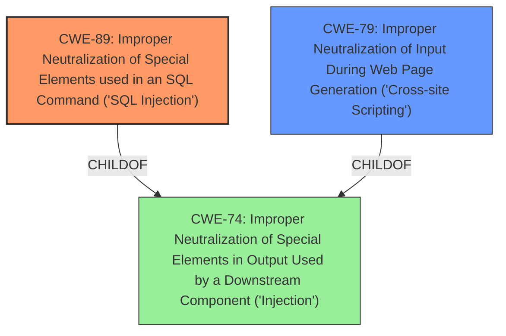

# Analysis Report for CVE-2021-25076

# Vulnerability Analysis Report: CVE-2021-25076

## Description


## Analysis (with Relationship Data)

# Summary
| CWE ID | CWE Name | Confidence | CWE Abstraction Level | CWE Vulnerability Mapping Label | CWE-Vulnerability Mapping Notes |
|---|---|---|---|---|---|
| CWE-89 | Improper Neutralization of Special Elements used in an SQL Command ('SQL Injection') | 1.0 | Base | Allowed | Primary CWE. The plugin fails to properly validate and escape the `status` parameter before using it in a SQL query, allowing for SQL injection. |
| CWE-79 | Improper Neutralization of Input During Web Page Generation ('Cross-site Scripting') | 1.0 | Base | Allowed | Secondary CWE. Due to the lack of sanitisation and escaping, this could also lead to Reflected Cross-Site Scripting. |

## Evidence and Confidence

*   **Confidence Score:** 1.0
*   **Evidence Strength:** HIGH

## Relationship Analysis
The primary relationship is that CWE-89 and CWE-79 are both children of CWE-74 (Improper Neutralization of Special Elements in Output Used by a Downstream Component ('Injection')), indicating that they are specific types of injection vulnerabilities. CWE-89 focuses on SQL injection, while CWE-79 deals with cross-site scripting. The description mentions both SQL injection and reflected XSS due to the **lack of sanitisation and escaping** of the `status` parameter.



## Vulnerability Chain
The vulnerability chain starts with the **lack of sanitisation and escaping** of the `status` parameter, leading to both SQL Injection (CWE-89) and Reflected Cross-Site Scripting (CWE-79).
  - **Root Cause:** **Lack of sanitisation and escaping** of the status parameter.
  - **Weakness 1:** SQL Injection (CWE-89) - Improper Neutralization of Special Elements used in an SQL Command.
  - **Weakness 2:** Reflected Cross-Site Scripting (CWE-79) - Improper Neutralization of Input During Web Page Generation.
  - **Impact:** An attacker could execute arbitrary SQL queries or inject malicious JavaScript into the user's browser.

## Summary of Analysis
The initial analysis identified two key weaknesses: SQL Injection (CWE-89) and Cross-Site Scripting (CWE-79), directly stemming from the **lack of sanitisation and escaping** of the `status` parameter within the WP User Frontend WordPress plugin.

The selection of CWE-89 and CWE-79 is based on the explicit mention of both SQL injection and reflected XSS in the vulnerability description and CVE Reference Links Content Summary. The "Vulnerability Description Key Phrases" also point to "**lack of sanitisation and escaping**" as the root cause.

The retriever results also supports these choices, with CWE-89 and CWE-79 being top candidates. The graph relationships confirm that both are children of CWE-74, indicating they are specific types of injection vulnerabilities. The mapping guidance for both CWEs allows their usage at the Base level of abstraction, which is preferred.

The selection of these CWEs is at the optimal level of specificity, as they directly address the identified weaknesses. While CWE-74 (Improper Neutralization of Special Elements in Output Used by a Downstream Component ('Injection')) could be considered, it is a class-level CWE and less specific than CWE-89 and CWE-79.

Relevant CWE Information:
# Enhanced Context (25 CWEs)
## CWE-1289: Improper Validation of Unsafe Equivalence in Input
Not Selected: While input validation is a factor, the core issue is the **lack of sanitisation and escaping** rather than explicitly an equivalence check.

## CWE-807: Reliance on Untrusted Inputs in a Security Decision
Not Selected: The vulnerability isn't directly about relying on untrusted inputs in a security decision, but rather the **lack of sanitisation and escaping** leading to injection.

## CWE-80: Improper Neutralization of Script-Related HTML Tags in a Web Page (Basic XSS)
Not Selected: CWE-79 is more general and fits better.

## CWE-74: Improper Neutralization of Special Elements in Output Used by a Downstream Component ('Injection')
Not Selected: This is a parent of CWE-89 and CWE-79. Selecting CWE-89 and CWE-79 provides more specific information.

## CWE-138: Improper Neutralization of Special Elements
Not Selected: This is a parent of CWE-74 and thus a grandparent of CWE-89 and CWE-79. Selecting CWE-89 and CWE-79 provides more specific information.

## CWE-184: Incomplete List of Disallowed Inputs
Not Selected: The issue isn't about an incomplete list of disallowed inputs, but the **lack of sanitisation and escaping**.

## CWE-183: Permissive List of Allowed Inputs
Not Selected: The issue isn't about a permissive list of allowed inputs, but the **lack of sanitisation and escaping**.

## CWE-179: Incorrect Behavior Order: Early Validation
Not Selected: The issue isn't about the order of validation, but the **lack of sanitisation and escaping**.

## CWE-73: External Control of File Name or Path
Not Selected: This CWE is not relevant to the described vulnerability, as it focuses on file path manipulation.

## CWE-116: Improper Encoding or Escaping of Output
Not Selected: While encoding/escaping is related to XSS and SQLi prevention, CWE-79 and CWE-89 are more specific and accurately represent the vulnerability.

## CWE-22: Improper Limitation of a Pathname to a Restricted Directory ('Path Traversal')
Not Selected: This vulnerability doesn't involve path traversal.

## CWE-352: Cross-Site Request Forgery (CSRF)
Not Selected: There is no evidence of CSRF in the vulnerability description.

## CWE-94: Improper Control of Generation of Code ('Code Injection')
Not Selected: While SQL injection can lead to code execution, CWE-89 is a more accurate representation of the vulnerability.

## CWE-770: Allocation of Resources Without Limits or Throttling
Not Selected: This CWE is not relevant to the described vulnerability.

## CWE-494: Download of Code Without Integrity Check
Not Selected: This CWE is not relevant to the described vulnerability.

## CWE-59: Improper Link Resolution Before File Access ('Link Following')
Not Selected: This vulnerability doesn't involve link following.

## CWE-613: Insufficient Session Expiration
Not Selected: This CWE is not relevant to the described vulnerability.

## CWE-98: Improper Control of Filename for Include/Require Statement in PHP Program ('PHP Remote File Inclusion')
Not Selected: This vulnerability doesn't involve file inclusion.


## CWE Relationship Analysis

Current CWEs represent these abstraction levels: .


### Vulnerability Chain Analysis

**Chain starting from CWE-116:**
- 116 (Improper Encoding or Escaping of Output) - ROOT


**Chain starting from CWE-179:**
- 179 (Incorrect Behavior Order: Early Validation) - ROOT


### CWE Relationship Diagram

```mermaid
graph TD
    classDef primary fill:#f96,stroke:#333,stroke-width:2px
    classDef secondary fill:#69f,stroke:#333
    classDef tertiary fill:#9e9,stroke:#333
```


*Report generated on 2025-04-01 20:55:20*
