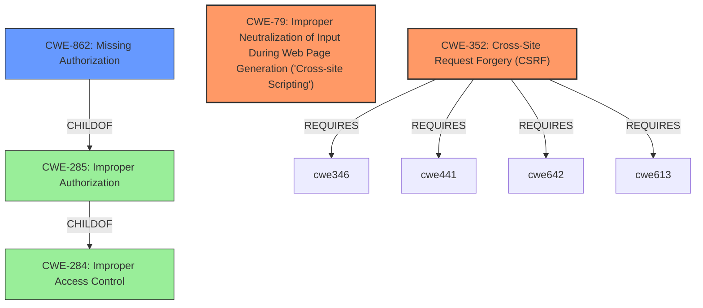

# Analysis Report for CVE-2021-25090

# Vulnerability Analysis Report: CVE-2021-25090

## Description


## Analysis (with Relationship Data)

# Summary
| CWE ID | CWE Name | Confidence | CWE Abstraction Level | CWE Vulnerability Mapping Label | CWE-Vulnerability Mapping Notes |
|---|---|---|---|---|---|
| CWE-352 | Cross-Site Request Forgery (CSRF) | 0.9 | Compound | Primary | Allowed |
| CWE-79 | Improper Neutralization of Input During Web Page Generation ('Cross-site Scripting') | 0.9 | Base | Primary | Allowed |
| CWE-862 | Missing Authorization | 0.8 | Class | Secondary | Allowed-with-Review |

## Evidence and Confidence

*   **Confidence Score:** 0.9
*   **Evidence Strength:** HIGH

## Relationship Analysis
The primary CWEs identified are CWE-352 (Cross-Site Request Forgery) and CWE-79 (Improper Neutralization of Input During Web Page Generation ('Cross-site Scripting')). CWE-352 is a Compound weakness comprising multiple underlying causes. CWE-79, a Base level CWE, describes the root cause of the Cross-Site Scripting vulnerability. CWE-862 (Missing Authorization) is included as a secondary issue where the product does not perform authorization checks when an actor attempts to access a resource or perform an action. CWE-862 is a Class level CWE and has a relationship to CWE-285 (Improper Authorization) and CWE-284 (Improper Access Control).



## Vulnerability Chain
The vulnerability chain starts with the **lack of authorization and CSRF checks**. This allows any authenticated user to call AJAX functions. Due to the **lack of sanitisation and escaping**, attackers can then perform Cross-Site Scripting attacks.

## Summary of Analysis
The vulnerability description clearly indicates **lack of authorisation and CSRF checks** and **cross-site scripting**. The "CVE Reference Links Content Summary" section provides solid evidence supporting these weaknesses: "The GridKit Portfolio plugin lacks proper authorization and CSRF checks in various AJAX action functions", "The plugin also lacks sufficient sanitization and escaping of user-supplied data, leading to Cross-Site Scripting (XSS) vulnerabilities."

CWE-352 (Cross-Site Request Forgery) is selected because the plugin lacks CSRF checks, allowing unauthorized actions to be performed on behalf of logged-in users.
CWE-79 (Improper Neutralization of Input During Web Page Generation ('Cross-site Scripting')) is selected because the plugin lacks sufficient sanitization and escaping of user-supplied data, leading to XSS vulnerabilities.
CWE-862 (Missing Authorization) is selected as there is a **lack of authorisation** in various functions.

Other CWEs Considered:
*   CWE-863 (Incorrect Authorization) - While authorization is mentioned, the primary issue is the *absence* of authorization checks, making CWE-862 a more precise fit than a case of *incorrect* authorization.
*   CWE-116 (Improper Encoding or Escaping of Output) - This is related to XSS, but CWE-79 is more specific to the web context.
*   CWE-434 (Unrestricted Upload of File with Dangerous Type) - This is not relevant as the vulnerability description does not discuss file uploads.

The selected CWEs are at the optimal level of specificity, with CWE-79 at the Base level and CWE-352 at the Compound level, and accurately represent the weaknesses described in the vulnerability description. The abstraction levels of the selected CWEs are appropriate, with the most specific Base and Compound levels chosen where possible.


## CWE Relationship Analysis

Current CWEs represent these abstraction levels: .


### Vulnerability Chain Analysis

**Chain starting from CWE-79:**
- 79 (Improper Neutralization of Input During Web Page Generation ('Cross-site Scripting')) - ROOT


**Chain starting from CWE-862:**
- 862 (Missing Authorization) - ROOT


### CWE Relationship Diagram

```mermaid
graph TD
    classDef primary fill:#f96,stroke:#333,stroke-width:2px
    classDef secondary fill:#69f,stroke:#333
    classDef tertiary fill:#9e9,stroke:#333
```


*Report generated on 2025-04-02 02:01:48*
