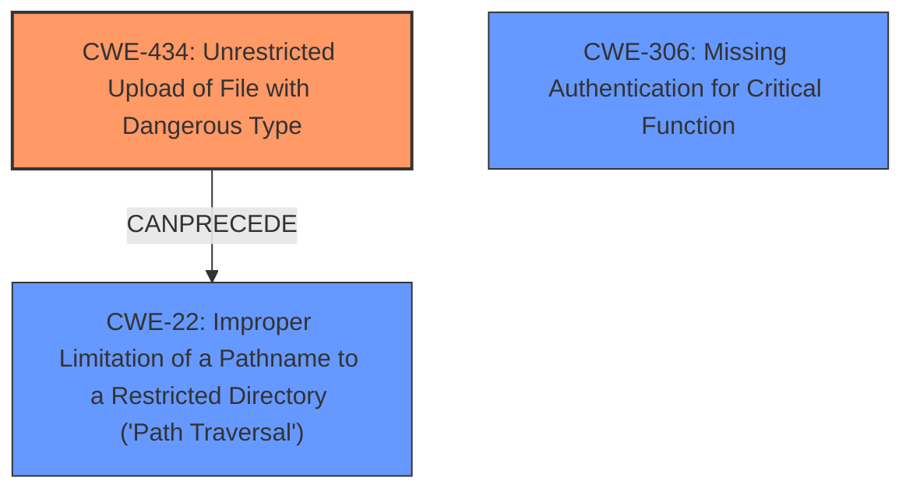

# Raw Analyzer Response for CVE-2021-25094

# Summary
| CWE ID | CWE Name | Confidence | CWE Abstraction Level | CWE Vulnerability Mapping Label | CWE-Vulnerability Mapping Notes |
|---|---|---|---|---|---|
| **CWE-434** | **Unrestricted Upload of File with Dangerous Type** | 0.9 | Base | Primary | Allowed |
| CWE-306 | Missing Authentication for Critical Function | 0.7 | Base | Secondary | Allowed |
| CWE-22 | Improper Limitation of a Pathname to a Restricted Directory ('Path Traversal') | 0.6 | Base | Secondary | Allowed |

## Evidence and Confidence

*   **Confidence Score:** 0.8
*   **Evidence Strength:** HIGH

## Relationship Analysis
The primary weakness is the **Unrestricted Upload of File with Dangerous Type (CWE-434)**, which allows for the upload of malicious files. This is compounded by **Missing Authentication for Critical Function (CWE-306)**, enabling unauthenticated users to perform the upload. **Improper Limitation of a Pathname to a Restricted Directory ('Path Traversal') (CWE-22)** may come into play if the uploaded file's path is not correctly restricted, leading to it being placed in a location accessible for execution.

## Vulnerability Chain
The vulnerability chain starts with **CWE-306**, as the lack of authentication allows unauthorized users to initiate the upload process. This leads to **CWE-434**, where the plugin fails to restrict the upload of dangerous file types. The race condition during zip extraction allows for the execution of the uploaded PHP shell and an attacker can then call the shell file from the filesystem. If **CWE-22** were present, the attacker could potentially place the shell in a more advantageous location.

## Summary of Analysis
Based on the provided evidence, the primary weakness is **CWE-434 (Unrestricted Upload of File with Dangerous Type)**. The "CVE Reference Links Content Summary" clearly states that the plugin allows the upload of custom fonts without proper validation, which can lead to the execution of malicious PHP scripts. The **weakness** is the **bypass authentication to upload rogue zip file**. The "Retriever Results" also supports this, with CWE-434 having the highest relevance score.

The secondary weakness is **CWE-306 (Missing Authentication for Critical Function)**. The vulnerability description mentions that the `add_custom_font` action can be used without prior authentication, which allows any user to upload a rogue zip file. This missing authentication is a prerequisite for exploiting the file upload vulnerability.

**CWE-22 (Improper Limitation of a Pathname to a Restricted Directory ('Path Traversal'))** is a potential, but less prominent, weakness. While the vulnerability description mentions that the zip file is uncompressed under the WordPress upload directory, it doesn't explicitly state that the attacker can control the path to which the file is extracted. However, if the attacker could influence the extraction path, it would further exacerbate the vulnerability.

The chosen CWEs are at the Base level of abstraction, which is the preferred level for mapping root causes. They accurately represent the specific weaknesses present in the Tatsu WordPress plugin.

Relevant CWE Information:

# Enhanced Context (25 CWEs)
The following CWEs were identified as potentially relevant to this vulnerability:

## CWE-41: Improper Resolution of Path Equivalence
**Abstraction Level**: Base
**Similarity Score**: 0.80
**Source**: dense

**Description**:
The product is vulnerable to file system contents disclosure through path equivalence. Path equivalence involves the use of special characters in file and directory names. The associated manipulations are intended to generate multiple names for the same object.

**Mapping Guidance**:
- Usage: Allowed
- Rationale: This CWE entry is at the Base level of abstraction, which is a preferred level of abstraction for mapping to the root causes of vulnerabilities.

**Why it was not selected:** This is not about disclosing file contents, but about uploading a malicious file to get code execution.

## CWE-23: Relative Path Traversal
**Abstraction Level**: Base
**Similarity Score**: 0.80
**Source**: dense

**Description**:
The product uses external input to construct a pathname that should be within a restricted directory, but it does not properly neutralize sequences such as ".." that can resolve to a location that is outside of that directory.

**Mapping Guidance**:
- Usage: Allowed
- Rationale: This CWE entry is at the Base level of abstraction, which is a preferred level of abstraction for mapping to the root causes of vulnerabilities.

**Why it was considered:** This CWE was considered because the zip file is extracted to a directory and there could be a path traversal issue.

## CWE-184: Incomplete List of Disallowed Inputs
**Abstraction Level**: Base
**Similarity Score**: 0.79
**Source**: dense

**Description**:
The product implements a protection mechanism that relies on a list of inputs (or properties of inputs) that are not allowed by policy or otherwise require other action to neutralize before additional processing takes place, but the list is incomplete.

**Mapping Guidance**:
- Usage: Allowed
- Rationale: This CWE entry is at the Base level of abstraction, which is a preferred level of abstraction for mapping to the root causes of vulnerabilities.

**Why it was not selected:** While the plugin does perform extension checks, the root cause is not the incomplete list, but that the files are uploaded and extracted prior to the check.

## CWE-74: Improper Neutralization of Special Elements in Output Used by a Downstream Component ('Injection')
**Abstraction Level**: Class
**Similarity Score**: 0.79
**Source**: dense

**Description**:
The product constructs all or part of a command, data structure, or record using externally-influenced input from an upstream component, but it does not neutralize or incorrectly neutralizes special elements that could modify how it is parsed or interpreted when it is sent to a downstream component.

**Mapping Guidance**:
- Usage: Discouraged
- Rationale: CWE-74 is high-level and often misused when lower-level weaknesses are more appropriate.

**Why it was not selected:** This is a high level CWE and not applicable.

## CWE-59: Improper Link Resolution Before File Access ('Link Following')
**Abstraction Level**: Base
**Similarity Score**: 0.78
**Source**: dense

**Description**:
The product attempts to access a file based on the filename, but it does not properly prevent that filename from identifying a link or shortcut that resolves to an unintended resource.

**Mapping Guidance**:
- Usage: Allowed
- Rationale: This CWE entry is at the Base level of abstraction, which is a preferred level of abstraction for mapping to the root causes of vulnerabilities.

**Why it was not selected:** This weakness is not about symlink or link following.

## CWE-73: External Control of File Name or Path
**Abstraction Level**: Base
**Similarity Score**: 0.78
**Source**: dense

**Description**:
The product allows user input to control or influence paths or file names that are used in filesystem operations.

**Mapping Guidance**:
- Usage: Allowed
- Rationale: This CWE entry is at the Base level of abstraction, which is a preferred level of abstraction for mapping to the root causes of vulnerabilities.

**Why it was not selected:** The primary issue is the upload of a dangerous file type, not direct control over the file name or path.

## CWE-425: Direct Request ('Forced Browsing')
**Abstraction Level**: Base
**Similarity Score**: 0.78
**Source**: dense

**Description**:
The web application does not adequately enforce appropriate authorization on all restricted URLs, scripts, or files.

**Mapping Guidance**:
- Usage: Allowed
- Rationale: This CWE entry is at the Base level of abstraction, which is a preferred level of abstraction for mapping to the root causes of vulnerabilities.

**Why it was not selected:** The vulnerability is about uploading a malicious file without authentication, not about direct access to URLs.

## CWE-639: Authorization Bypass Through User-Controlled Key
**Abstraction Level**: Base
**Similarity Score**: 0.78
**Source**: dense

**Description**:
The system's authorization functionality does not prevent one user from gaining access to another user's data or record by modifying the key value identifying the data.

**Mapping Guidance**:
- Usage: Allowed
- Rationale: This CWE entry is at the Base level of abstraction, which is a preferred level of abstraction for mapping to the root causes of vulnerabilities.

**Why it was not selected:** The vulnerability is not about bypassing authorization through a user-controlled key.

## CWE