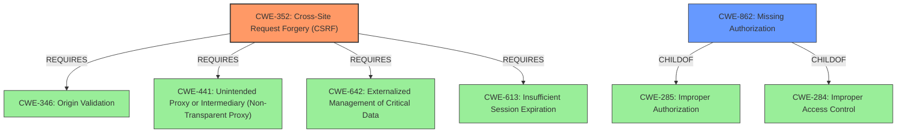

# Analysis for CVE-2021-25097

# Summary
| CWE ID | CWE Name | Confidence | CWE Abstraction Level | CWE Vulnerability Mapping Label | CWE-Vulnerability Mapping Notes |
|---|---|---|---|---|---|
| CWE-352 | Cross-Site Request Forgery (CSRF) | 1.0 | Compound | Allowed | Primary CWE |
| CWE-862 | Missing Authorization | 1.0 | Class | Allowed-with-Review | Secondary Candidate |

## Evidence and Confidence

*   **Confidence Score:** 1.0
*   **Evidence Strength:** HIGH

## Relationship Analysis
The primary weakness is the **missing authorisation and CSRF check**.

CWE-352 is a compound weakness comprising multiple weaknesses that must occur simultaneously. It requires CWE-346, CWE-441, CWE-642 and CWE-613.
CWE-862 is a class that is a child of CWE-285 and CWE-284.

## Vulnerability Chain
The vulnerability chain starts with the **missing authorisation and CSRF check**, leading to any authenticated user being able to delete arbitrary publications.

## Summary of Analysis
The vulnerability description states a **missing authorisation and CSRF check** in place when deleting publications.
The vulnerability description key phrases include "**rootcause:** **missing authorisation and CSRF check**" and "**impact:** delete arbitrary publication". The "CVE Reference Links Content Summary" section also states that the root cause of the vulnerability is the **missing authorisation and CSRF check**.

The retriever results lists both CWE-352 and CWE-862 as possible candidates.

CWE-352 Cross-Site Request Forgery (CSRF) is a compound weakness that occurs when the web application does not sufficiently verify whether a well-formed, valid, consistent request was intentionally provided by the user who submitted the request. In this case, the plugin does not have a CSRF check in place, so any authenticated user can delete arbitrary publications. The usage for CWE-352 is ALLOWED.

CWE-862 Missing Authorization is a class that occurs when the product does not perform an authorization check when an actor attempts to access a resource or perform an action. In this case, the plugin does not have proper authorization in place, so any authenticated user can delete arbitrary publications. The usage for CWE-862 is ALLOWED-WITH-REVIEW because it is a Class and might have Base-level children that would be more appropriate. However, there is no further information to select a more specific child.

Given that the vulnerability description explicitly states that both authorisation and CSRF checks are missing, I have selected both CWE-352 and CWE-862. I am choosing to map both CWE-352 and CWE-862 because the vulnerability description explicitly mentions both.

I considered CWE-285 Improper Authorization, but its usage is Discouraged and it is a parent of CWE-862, which is a better fit.
I considered CWE-863 Incorrect Authorization, but the vulnerability description states that authorisation is missing, not incorrect.
I considered CWE-425 Direct Request ('Forced Browsing'), but this CWE describes missing authorization on restricted URLs, scripts, or files, which is not explicitly stated in the vulnerability description.
I considered CWE-639 Authorization Bypass Through User-Controlled Key, but the vulnerability description does not state that the authorization is bypassed through a user-controlled key.

I am confident in my assessment, given the explicit evidence provided in the vulnerability description.