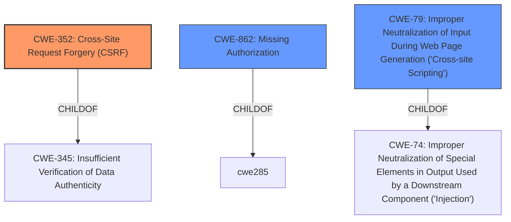

# Analysis Report for CVE-2021-25106

# Vulnerability Analysis Report: CVE-2021-25106

## Description


## Analysis (with Relationship Data)

# Summary
| CWE ID | CWE Name | Confidence | CWE Abstraction Level | CWE Vulnerability Mapping Label | CWE-Vulnerability Mapping Notes |
|---|---|---|---|---|---|
| CWE-352 | Cross-Site Request Forgery (CSRF) | 0.9 | Compound | Allowed | Primary CWE: The plugin has a flawed CSRF logic when saving its settings. |
| CWE-862 | Missing Authorization | 0.9 | Class | Allowed-with-Review | Secondary CWE: The plugin does not check for authorisation when saving its settings. |
| CWE-79 | Improper Neutralization of Input During Web Page Generation ('Cross-site Scripting') | 0.8 | Base | Allowed | Secondary CWE: Due to the lack of sanitisation and escaping, it could lead to Stored Cross-Site Scripting. |

## Evidence and Confidence

*   **Confidence Score:** 0.9
*   **Evidence Strength:** HIGH

## Relationship Analysis
The primary weakness is the **CWE-352** [Cross-Site Request Forgery (CSRF)] which exists because the application doesn't properly verify that a request was intentionally sent by the user. This weakness is related to **CWE-862** [Missing Authorization] because the lack of authorization checks allows any authenticated user to perform actions they shouldn't. The **CWE-79** [Improper Neutralization of Input During Web Page Generation ('Cross-site Scripting')] is a result of the **lack of sanitization**, thus it is a separate issue.



## Vulnerability Chain
The vulnerability chain starts with **CWE-862** [Missing Authorization] and **CWE-352** [Cross-Site Request Forgery (CSRF)]. Since there is **lack of authorization and flawed CSRF logic**, an attacker can modify settings. Then, due to the **lack of sanitization and escaping**, the attacker can inject a **Cross-Site Scripting (XSS)** payload. The **XSS** can then be used to perform malicious actions.

## Summary of Analysis
Based on the vulnerability description and the provided information, the primary weakness is **CWE-352** [Cross-Site Request Forgery (CSRF)]. The description states the plugin has a **flawed CSRF logic**, which aligns perfectly with the definition of **CWE-352** [Cross-Site Request Forgery (CSRF)]. Additionally, the plugin does not check for authorization which makes **CWE-862** [Missing Authorization] a good fit as well. Finally, the **lack of sanitization and escaping** of input leads to **CWE-79** [Improper Neutralization of Input During Web Page Generation ('Cross-site Scripting')], also known as **XSS**.

The evidence for **CWE-352** [Cross-Site Request Forgery (CSRF)] is that the "plugin does not check for authorization and has **flawed CSRF logic** when saving its settings".
The evidence for **CWE-862** [Missing Authorization] is that "plugin **does not check for authorisation** when saving its settings".
The evidence for **CWE-79** [Improper Neutralization of Input During Web Page Generation ('Cross-site Scripting')] is that "due to the **lack of sanitisation and escaping**, it could lead to Stored Cross-Site Scripting".

I considered **CWE-863** [Incorrect Authorization] but chose **CWE-862** [Missing Authorization] instead, because the description says that the plugin **does not check for authorisation** at all. **CWE-863** [Incorrect Authorization] implies an authorization check is performed but incorrectly.

I considered **CWE-116** [Improper Encoding or Escaping of Output] because the description mentions **lack of sanitisation and escaping**. However, I chose **CWE-79** [Improper Neutralization of Input During Web Page Generation ('Cross-site Scripting')] instead, because the **lack of sanitisation and escaping** lead to **Cross-Site Scripting**.

Relevant CWE Information:

# Enhanced Context (25 CWEs)
The following CWEs were identified as potentially relevant to this vulnerability:

## CWE-80: Improper Neutralization of Script-Related HTML Tags in a Web Page (Basic XSS)
**Abstraction Level**: Variant
**Similarity Score**: 0.77
**Source**: dense

**Description**:
The product receives input from an upstream component, but it does not neutralize or incorrectly neutralizes special characters such as "<", ">", and "&" that could be interpreted as web-scripting elements when they are sent to a downstream component that processes web pages.

**Mapping Guidance**:
- Usage: Allowed
- Rationale: This CWE entry is at the Variant level of abstraction, which is a preferred level of abstraction for mapping to the root causes of vulnerabilities.


## CWE-74: Improper Neutralization of Special Elements in Output Used by a Downstream Component ('Injection')
**Abstraction Level**: Class
**Similarity Score**: 0.77
**Source**: dense

**Description**:
The product constructs all or part of a command, data structure, or record using externally-influenced input from an upstream component, but it does not neutralize or incorrectly neutralizes special elements that could modify how it is parsed or interpreted when it is sent to a downstream component.

**Mapping Guidance**:
- Usage: Discouraged
- Rationale: CWE-74 is high-level and often misused when lower-level weaknesses are more appropriate.


## CWE-472: External Control of Assumed-Immutable Web Parameter
**Abstraction Level**: Base
**Similarity Score**: 0.76
**Source**: dense

**Description**:
The web application does not sufficiently verify inputs that are assumed to be immutable but are actually externally controllable, such as hidden form fields.

**Mapping Guidance**:
- Usage: Allowed
- Rationale: This CWE entry is at the Base level of abstraction, which is a preferred level of abstraction for mapping to the root causes of vulnerabilities.


## CWE-1289: Improper Validation of Unsafe Equivalence in Input
**Abstraction Level**: Base
**Similarity Score**: 0.76
**Source**: dense

**Description**:
The product receives an input value that is used as a resource identifier or other type of reference, but it does not validate or incorrectly validates that the input is equivalent to a potentially-unsafe value.

**Mapping Guidance**:
- Usage: Allowed
- Rationale: This CWE entry is at the Base level of abstraction, which is a preferred level of abstraction for mapping to the root causes of vulnerabilities.


## CWE-943: Improper Neutralization of Special Elements in Data Query Logic
**Abstraction Level**: Class
**Similarity Score**: 0.75
**Source**: dense

**Description**:
The product generates a query intended to access or manipulate data in a data store such as a database, but it does not neutralize or incorrectly neutralizes special elements that can modify the intended logic of the query.

**Mapping Guidance**:
- Usage: Allowed-with-Review
- Rationale: This CWE entry is a Class and might have Base-level children that would be more appropriate


## CWE-116: Improper Encoding or Escaping of Output
**Abstraction Level**: Class
**Similarity Score**: 0.75
**Source**: dense

**Description**:
The product prepares a structured message for communication with another component, but encoding or escaping of the data is either missing or done incorrectly. As a result, the intended structure of the message is not preserved.

**Mapping Guidance**:
- Usage: Allowed-with-Review
- Rationale: This CWE entry is a Class and might have Base-level children that would be more appropriate


## CWE-184: Incomplete List of Disallowed Inputs
**Abstraction Level**: Base
**Similarity Score**: 0.75
**Source**: dense

**Description**:
The product implements a protection mechanism that relies on a list of inputs (or properties of inputs) that are not allowed by policy or otherwise require other action to neutralize before additional processing takes place, but the list is incomplete.

**Mapping Guidance**:
- Usage: Allowed
- Rationale: This CWE entry is at the Base level of abstraction


## CWE Relationship Analysis

Current CWEs represent these abstraction levels: .


### Vulnerability Chain Analysis

**Chain starting from CWE-79:**
- 79 (Improper Neutralization of Input During Web Page Generation ('Cross-site Scripting')) - ROOT


**Chain starting from CWE-862:**
- 862 (Missing Authorization) - ROOT


### CWE Relationship Diagram

```mermaid
graph TD
    classDef primary fill:#f96,stroke:#333,stroke-width:2px
    classDef secondary fill:#69f,stroke:#333
    classDef tertiary fill:#9e9,stroke:#333
```


*Report generated on 2025-04-02 03:57:28*
