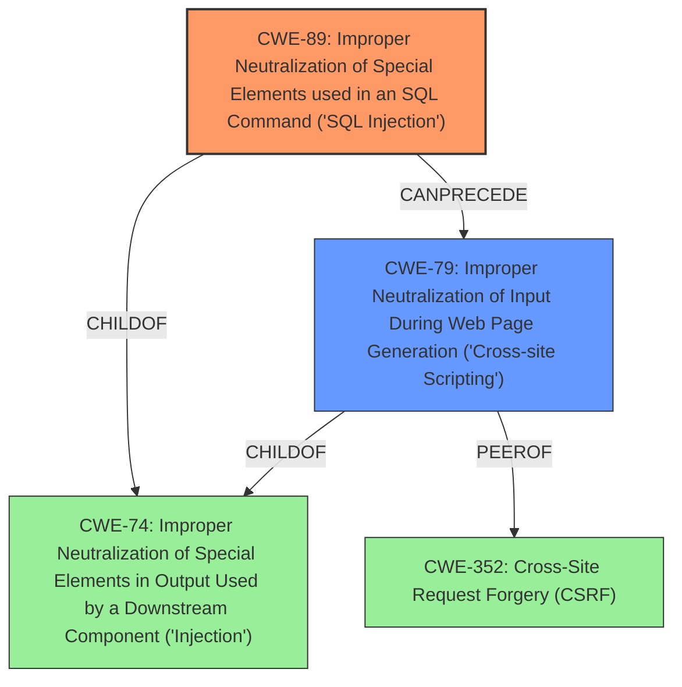

# Raw Analyzer Response for CVE-2021-25109

# Summary
| CWE ID | CWE Name | Confidence | CWE Abstraction Level | CWE Vulnerability Mapping Label | CWE-Vulnerability Mapping Notes |
|---|---|---|---|---|---|
| CWE-89 | Improper Neutralization of Special Elements used in an SQL Command ('SQL Injection') | 1.0 | Base | Allowed | Primary CWE |
| CWE-79 | Improper Neutralization of Input During Web Page Generation ('Cross-site Scripting') | 0.7 | Base | Allowed | Secondary CWE |

## Evidence and Confidence

*   **Confidence Score:** 0.85
*   **Evidence Strength:** HIGH

## Relationship Analysis
The primary weakness is **CWE-89 (SQL Injection)**, which is a base-level CWE and a child of **CWE-74 (Improper Neutralization of Special Elements in Output Used by a Downstream Component ('Injection'))**. The secondary weakness is **CWE-79 (Improper Neutralization of Input During Web Page Generation ('Cross-site Scripting'))**. **CWE-79** is also a child of **CWE-74**, and a peer of **CWE-352 (Cross-Site Request Forgery (CSRF))**. The relationship between **CWE-89** and **CWE-79** is that **CWE-89** enables **CWE-79** by allowing an attacker to inject malicious code into the database, which is then displayed to other users.

## Vulnerability Chain
The vulnerability chain starts with **insufficient sanitization of user-supplied input** in the `dilaz_mb_query_select` AJAX action, leading to a **CWE-89 (SQL Injection)**. This allows attackers to **extract data from the database** and perform **CWE-79 (Cross-Site Scripting)** attacks against logged-in administrators.

## Summary of Analysis
The initial analysis indicated a **SQL Injection vulnerability**, which aligns with **CWE-89**. The analysis was confirmed by the "CVE Reference Links Content Summary," which states that the root cause of the vulnerability is the **insufficient sanitization of user-supplied input** in the `dilaz_mb_query_select` AJAX action. The content summary also highlights that this vulnerability can be exploited to perform **Cross-Site Scripting (XSS)** attacks.

The relationship graph helped to understand how **CWE-89** can lead to **CWE-79**. The **SQL Injection vulnerability** allows an attacker to inject malicious code into the database, which is then displayed to other users, resulting in a **Cross-Site Scripting (XSS)** vulnerability.

**CWE-89** is the most specific and appropriate CWE for the **SQL Injection vulnerability** described in the vulnerability description. The vulnerability description clearly states that the Futurio Extra WordPress plugin is affected by a **SQL Injection vulnerability**, and the "CVE Reference Links Content Summary" confirms that the root cause of the vulnerability is the **insufficient sanitization of user-supplied input**.

**CWE-79** is included as a secondary CWE because the **SQL Injection vulnerability** can be used to perform **Cross-Site Scripting (XSS)** attacks against logged-in administrators. The "CVE Reference Links Content Summary" highlights that by injecting malicious code into the SQL query, an attacker can perform **XSS** attacks against logged-in administrators.

Other CWEs considered but not used:
*   **CWE-74 (Improper Neutralization of Special Elements in Output Used by a Downstream Component ('Injection'))**: While **CWE-74** is a parent of **CWE-89** and **CWE-79**, it is a class-level CWE and is less specific than **CWE-89**.
*   **CWE-352 (Cross-Site Request Forgery (CSRF))**: While the vulnerability description mentions that the **SQL Injection vulnerability** could be used to perform **Cross-Site Scripting (XSS)** attacks, there is no evidence to suggest that the vulnerability is related to **CSRF**.
*   **CWE-116 (Improper Encoding or Escaping of Output)**: This CWE was considered because **SQL Injection** often involves improper escaping, but the primary issue is the lack of sanitization, making **CWE-89** a more direct fit.

Relevant CWE Information:

# Enhanced Context (25 CWEs)

## CWE-74: Improper Neutralization of Special Elements in Output Used by a Downstream Component ('Injection')
**Abstraction Level**: Class
**Similarity Score**: 0.76
**Source**: dense

**Description**:
The product constructs all or part of a command, data structure, or record using externally-influenced input from an upstream component, but it does not neutralize or incorrectly neutralizes special elements that could modify how it is parsed or interpreted when it is sent to a downstream component.

**Mapping Guidance**:
- Usage: Discouraged
- Rationale: CWE-74 is high-level and often misused when lower-level weaknesses are more appropriate.

## CWE-113: Improper Neutralization of CRLF Sequences in HTTP Headers ('HTTP Request/Response Splitting')
**Abstraction Level**: Variant
**Similarity Score**: 0.76
**Source**: dense

**Description**:
The product receives data from an HTTP agent/component (e.g., web server, proxy, browser, etc.), but it does not neutralize or incorrectly neutralizes CR and LF characters before the data is included in outgoing HTTP headers.

**Mapping Guidance**:
- Usage: Allowed
- Rationale: This CWE entry is at the Variant level of abstraction, which is a preferred level of abstraction for mapping to the root causes of vulnerabilities.

## CWE-80: Improper Neutralization of Script-Related HTML Tags in a Web Page (Basic XSS)
**Abstraction Level**: Variant
**Similarity Score**: 0.75
**Source**: dense

**Description**:
The product receives input from an upstream component, but it does not neutralize or incorrectly neutralizes special characters such as "<", ">", and "&" that could be interpreted as web-scripting elements when they are sent to a downstream component that processes web pages.

**Mapping Guidance**:
- Usage: Allowed
- Rationale: This CWE entry is at the Variant level of abstraction, which is a preferred level of abstraction for mapping to the root causes of vulnerabilities.

## CWE-918: Server-Side Request Forgery (SSRF)
**Abstraction Level**: Base
**Similarity Score**: 0.75
**Source**: dense

**Description**:
The web server receives a URL or similar request from an upstream component and retrieves the contents of this URL, but it does not sufficiently ensure that the request is being sent to the expected destination.

**Mapping Guidance**:
- Usage: Allowed
- Rationale: This CWE entry is at the Base level of abstraction, which is a preferred level of abstraction for mapping to the root causes of vulnerabilities.

## CWE-611: Improper Restriction of XML External Entity Reference
**Abstraction Level**: Base
**Similarity Score**: 0.74
**Source**: dense

**Description**:
The product processes an XML document that can contain XML entities with URIs that resolve to documents outside of the intended sphere of control, causing the product to embed incorrect documents into its output.

**Mapping Guidance**:
- Usage: Allowed
- Rationale: This CWE entry is at the Base level of abstraction, which is a preferred level of abstraction for mapping to the root causes of vulnerabilities.

## CWE-1289: Improper Validation of Unsafe Equivalence in Input
**Abstraction Level**: Base
**Similarity Score**: 0.74
**Source**: dense

**Description**:
The product receives an input value that is used as a resource identifier or other type of reference, but it does not validate or incorrectly validates that the input is equivalent to a potentially-unsafe value.

**Mapping Guidance**:
- Usage: Allowed
- Rationale: This CWE entry is at the Base level of abstraction, which is a preferred level of abstraction for mapping to the root causes of vulnerabilities.

## CWE-184: Incomplete List of Disallowed Inputs
**Abstraction Level**: Base
**Similarity Score**: