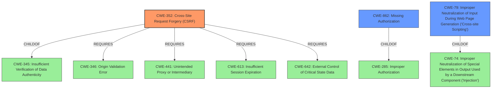

# Enhanced Analysis for CVE-2021-25113

# Summary
| CWE ID | CWE Name | Confidence | CWE Abstraction Level | CWE Vulnerability Mapping Label | CWE-Vulnerability Mapping Notes |
|---|---|---|---|---|---|
| CWE-352 | Cross-Site Request Forgery (CSRF) | 1.0 | Compound | Primary | Allowed |
| CWE-862 | Missing Authorization | 1.0 | Class | Secondary | Allowed-with-Review |
| CWE-79 | Improper Neutralization of Input During Web Page Generation ('Cross-site Scripting') | 1.0 | Base | Secondary | Allowed |

## Evidence and Confidence

*   **Confidence Score:** 1.0
*   **Evidence Strength:** HIGH

## Relationship Analysis
The primary relationships impacting the CWE selection are as follows:
  - CWE-352 (CSRF) requires CWE-346 (Origin Validation), CWE-441 (Unintended Proxy or Intermediary), CWE-613 (Insufficient Session Expiration), and CWE-642 (External Control of Critical State Data) indicating a complex weakness involving multiple components.
  - CWE-862 (Missing Authorization) is a child of CWE-285 (Improper Authorization), indicating a more specific case of authorization failure.
  - CWE-79 (XSS) can be caused by CWE-74 (Improper Neutralization of Special Elements), showing a potential cause-effect relationship.



## Vulnerability Chain
The vulnerability chain is as follows:
  1. **Root Cause 1:** **Lack of authorization checks** (CWE-862), allowing low-privileged users to access sensitive settings.
  2. **Root Cause 2:** **Lack of CSRF checks** (CWE-352), allowing attackers to potentially craft malicious requests.
  3. **Root Cause 3:** **Lack of sanitization and escaping** (inferred, contributing to CWE-79), leading to Stored Cross-Site Scripting.
  4. **Impact 1:** Arbitrary settings update.
  5. **Impact 2:** Stored Cross-Site Scripting (CWE-79), enabling arbitrary code execution in the browsers of other users.

## Summary of Analysis
The initial analysis identified three potential CWEs: CWE-352, CWE-862, and CWE-79. The final assessment concludes that all three are relevant and accurately describe the vulnerability.

The assessment heavily relies on the provided evidence from the "Vulnerability Description Key Phrases" and "CVE Reference Links Content Summary." Specifically, the phrases "**lack of authorisation and CSRF checks**" and "The plugin **lacks proper authorization and Cross-Site Request Forgery (CSRF) protection** when saving settings" directly support the selection of CWE-352 and CWE-862. Furthermore, "The plugin **doesn't properly sanitize or escape user-supplied input** before saving it to the database and rendering it, leading to Stored Cross-Site Scripting (XSS)" clearly supports CWE-79.

The graph relationships influenced the final selection by highlighting the interconnectedness of the vulnerabilities. CWE-352's reliance on other CWEs like CWE-346 emphasizes the multi-faceted nature of CSRF. The child-parent relationship between CWE-862 and CWE-285 reinforces the specificity of the authorization failure. The relationship between CWE-79 and CWE-74 demonstrates how improper neutralization leads to XSS.

The selected CWEs are at the optimal level of specificity. CWE-352 is a Compound weakness that accurately represents the CSRF vulnerability. CWE-862 is a Class-level weakness representing the missing authorization. CWE-79 is a Base-level weakness directly describing the Stored Cross-Site Scripting issue.

Relevant CWE Information:

# Enhanced Context (25 CWEs)
The following CWEs were identified as potentially relevant to this vulnerability:

## CWE-74: Improper Neutralization of Special Elements in Output Used by a Downstream Component ('Injection')
**Abstraction Level**: Class
**Similarity Score**: 0.77
**Source**: dense

**Description**:
The product constructs all or part of a command, data structure, or record using externally-influenced input from an upstream component, but it does not neutralize or incorrectly neutralizes special elements that could modify how it is parsed or interpreted when it is sent to a downstream component.

**Mapping Guidance**:
- Usage: Discouraged
- Rationale: CWE-74 is high-level and often misused when lower-level weaknesses are more appropriate.

## CWE-80: Improper Neutralization of Script-Related HTML Tags in a Web Page (Basic XSS)
**Abstraction Level**: Variant
**Similarity Score**: 0.77
**Source**: dense

**Description**:
The product receives input from an upstream component, but it does not neutralize or incorrectly neutralizes special characters such as "<", ">", and "&" that could be interpreted as web-scripting elements when they are sent to a downstream component that processes web pages.

**Mapping Guidance**:
- Usage: Allowed
- Rationale: This CWE entry is at the Variant level of abstraction, which is a preferred level of abstraction for mapping to the root causes of vulnerabilities.

## CWE-472: External Control of Assumed-Immutable Web Parameter
**Abstraction Level**: Base
**Similarity Score**: 0.76
**Source**: dense

**Description**:
The web application does not sufficiently verify inputs that are assumed to be immutable but are actually externally controllable, such as hidden form fields.

**Mapping Guidance**:
- Usage: Allowed
- Rationale: This CWE entry is at the Base level of abstraction, which is a preferred level of abstraction for mapping to the root causes of vulnerabilities.

## CWE-639: Authorization Bypass Through User-Controlled Key
**Abstraction Level**: Base
**Similarity Score**: 0.76
**Source**: dense

**Description**:
The system's authorization functionality does not prevent one user from gaining access to another user's data or record by modifying the key value identifying the data.

**Mapping Guidance**:
- Usage: Allowed
- Rationale: This CWE entry is at the Base level of abstraction, which is a preferred level of abstraction for mapping to the root causes of vulnerabilities.

## CWE-1289: Improper Validation of Unsafe Equivalence in Input
**Abstraction Level**: Base
**Similarity Score**: 0.76
**Source**: dense

**Description**:
The product receives an input value that is used as a resource identifier or other type of reference, but it does not validate or incorrectly validates that the input is equivalent to a potentially-unsafe value.

**Mapping Guidance**:
- Usage: Allowed
- Rationale: This CWE entry is at the Base level of abstraction, which is a preferred level of abstraction for mapping to the root causes of vulnerabilities.

## CWE-116: Improper Encoding or Escaping of Output
**Abstraction Level**: Class
**Similarity Score**: 0.75
**Source**: dense

**Description**:
The product prepares a structured message for communication with another component, but encoding or escaping of the data is either missing or done incorrectly. As a result, the intended structure of the message is not preserved.

**Mapping Guidance


## CWE Relationship Analysis

Current CWEs represent these abstraction levels: .


### Vulnerability Chain Analysis

**Chain starting from CWE-79:**
- 79 (Improper Neutralization of Input During Web Page Generation ('Cross-site Scripting')) - ROOT


**Chain starting from CWE-862:**
- 862 (Missing Authorization) - ROOT


### CWE Relationship Diagram

```mermaid
graph TD
    classDef primary fill:#f96,stroke:#333,stroke-width:2px
    classDef secondary fill:#69f,stroke:#333
    classDef tertiary fill:#9e9,stroke:#333
```