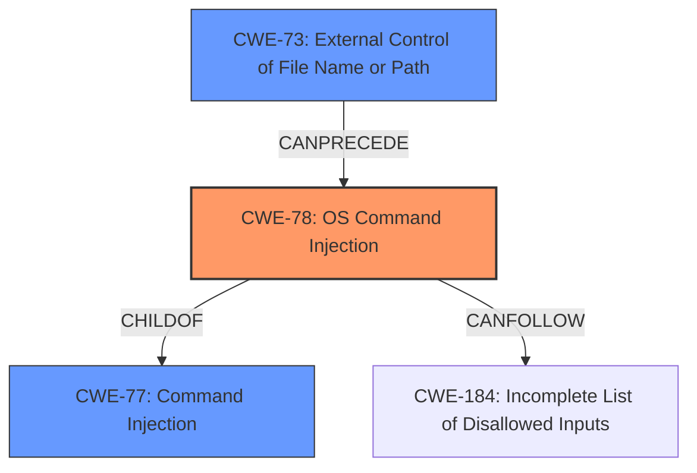

# Enhanced Analysis for CVE-2021-25150

# Summary
| CWE ID | CWE Name | Confidence | CWE Abstraction Level | CWE Vulnerability Mapping Label | CWE-Vulnerability Mapping Notes |
|---|---|---|---|---|---|
| CWE-78 | Improper Neutralization of Special Elements used in an OS Command ('OS Command Injection') | 1.0 | Base | Allowed | Primary CWE |
| CWE-77 | Improper Neutralization of Special Elements used in a Command ('Command Injection') | 0.7 | Class | Allowed-with-Review | Secondary Candidate |
| CWE-73 | External Control of File Name or Path | 0.5 | Base | Allowed | Secondary Candidate |

## Evidence and Confidence

*   **Confidence Score:** 0.9
*   **Evidence Strength:** HIGH

## Relationship Analysis
The primary relationship that influenced the decision was the ChildOf relationship between CWE-78 (OS Command Injection) and CWE-77 (Command Injection). CWE-78 is a more specific type of CWE-77.
CWE-78 can follow CWE-184 (Incomplete List of Disallowed Inputs). CWE-73 (External Control of File Name or Path) can precede CWE-78. The abstraction levels were also considered, with a preference for the Base level CWE-78, as it provides more specific information than the Class level CWE-77.



## Vulnerability Chain
The vulnerability chain starts with **improper neutralization** of special elements within a command, leading to **OS command injection**. User input influences the command without proper sanitization, allowing an attacker to execute arbitrary commands. The final impact is remote execution of arbitrary commands and complete compromise of the device.

## Summary of Analysis
The primary assessment is based on the provided "CVE Reference Links Content Summary," which explicitly states: "Root Cause of Vulnerability: - Improper neutralization of special elements used in a command, leading to command injection." This directly aligns with the description of CWE-78.
The selection of CWE-78 is further supported by the "Vulnerability Description Key Phrases" which identifies the "weakness" as "remote command execution". The retriever results also list CWE-78 as the top combined result.
The graph relationships confirm that CWE-78 is a specific type of command injection, making it more appropriate than the more general CWE-77. The decision to choose CWE-78 is based on the evidence that the vulnerability involves **improper neutralization** of special elements used in an *OS* command, leading to command injection, as stated in the CVE Reference Links Content Summary. This is more specific than a general command injection.
The selected CWE is at the optimal level of specificity because it accurately represents the root cause of the vulnerability, which is related to the execution of OS commands.

Relevant CWE Information:

# Enhanced Context (25 CWEs)

## CWE-78: Improper Neutralization of Special Elements used in an OS Command ('OS Command Injection')
**Abstraction:** Base
**Status:** Stable

### Description
The product constructs all or part of an OS command using externally-influenced input from an upstream component, but it **does not neutralize or incorrectly neutralizes special elements** that could modify the intended OS command when it is sent to a downstream component.

### Extended Description
This weakness can lead to a vulnerability in environments in which the attacker does not have direct access to the operating system, such as in web applications. Alternately, if the weakness occurs in a privileged program, it could allow the attacker to specify commands that normally would not be accessible, or to call alternate commands with privileges that the attacker does not have. The problem is exacerbated if the compromised process **does not follow the principle of least privilege**, because the attacker-controlled commands may run with special system privileges that increases the amount of damage.

### Observed Examples
- **CVE-2020-10987:** OS command injection in Wi-Fi router, as exploited in the wild per CISA KEV.

## CWE-77: Improper Neutralization of Special Elements used in a Command ('Command Injection')
**Abstraction:** Class
**Status:** Draft

### Description
The product constructs all or part of a command using externally-influenced input from an upstream component, but it **does not neutralize or incorrectly neutralizes special elements** that could modify the intended command when it is sent to a downstream component.

## CWE-73: External Control of File Name or Path
**Abstraction:** Base
**Status:** Draft

### Description
The product allows user input to control or influence paths or file names that are used in filesystem operations.

## CWE-22: Improper Limitation of a Pathname to a Restricted Directory ('Path Traversal')
**Abstraction:** Base
**Status:** Stable

### Description
The product uses external input to construct a pathname that is intended to identify a file or directory that is located underneath a restricted parent directory, but the product **does not properly neutralize special elements** within the pathname that can cause the pathname to resolve to a location that is outside of the restricted directory.


## CWE Relationship Analysis

Current CWEs represent these abstraction levels: .


### Vulnerability Chain Analysis

**Chain starting from CWE-73:**
- 73 (External Control of File Name or Path) - ROOT


**Chain starting from CWE-78:**
- 78 (Improper Neutralization of Special Elements used in an OS Command ('OS Command Injection')) - ROOT


### CWE Relationship Diagram

```mermaid
graph TD
    classDef primary fill:#f96,stroke:#333,stroke-width:2px
    classDef secondary fill:#69f,stroke:#333
    classDef tertiary fill:#9e9,stroke:#333
```