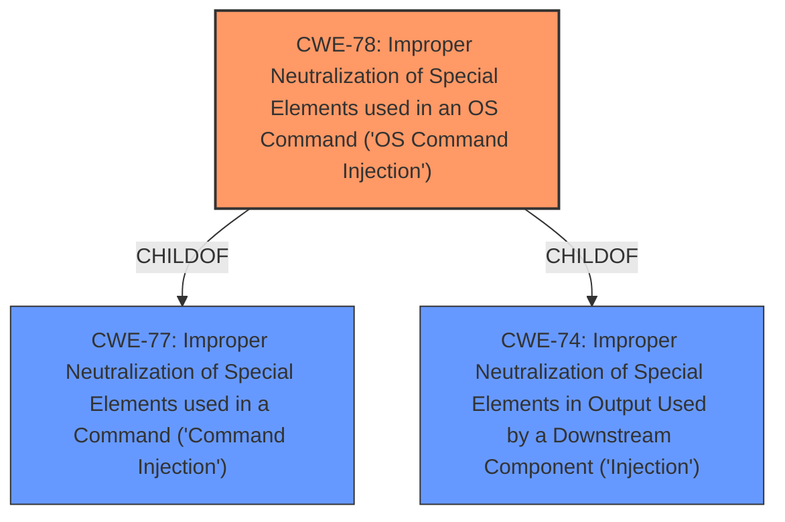

# Analysis Report for CVE-2021-25162

# Vulnerability Analysis Report: CVE-2021-25162

## Description


## Analysis (with Relationship Data)

# Summary
| CWE ID | CWE Name | Confidence | CWE Abstraction Level | CWE Vulnerability Mapping Label | CWE-Vulnerability Mapping Notes |
|---|---|---|---|---|---|
| CWE-78 | Improper Neutralization of Special Elements used in an OS Command ('OS Command Injection') | 1 | Base | Allowed | Primary CWE |

## Evidence and Confidence

*   **Confidence Score:** 1
*   **Evidence Strength:** HIGH

## Relationship Analysis
The primary relationship influencing the decision is the ChildOf relationship between CWE-78 and CWE-77, as well as CWE-74. However, CWE-78 is the most specific and accurate representation of the vulnerability. Also, the retriever results gives the best score to CWE-78.



## Vulnerability Chain
The vulnerability chain starts with the **improper neutralization** of special elements in a command, leading to OS command injection, which then allows for remote execution of arbitrary commands.

## Summary of Analysis
The analysis is primarily based on the provided evidence, specifically the "CVE Reference Links Content Summary" which states the **root cause** as "Improper neutralization of special elements used in a command ('Command Injection')" and the impact as "Remote execution of arbitrary commands." The "Vulnerability Description Key Phrases" also highlights the "remote command execution" impact.

The graph relationships influenced the selection by showing that CWE-78 is a more specific child of CWE-77 and CWE-74, making it a better fit for the vulnerability described.

The selected CWE, CWE-78, is at the optimal level of specificity because it directly addresses the **root cause** of the vulnerability: the improper neutralization of special elements in an OS command. This aligns with the MITRE mapping guidance, which recommends using the most specific Base or Variant CWE when possible. Other CWEs were considered but deemed less specific or accurate in representing the **root cause**.

Relevant CWE Information:

# Enhanced Context (25 CWEs)
The following CWEs were identified as potentially relevant to this vulnerability:

## CWE-78: Improper Neutralization of Special Elements used in an OS Command ('OS Command Injection')
**Abstraction:** Base
**Status:** Stable

### Description
The product constructs all or part of an OS command using externally-influenced input from an upstream component, but it does not neutralize or incorrectly neutralizes special elements that could modify the intended OS command when it is sent to a downstream component.

### Extended Description
This weakness can lead to a vulnerability in environments in which the attacker does not have direct access to the operating system, such as in web applications. Alternately, if the weakness occurs in a privileged program, it could allow the attacker to specify commands that normally would not be accessible, or to call alternate commands with privileges that the attacker does not have. The problem is exacerbated if the compromised process does not follow the principle of least privilege, because the attacker-controlled commands may run with special system privileges that increases the amount of damage.

### Alternative Terms
Shell injection
Shell metacharacters
OS Command Injection

### Relationships
ChildOf -> CWE-77
ChildOf -> CWE-74
CanAlsoBe -> CWE-88

### Mapping Guidance
**Usage:** Allowed
**Rationale:** This CWE entry is at the Base level of abstraction, which is a preferred level of abstraction for mapping to the root causes of vulnerabilities.

### Additional Notes
The "OS command injection" phrase carries different meanings to different people. For some people, it only refers to cases in which the attacker injects command separators into arguments for an application-controlled program that is being invoked. For some people, it refers to any type of attack that can allow the attacker to execute OS commands of their own choosing.

### Observed Examples
- **CVE-2020-10987:** OS command injection in Wi-Fi router, as exploited in the wild per CISA KEV.
- **CVE-2020-10221:** Template functionality in network configuration management tool allows OS command injection, as exploited in the wild per CISA KEV.

## Other CWEs Considered and Rejected:

*   **CWE-22: Improper Limitation of a Pathname to a Restricted Directory ('Path Traversal')**: While path traversal could potentially be involved, the primary issue is the command injection, not the path manipulation.
*   **CWE-732: Incorrect Permission Assignment for Critical Resource**: This is not related to permission assignments.
*   **CWE-1286: Improper Validation of Syntactic Correctness of Input**: Input validation might be a contributing factor, but the core issue is the **improper neutralization** of special elements.
*   **CWE-73: External Control of File Name or Path**: This is not about file name or path control.
*   **CWE-77: Improper Neutralization of Special Elements used in a Command ('Command Injection')**: While related, CWE-78 is more specific as it focuses on OS commands.
*   **CWE-59: Improper Link Resolution Before File Access ('Link Following')**: Not relevant to link resolution.
*   **CWE-269: Improper Privilege Management**: Privilege management is not the root cause.
*   **CWE-284: Improper Access Control**: Too high-level and not specific to the **root cause**.
*   **CWE-522: Insufficiently Protected Credentials**: Not related to credential protection.


## CWE Relationship Analysis

Current CWEs represent these abstraction levels: .


### Vulnerability Chain Analysis

**Chain starting from CWE-732:**
- 732 (Incorrect Permission Assignment for Critical Resource) - ROOT


**Chain starting from CWE-88:**
- 88 (Improper Neutralization of Argument Delimiters in a Command ('Argument Injection')) - ROOT


### CWE Relationship Diagram

```mermaid
graph TD
    classDef primary fill:#f96,stroke:#333,stroke-width:2px
    classDef secondary fill:#69f,stroke:#333
    classDef tertiary fill:#9e9,stroke:#333
```


*Report generated on 2025-04-02 02:08:32*
