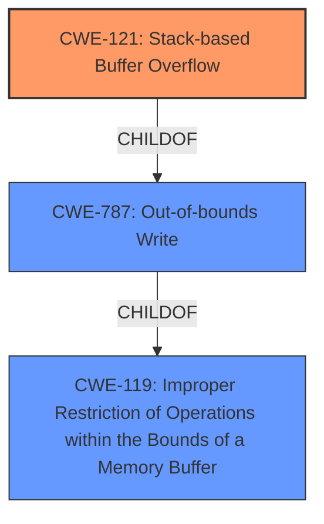

# Enhanced Analysis for CVE-2021-25178

# Summary
| CWE ID | CWE Name | Confidence | CWE Abstraction Level | CWE Vulnerability Mapping Label | CWE-Vulnerability Mapping Notes |
|---|---|---|---|---|---|
| CWE-121 | Stack-based Buffer Overflow | 1 | Variant | ALLOWED | Primary CWE |
| CWE-787 | Out-of-bounds Write | 0.7 | Base | ALLOWED | Secondary Candidate |
| CWE-119 | Improper Restriction of Operations within the Bounds of a Memory Buffer | 0.5 | Class | DISCOURAGED | Secondary Candidate |

## Evidence and Confidence

*   **Confidence Score:** 0.8
*   **Evidence Strength:** HIGH

## Relationship Analysis
The primary CWE selected is CWE-121 Stack-based Buffer Overflow which is a variant of CWE-787 Out-of-bounds Write, a base CWE. CWE-787 is a child of CWE-119 Improper Restriction of Operations within the Bounds of a Memory Buffer, which is a class CWE. The relationships indicate a clear path from a general buffer issue (CWE-119) to a specific type of buffer overflow (CWE-121). Selecting CWE-121 provides the most specific classification based on the provided evidence.



## Vulnerability Chain
The vulnerability chain starts with the **stack-based buffer overflow** due to **improper input validation** when handling malformed .DXF and .DWG files when the recover operation is run. This leads to potential code execution or denial of service.
  - **Root Cause:** **Stack-based buffer overflow** (CWE-121) due to **lack of input validation**.
  - **Impact:** Code execution, Denial of Service.

## Summary of Analysis
The initial assessment identified CWE-121 as the primary weakness, aligning with the description of a **stack-based buffer overflow**. This is further supported by the "CVE Reference Links Content Summary" that specifies the root cause as a lack of proper validation of user-supplied data before copying it to a fixed-size stack buffer. The retriever results also list CWE-121.

The selection of CWE-121 is based on the explicit mention of "stack-based buffer overflow" in both the vulnerability description and the CVE reference summary.

CWE-787 Out-of-bounds Write was considered because it is a parent of CWE-121. While it is accurate, it is less specific than CWE-121.

CWE-119 Improper Restriction of Operations within the Bounds of a Memory Buffer was also considered but ultimately not chosen as the primary CWE because it is a more general class. The mapping guidance discourages its use when more specific CWEs are available.

The final decision to prioritize CWE-121 is based on the specificity of the vulnerability description, the supporting evidence in the CVE reference, and the CWE's position in the hierarchy as a variant, offering a more precise classification.
Relevant CWE Information:
**Vulnerability Description Key Phrases**
- **weakness:** **stack-based buffer overflow**

**CVE Reference Links Content Summary**
- **Stack-based Buffer Overflow (CWE-121):** The vulnerability stems from a lack of proper validation of the length of user-supplied data before copying it to a fixed-size stack buffer. This allows an attacker to write past the allocated buffer on the stack.


## CWE Relationship Analysis

Current CWEs represent these abstraction levels: .


### Vulnerability Chain Analysis

**Chain starting from CWE-121:**
- 121 (Stack-based Buffer Overflow) - ROOT


**Chain starting from CWE-119:**
- 119 (Improper Restriction of Operations within the Bounds of a Memory Buffer) - ROOT


### CWE Relationship Diagram

```mermaid
graph TD
    classDef primary fill:#f96,stroke:#333,stroke-width:2px
    classDef secondary fill:#69f,stroke:#333
    classDef tertiary fill:#9e9,stroke:#333
```