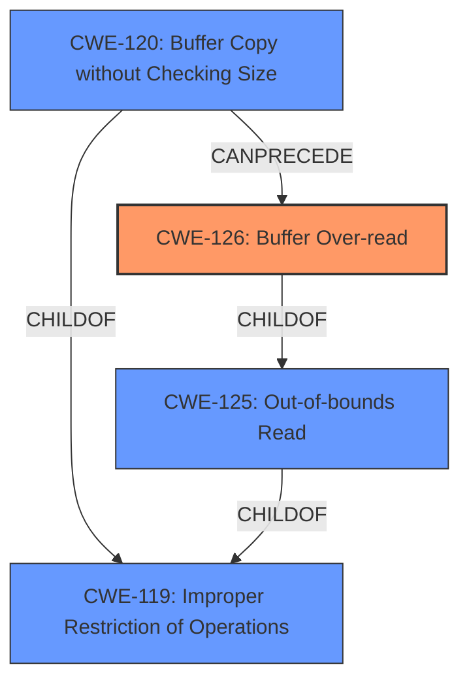

# Enhanced Analysis for CVE-2021-25216

# Summary
| CWE ID  | CWE Name                                                        | Confidence | CWE Abstraction Level | CWE Vulnerability Mapping Label | CWE-Vulnerability Mapping Notes |
| :-------- | :-------------------------------------------------------------- | :--------- | :-------------------- | :------------------------------ | :------------------------------ |
| CWE-126   | Buffer Over-read                                                | 0.9        | Variant               | Primary                         | Allowed                         |
| CWE-120   | Buffer Copy without Checking Size Limits                       | 0.7        | Base                  | Secondary                       | Allowed                         |

## Evidence and Confidence

*   **Confidence Score:** 0.8
*   **Evidence Strength:** HIGH

## Relationship Analysis
The primary weakness is CWE-126 (Buffer Over-read), a variant of CWE-125 (Out-of-bounds Read). CWE-126 is a child of CWE-125. Buffer overflows, which can lead to over-reads, are often related to CWE-120 (Buffer Copy without Checking Size Limits), a base-level CWE. CWE-120 is a child of CWE-119 (Improper Restriction of Operations within the Bounds of a Memory Buffer). The relationship analysis shows that the vulnerability stems from copying data without proper size checks, potentially leading to a buffer over-read.



## Vulnerability Chain
The vulnerability chain starts with the **improper implementation of SPNEGO in ISC**, leading to a **buffer over-read** or **buffer overflow**, which can then cause a server crash or potentially remote code execution.
  - Improper SPNEGO Implementation (Root Cause)
  - **Buffer Over-read** (CWE-126) or **Buffer Overflow** (CWE-120)
  - Server Crash or Remote Code Execution (Impact)

## Summary of Analysis
The analysis identified **CWE-126 (Buffer Over-read)** as the primary weakness, with **CWE-120 (Buffer Copy without Checking Size Limits)** as a secondary contributing factor. This assessment is strongly based on the vulnerability description, which explicitly mentions "**buffer over-read**" for 64-bit platforms and "**buffer overflow**" for 32-bit platforms.

The retriever results consistently highlighted **CWE-126** as the top candidate, and this aligns with the description of the vulnerability. The relationship analysis further supports this by showing how buffer overflows (related to CWE-120) can lead to buffer over-reads (CWE-126).

The selection of **CWE-126** is at the optimal level of specificity because it directly describes the **buffer over-read** condition mentioned in the vulnerability description. While **CWE-125 (Out-of-bounds Read)** is a parent CWE, **CWE-126** provides more specific information about the type of out-of-bounds read.

Relevant CWE Information:

# Enhanced Context (25 CWEs)

## CWE-617: Reachable Assertion
**Abstraction Level**: Base
**Similarity Score**: 0.75
**Source**: dense

**Description**:
The product contains an assert() or similar statement that can be triggered by an attacker, which leads to an application exit or other behavior that is more severe than necessary.

**Mapping Guidance**:
- Usage: Allowed
- Rationale: This CWE entry is at the Base level of abstraction, which is a preferred level of abstraction for mapping to the root causes of vulnerabilities.

*Was considered, but it is not the root cause of the vulnerability. The vulnerability is not due to an assertion failure but rather a buffer over-read.*

## CWE-1391: Use of Weak Credentials
**Abstraction Level**: Class
**Similarity Score**: 0.74
**Source**: dense

**Description**:
The product uses weak credentials (such as a default key or hard-coded password) that can be calculated, derived, reused, or guessed by an attacker.

**Mapping Guidance**:
- Usage: Allowed-with-Review
- Rationale: This CWE entry is a Class and might have Base-level children that would be more appropriate

*Was considered, but it is not the root cause of the vulnerability. The vulnerability is not due to weak credentials.*

## CWE-131: Incorrect Calculation of Buffer Size
**Abstraction Level**: Base
**Similarity Score**: 0.73
**Source**: dense

**Description**:
The product does not correctly calculate the size to be used when allocating a buffer, which could lead to a buffer overflow.

**Mapping Guidance**:
- Usage: Allowed
- Rationale: This CWE entry is at the Base level of abstraction, which is a preferred level of abstraction for mapping to the root causes of vulnerabilities.

*Was considered as a contributing factor, but not the direct cause described in the vulnerability description.*

## CWE-755: Improper Handling of Exceptional Conditions
**Abstraction Level**: Class
**Similarity Score**: 0.73
**Source**: dense

**Description**:
The product does not handle or incorrectly handles an exceptional condition.

**Mapping Guidance**:
- Usage: Discouraged
- Rationale: This CWE entry is a level-1 Class (i.e., a child of a Pillar). It might have lower-level children that would be more appropriate

*Was considered, but it is not the root cause of the vulnerability. The vulnerability is more specific than a general failure to handle exceptional conditions.*

## CWE-303: Incorrect Implementation of Authentication Algorithm
**Abstraction Level**: Base
**Similarity Score**: 0.73
**Source**: dense

**Description**:
The requirements for the product dictate the use of an established authentication algorithm, but the implementation of the algorithm is incorrect.

**Mapping Guidance**:
- Usage: Allowed
- Rationale: This CWE entry is at the Base level of abstraction, which is a preferred level of abstraction for mapping to the root causes of vulnerabilities.

*Was considered, but not as accurate as the buffer over-read description.*

## CWE-407: Inefficient Algorithmic Complexity
**Abstraction Level**: Class
**Similarity Score**: 0.73
**Source**: dense

**Description**:
An algorithm in a product has an inefficient worst-case computational complexity that may be detrimental to system performance and can be triggered by an attacker, typically using crafted manipulations that ensure that the worst case is being reached.

**Mapping Guidance**:
- Usage: Allowed-with-Review
- Rationale: This CWE entry is a Class and might have Base-level children that would be more appropriate

*Was considered, but it is not the root cause of the vulnerability. The vulnerability is not related to algorithmic complexity.*

## CWE-703: Improper Check or Handling of Exceptional Conditions
**Abstraction Level**: Pillar
**Similarity Score**: 0.73
**Source**: dense

**Description**:
The product does not properly anticipate or handle exceptional conditions that rarely occur during normal operation of the product.

**Mapping Guidance**:
- Usage: Discouraged
- Rationale: This CWE entry is extremely high-level, a Pillar.

*Was considered, but it is too high-level and does not accurately represent the vulnerability.*

## CWE-923: Improper Restriction of Communication Channel to Intended Endpoints
**Abstraction Level**: Class
**Similarity Score**: 0.73
**Source**: dense

**Description**:
The product establishes a communication channel to (or from) an endpoint for privileged or protected operations, but it does not properly ensure that it is communicating with the correct endpoint.

**Mapping Guidance**:
- Usage: Allowed-with-Review
- Rationale: This CWE entry is a Class and might have Base-level children that would be more appropriate

*Was considered, but it is not the root cause of the vulnerability. The vulnerability is not related to communication channel restrictions.*

## CWE-824: Access of Uninitialized Pointer
**Abstraction Level**: Base
**Similarity Score**: 0.73
**Source**: dense

**Description**:
The product accesses or uses a pointer that has not been initialized.

**Mapping Guidance**:
- Usage: Allowed
- Rationale: This CWE entry is at the Base level of abstraction, which is a preferred level of abstraction for mapping to the root causes of vulnerabilities.

*Was considered, but it is not the root cause of the vulnerability


## CWE Relationship Analysis

Current CWEs represent these abstraction levels: .


### Vulnerability Chain Analysis

**Chain starting from CWE-407:**
- 407 (Inefficient Algorithmic Complexity) - ROOT


**Chain starting from CWE-303:**
- 303 (Incorrect Implementation of Authentication Algorithm) - ROOT


### CWE Relationship Diagram

```mermaid
graph TD
    classDef primary fill:#f96,stroke:#333,stroke-width:2px
    classDef secondary fill:#69f,stroke:#333
    classDef tertiary fill:#9e9,stroke:#333
```