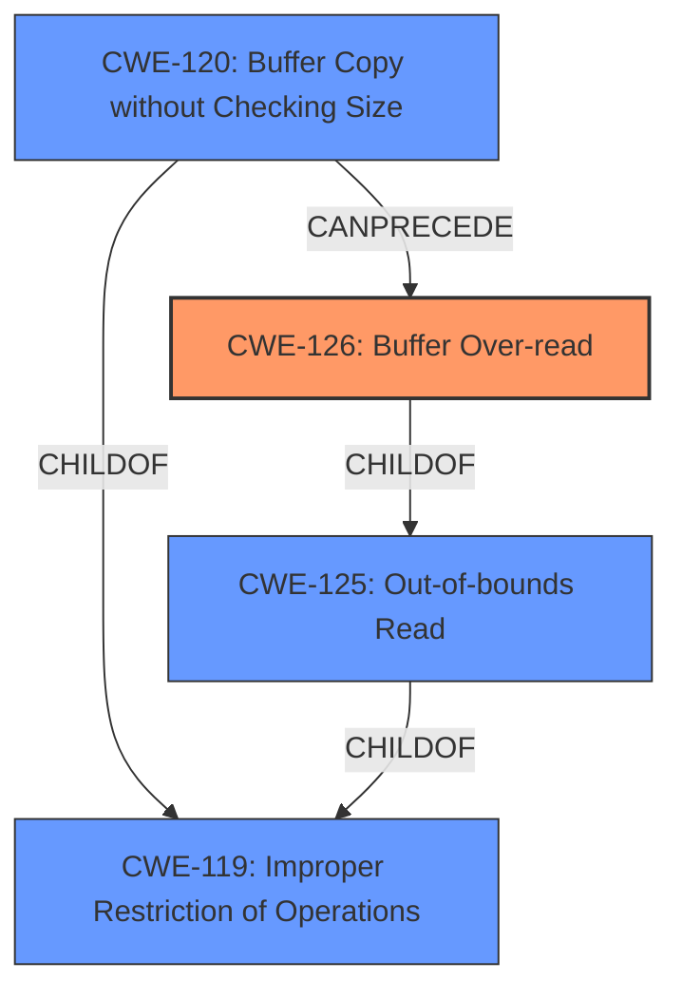

# Analysis for CVE-2021-25216

# Summary
| CWE ID  | CWE Name                                                        | Confidence | CWE Abstraction Level | CWE Vulnerability Mapping Label | CWE-Vulnerability Mapping Notes |
| :-------- | :-------------------------------------------------------------- | :--------- | :-------------------- | :------------------------------ | :------------------------------ |
| CWE-126   | Buffer Over-read                                                | 0.9        | Variant               | Primary                         | Allowed                         |
| CWE-120   | Buffer Copy without Checking Size Limits                       | 0.7        | Base                  | Secondary                       | Allowed                         |

## Evidence and Confidence

*   **Confidence Score:** 0.8
*   **Evidence Strength:** HIGH

## Relationship Analysis
The primary weakness is CWE-126 (Buffer Over-read), a variant of CWE-125 (Out-of-bounds Read). CWE-126 is a child of CWE-125. Buffer overflows, which can lead to over-reads, are often related to CWE-120 (Buffer Copy without Checking Size Limits), a base-level CWE. CWE-120 is a child of CWE-119 (Improper Restriction of Operations within the Bounds of a Memory Buffer). The relationship analysis shows that the vulnerability stems from copying data without proper size checks, potentially leading to a buffer over-read.

## Vulnerability Chain
The vulnerability chain starts with the **improper implementation of SPNEGO in ISC**, leading to a **buffer over-read** or **buffer overflow**, which can then cause a server crash or potentially remote code execution.
  - Improper SPNEGO Implementation (Root Cause)
  - **Buffer Over-read** (CWE-126) or **Buffer Overflow** (CWE-120)
  - Server Crash or Remote Code Execution (Impact)

## Summary of Analysis
The analysis identified **CWE-126 (Buffer Over-read)** as the primary weakness, with **CWE-120 (Buffer Copy without Checking Size Limits)** as a secondary contributing factor. This assessment is strongly based on the vulnerability description, which explicitly mentions "**buffer over-read**" for 64-bit platforms and "**buffer overflow**" for 32-bit platforms.

The retriever results consistently highlighted **CWE-126** as the top candidate, and this aligns with the description of the vulnerability. The relationship analysis further supports this by showing how buffer overflows (related to CWE-120) can lead to buffer over-reads (CWE-126).

The selection of **CWE-126** is at the optimal level of specificity because it directly describes the **buffer over-read** condition mentioned in the vulnerability description. While **CWE-125 (Out-of-bounds Read)** is a parent CWE, **CWE-126** provides more specific information about the type of out-of-bounds read.

Relevant CWE Information:

# Enhanced Context (25 CWEs)

## CWE-617: Reachable Assertion
**Abstraction Level**: Base
**Similarity Score**: 0.75
**Source**: dense

**Description**:
The product contains an assert() or similar statement that can be triggered by an attacker, which leads to an application exit or other behavior that is more severe than necessary.

**Mapping Guidance**:
- Usage: Allowed
- Rationale: This CWE entry is at the Base level of abstraction, which is a preferred level of abstraction for mapping to the root causes of vulnerabilities.

*Was considered, but it is not the root cause of the vulnerability. The vulnerability is not due to an assertion failure but rather a buffer over-read.*

## CWE-1391: Use of Weak Credentials
**Abstraction Level**: Class
**Similarity Score**: 0.74
**Source**: dense

**Description**:
The product uses weak credentials (such as a default key or hard-coded password) that can be calculated, derived, reused, or guessed by an attacker.

**Mapping Guidance**:
- Usage: Allowed-with-Review
- Rationale: This CWE entry is a Class and might have Base-level children that would be more appropriate

*Was considered, but it is not the root cause of the vulnerability. The vulnerability is not due to weak credentials.*

## CWE-131: Incorrect Calculation of Buffer Size
**Abstraction Level**: Base
**Similarity Score**: 0.73
**Source**: dense

**Description**:
The product does not correctly calculate the size to be used when allocating a buffer, which could lead to a buffer overflow.

**Mapping Guidance**:
- Usage: Allowed
- Rationale: This CWE entry is at the Base level of abstraction, which is a preferred level of abstraction for mapping to the root causes of vulnerabilities.

*Was considered as a contributing factor, but not the direct cause described in the vulnerability description.*

## CWE-755: Improper Handling of Exceptional Conditions
**Abstraction Level**: Class
**Similarity Score**: 0.73
**Source**: dense

**Description**:
The product does not handle or incorrectly handles an exceptional condition.

**Mapping Guidance**:
- Usage: Discouraged
- Rationale: This CWE entry is a level-1 Class (i.e., a child of a Pillar). It might have lower-level children that would be more appropriate

*Was considered, but it is not the root cause of the vulnerability. The vulnerability is more specific than a general failure to handle exceptional conditions.*

## CWE-303: Incorrect Implementation of Authentication Algorithm
**Abstraction Level**: Base
**Similarity Score**: 0.73
**Source**: dense

**Description**:
The requirements for the product dictate the use of an established authentication algorithm, but the implementation of the algorithm is incorrect.

**Mapping Guidance**:
- Usage: Allowed
- Rationale: This CWE entry is at the Base level of abstraction, which is a preferred level of abstraction for mapping to the root causes of vulnerabilities.

*Was considered, but not as accurate as the buffer over-read description.*

## CWE-407: Inefficient Algorithmic Complexity
**Abstraction Level**: Class
**Similarity Score**: 0.73
**Source**: dense

**Description**:
An algorithm in a product has an inefficient worst-case computational complexity that may be detrimental to system performance and can be triggered by an attacker, typically using crafted manipulations that ensure that the worst case is being reached.

**Mapping Guidance**:
- Usage: Allowed-with-Review
- Rationale: This CWE entry is a Class and might have Base-level children that would be more appropriate

*Was considered, but it is not the root cause of the vulnerability. The vulnerability is not related to algorithmic complexity.*

## CWE-703: Improper Check or Handling of Exceptional Conditions
**Abstraction Level**: Pillar
**Similarity Score**: 0.73
**Source**: dense

**Description**:
The product does not properly anticipate or handle exceptional conditions that rarely occur during normal operation of the product.

**Mapping Guidance**:
- Usage: Discouraged
- Rationale: This CWE entry is extremely high-level, a Pillar.

*Was considered, but it is too high-level and does not accurately represent the vulnerability.*

## CWE-923: Improper Restriction of Communication Channel to Intended Endpoints
**Abstraction Level**: Class
**Similarity Score**: 0.73
**Source**: dense

**Description**:
The product establishes a communication channel to (or from) an endpoint for privileged or protected operations, but it does not properly ensure that it is communicating with the correct endpoint.

**Mapping Guidance**:
- Usage: Allowed-with-Review
- Rationale: This CWE entry is a Class and might have Base-level children that would be more appropriate

*Was considered, but it is not the root cause of the vulnerability. The vulnerability is not related to communication channel restrictions.*

## CWE-824: Access of Uninitialized Pointer
**Abstraction Level**: Base
**Similarity Score**: 0.73
**Source**: dense

**Description**:
The product accesses or uses a pointer that has not been initialized.

**Mapping Guidance**:
- Usage: Allowed
- Rationale: This CWE entry is at the Base level of abstraction, which is a preferred level of abstraction for mapping to the root causes of vulnerabilities.

*Was considered, but it is not the root cause of the vulnerability

# Enhanced Query for CVE-2021-25216

# Vulnerability Description

    In BIND 9.5.0 -> 9.11.29, 9.12.0 -> 9.16.13, and versions BIND 9.11.3-S1 -> 9.11.29-S1 and 9.16.8-S1 -> 9.16.13-S1 of BIND Supported Preview Edition, as well as release versions 9.17.0 -> 9.17.1 of the BIND 9.17 development branch, BIND servers are vulnerable if they are running an affected version and are configured to use GSS-TSIG features. In a configuration which uses BINDs default settings the vulnerable code path is not exposed, but a server can be rendered vulnerable by explicitly setting values for the tkey-gssapi-keytab or tkey-gssapi-credential configuration options. Although the default configuration is not vulnerable, GSS-TSIG is frequently used in networks where BIND is integrated with Samba, as well as in mixed-server environments that combine BIND servers with Active Directory domain controllers. For servers that meet these conditions, the ISC SPNEGO implementation is vulnerable to various attacks, depending on the CPU architecture for which BIND was built For named binaries compiled for 64-bit platforms, this flaw can be used to trigger a **buffer over-read**, leading to a server crash. For named binaries compiled for 32-bit platforms, this flaw can be used to trigger a server crash due to a **buffer overflow** and possibly also to achieve remote code execution. We have determined that standard SPNEGO implementations are available in the MIT and Heimdal Kerberos libraries, which support a broad range of operating systems, rendering the ISC implementation unnecessary and obsolete. Therefore, to reduce the attack surface for BIND users, we will be removing the ISC SPNEGO implementation in the April releases of BIND 9.11 and 9.16 (it had already been dropped from BIND 9.17). We would not normally remove something from a stable ESV (Extended Support Version) of BIND, but since system libraries can replace the ISC SPNEGO implementation, we have made an exception in this case for reasons of stability and security.

    # Keyphrase-Specific CWE Analysis
    This vulnerability contains multiple keyphrases that may map to different CWEs. 
    Please analyze each keyphrase separately and determine the most appropriate CWE(s) for each.

    ## ROOTCAUSE: 'The ISC SPNEGO implementation has a bug in it.'

Relevant CWEs for this ROOTCAUSE:

### 1. CWE-126: Buffer Over-read (Score: 2705.11)

The product reads from a buffer using buffer access mechanisms such as indexes or pointers that reference memory locations after the targeted buffer....

### 2. CWE-617: Reachable Assertion (Score: 1902.26)

The product contains an assert() or similar statement that can be triggered by an attacker, which leads to an application exit or other behavior that is more severe than necessary....

### 3. CWE-863: Incorrect Authorization (Score: 1715.98)

The product performs an authorization check when an actor attempts to access a resource or perform an action, but it does not correctly perform the check....

### 4. CWE-287: Improper Authentication (Score: 1695.68)

When an actor claims to have a given identity, the product does not prove or insufficiently proves that the claim is correct....

### 5. CWE-1284: Improper Validation of Specified Quantity in Input (Score: 1691.83)

The product receives input that is expected to specify a quantity (such as size or length), but it does not validate or incorrectly validates that the quantity has the required properties....

## WEAKNESS: 'buffer over-read'

Relevant CWEs for this WEAKNESS:

### 1. CWE-126: Buffer Over-read (Score: 2705.11)

The product reads from a buffer using buffer access mechanisms such as indexes or pointers that reference memory locations after the targeted buffer....

### 2. CWE-617: Reachable Assertion (Score: 1902.26)

The product contains an assert() or similar statement that can be triggered by an attacker, which leads to an application exit or other behavior that is more severe than necessary....

### 3. CWE-863: Incorrect Authorization (Score: 1715.98)

The product performs an authorization check when an actor attempts to access a resource or perform an action, but it does not correctly perform the check....

### 4. CWE-1284: Improper Validation of Specified Quantity in Input (Score: 1691.83)

The product receives input that is expected to specify a quantity (such as size or length), but it does not validate or incorrectly validates that the quantity has the required properties....

### 5. CWE-190: Integer Overflow or Wraparound (Score: 1508.79)

The product performs a calculation that can
         produce an integer overflow or wraparound when the logic
         assumes that the resulting value will always be larger than
         the original value. This occurs when an integer value is
         incremented to a value that is too large to st...

## WEAKNESS: 'buffer overflow'

Relevant CWEs for this WEAKNESS:

### 1. CWE-126: Buffer Over-read (Score: 2705.11)

The product reads from a buffer using buffer access mechanisms such as indexes or pointers that reference memory locations after the targeted buffer....

### 2. CWE-617: Reachable Assertion (Score: 1902.26)

The product contains an assert() or similar statement that can be triggered by an attacker, which leads to an application exit or other behavior that is more severe than necessary....

### 3. CWE-863: Incorrect Authorization (Score: 1715.98)

The product performs an authorization check when an actor attempts to access a resource or perform an action, but it does not correctly perform the check....

### 4. CWE-1284: Improper Validation of Specified Quantity in Input (Score: 1691.83)

The product receives input that is expected to specify a quantity (such as size or length), but it does not validate or incorrectly validates that the quantity has the required properties....

### 5. CWE-190: Integer Overflow or Wraparound (Score: 1508.79)

The product performs a calculation that can
         produce an integer overflow or wraparound when the logic
         assumes that the resulting value will always be larger than
         the original value. This occurs when an integer value is
         incremented to a value that is too large to st...

## IMPACT: 'remote code execution'

Relevant CWEs for this IMPACT:

### 1. CWE-126: Buffer Over-read (Score: 2705.11)

The product reads from a buffer using buffer access mechanisms such as indexes or pointers that reference memory locations after the targeted buffer....

### 2. CWE-617: Reachable Assertion (Score: 1902.26)

The product contains an assert() or similar statement that can be triggered by an attacker, which leads to an application exit or other behavior that is more severe than necessary....

### 3. CWE-863: Incorrect Authorization (Score: 1715.98)

The product performs an authorization check when an actor attempts to access a resource or perform an action, but it does not correctly perform the check....

### 4. CWE-1284: Improper Validation of Specified Quantity in Input (Score: 1691.83)

The product receives input that is expected to specify a quantity (such as size or length), but it does not validate or incorrectly validates that the quantity has the required properties....

### 5. CWE-362: Concurrent Execution using Shared Resource with Improper Synchronization ('Race Condition') (Score: 536.10)

The product contains a concurrent code sequence that requires temporary, exclusive access to a shared resource, but a timing window exists in which the shared resource can be modified by another code sequence operating concurrently....

## PRODUCT: 'BIND'

Relevant CWEs for this PRODUCT:

### 1. CWE-126: Buffer Over-read (Score: 2705.11)

The product reads from a buffer using buffer access mechanisms such as indexes or pointers that reference memory locations after the targeted buffer....

### 2. CWE-617: Reachable Assertion (Score: 1902.26)

The product contains an assert() or similar statement that can be triggered by an attacker, which leads to an application exit or other behavior that is more severe than necessary....

### 3. CWE-863: Incorrect Authorization (Score: 1715.98)

The product performs an authorization check when an actor attempts to access a resource or perform an action, but it does not correctly perform the check....

### 4. CWE-287: Improper Authentication (Score: 1695.68)

When an actor claims to have a given identity, the product does not prove or insufficiently proves that the claim is correct....

### 5. CWE-362: Concurrent Execution using Shared Resource with Improper Synchronization ('Race Condition') (Score: 536.10)

The product contains a concurrent code sequence that requires temporary, exclusive access to a shared resource, but a timing window exists in which the shared resource can be modified by another code sequence operating concurrently....

## VERSION: '9.5.0 -> 9.11.29, 9.12.0 -> 9.16.13, and versions BIND 9.11.3-S1 -> 9.11.29-S1 and 9.16.8-S1 -> 9.16.13-S1 of BIND Supported Preview Edition, as well as release versions 9.17.0 -> 9.17.1 of the BIND 9.17 development branch'

Relevant CWEs for this VERSION:

### 1. CWE-126: Buffer Over-read (Score: 2705.11)

The product reads from a buffer using buffer access mechanisms such as indexes or pointers that reference memory locations after the targeted buffer....

### 2. CWE-617: Reachable Assertion (Score: 1902.26)

The product contains an assert() or similar statement that can be triggered by an attacker, which leads to an application exit or other behavior that is more severe than necessary....

### 3. CWE-863: Incorrect Authorization (Score: 1715.98)

The product performs an authorization check when an actor attempts to access a resource or perform an action, but it does not correctly perform the check....

### 4. CWE-1286: Improper Validation of Syntactic Correctness of Input (Score: 749.85)

The product receives input that is expected to be well-formed - i.e., to comply with a certain syntax - but it does not validate or incorrectly validates that the input complies with the syntax....

### 5. CWE-400: Uncontrolled Resource Consumption (Score: 741.73)

The product does not properly control the allocation and maintenance of a limited resource, thereby enabling an actor to influence the amount of resources consumed, eventually leading to the exhaustion of available resources....

    # Analysis Instructions
    1. For each keyphrase, identify the most appropriate CWE(s) that represent the weakness.
    2. Consider how the different keyphrases might relate to each other in the vulnerability chain.
    3. Provide a final determination of primary CWE(s) and any secondary CWEs.
    4. Format your response using the standard analysis template.

    Please analyze how these different weaknesses interact and provide a comprehensive CWE classification.
    