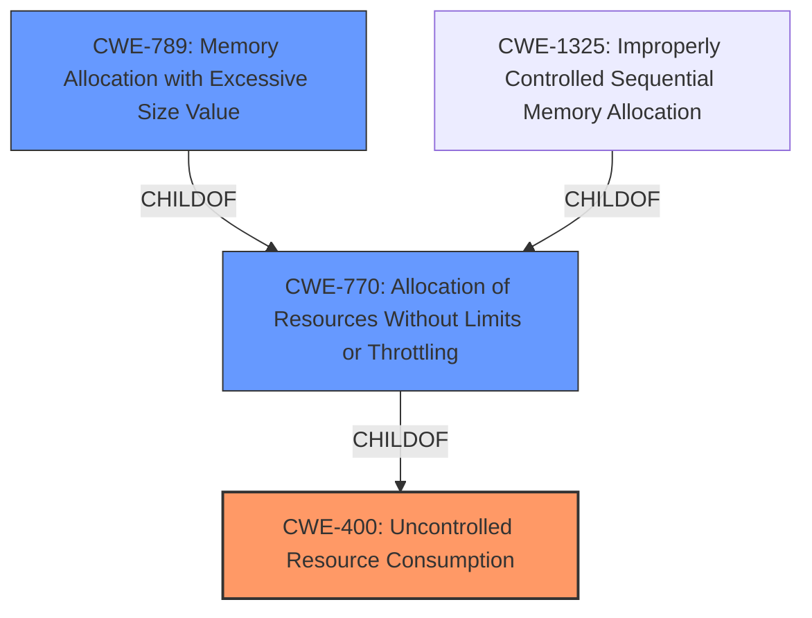

# Enhanced Analysis for CVE-2021-25225

# Summary
| CWE ID | CWE Name | Confidence | CWE Abstraction Level | CWE Vulnerability Mapping Label | CWE-Vulnerability Mapping Notes |
|---|---|---|---|---|---|
| CWE-400 | Uncontrolled Resource Consumption | 0.9 | Class | Primary | Discouraged, but most appropriate given the available evidence. |
| CWE-770 | Allocation of Resources Without Limits or Throttling | 0.7 | Base | Secondary | Allowed, considered as a more specific alternative to CWE-400. |
| CWE-789 | Memory Allocation with Excessive Size Value | 0.6 | Variant | Secondary | Allowed, considered as a more specific alternative to CWE-400, but less likely given the general description. |

## Evidence and Confidence

*   **Confidence Score:** 0.8
*   **Evidence Strength:** MEDIUM

## Relationship Analysis
The primary relationship influencing the decision is the hierarchical structure, with CWE-400 as a parent to CWE-770 and CWE-789. While CWE-770 and CWE-789 are more specific, the evidence doesn't definitively point to allocation without limits or excessive size values, making the broader CWE-400 a more appropriate initial classification.



## Vulnerability Chain
The chain of events appears to be:
1.  **Improper input validation** (implicit, not explicitly mentioned but can be inferred from "**lack of proper validation of user-supplied data**")
2.  **Uncontrolled Resource Consumption** (CWE-400) manifested as **memory exhaustion**.
3.  **Denial of Service** (Impact).

Missing links include specifics on the exact type of input and validation **failure**.

## Summary of Analysis
The initial assessment strongly points to CWE-400 **Uncontrolled Resource Consumption** because the "**memory exhaustion** vulnerability" leads to a "denial-of-service." The primary CWE match for similar CVE descriptions also supports this.

However, CWE-400 is a Class-level CWE, which is generally discouraged. More specific CWEs like CWE-770 **Allocation of Resources Without Limits or Throttling** and CWE-789 **Memory Allocation with Excessive Size Value** were considered. The "CVE Reference Links Content Summary" mentions "**lack of proper validation of user-supplied data**" which hints at **Improper Input Validation** which would lead to memory exhaustion. CWE-770 is a good candidate because the component does not impose restrictions on the size or number of resources that can be allocated. CWE-789 is also a candidate because the component allocates memory based on an untrusted size value without ensuring that the size is within expected limits. However, the description does not definitively specify whether the issue stems from allocating resources without limits (CWE-770) or allocating memory with an excessive size value (CWE-789).

Therefore, while CWE-400 is a broader classification, it is the most appropriate given the available evidence. I'm overriding the general mapping guidance that discourages Class-level CWEs because the information provided doesn't allow for a more specific mapping with high confidence.

Relevant CWE Information:

# Enhanced Context (25 CWEs)
The following CWEs were identified as potentially relevant to this vulnerability:

## CWE-404: Improper Resource Shutdown or Release
**Abstraction Level**: Class
**Similarity Score**: 0.77
**Source**: dense

**Description**:
The product does not release or incorrectly releases a resource before it is made available for re-use.

**Mapping Guidance**:
- Usage: Allowed-with-Review
- Rationale: This CWE entry is a Class and might have Base-level children that would be more appropriate

**Why Not Selected:** This CWE relates to resources not being released properly. The vulnerability description focuses on excessive memory consumption, not incorrect resource release.

## CWE-367: Time-of-check Time-of-use (TOCTOU) Race Condition
**Abstraction Level**: Base
**Similarity Score**: 0.76
**Source**: dense

**Description**:
The product checks the state of a resource before using that resource, but the resource's state can change between the check and the use in a way that invalidates the results of the check. This can cause the product to perform invalid actions when the resource is in an unexpected state.

**Mapping Guidance**:
- Usage: Allowed
- Rationale: This CWE entry is at the Base level of abstraction, which is a preferred level of abstraction for mapping to the root causes of vulnerabilities.

**Why Not Selected:** This CWE relates to race conditions. The vulnerability description does not indicate a race condition.

## CWE-664: Improper Control of a Resource Through its Lifetime
**Abstraction Level**: Pillar
**Similarity Score**: 0.75
**Source**: dense

**Description**:
The product does not maintain or incorrectly maintains control over a resource throughout its lifetime of creation, use, and release.

**Mapping Guidance**:
- Usage: Discouraged
- Rationale: This CWE entry is high-level when lower-level children are available.

**Why Not Selected**: This is a high-level pillar, and more specific CWEs are available.

## CWE-405: Asymmetric Resource Consumption (Amplification)
**Abstraction Level**: Class
**Similarity Score**: 0.75
**Source**: dense

**Description**:
The product does not properly control situations in which an adversary can cause the product to consume or produce excessive resources without requiring the adversary to invest equivalent work or otherwise prove authorization, i.e., the adversary's influence is "asymmetric."

**Mapping Guidance**:
- Usage: Allowed-with-Review
- Rationale: This CWE entry is a Class and might have Base-level children that would be more appropriate

**Why Not Selected**: While this could be a potential candidate, there is no information about asymmetric resource consumption.

## CWE-667: Improper Locking
**Abstraction Level**: Class
**Similarity Score**: 0.74
**Source**: dense

**Description**:
The product does not properly acquire or release a lock on a resource, leading to unexpected resource state changes and behaviors.

**Mapping Guidance**:
- Usage: Allowed-with-Review
- Rationale: This CWE entry is a Class and might have Base-level children that would be more appropriate

**Why Not Selected**: Improper locking is not related to this vulnerability.

## CWE-789: Memory Allocation with Excessive Size Value
**Abstraction Level**: Variant
**Similarity Score**: 0.74
**Source**: dense

**Description**:
The product allocates memory based on an untrusted, large size value, but it does not ensure that the size is within expected limits, allowing arbitrary amounts of memory to be allocated.

**Mapping Guidance**:
- Usage: Allowed
- Rationale: This CWE entry is at the Variant level of abstraction, which is a preferred level of abstraction for mapping to the root causes of vulnerabilities.

**Why Selected**: The description of the vulnerability indicates memory exhaustion. It's possible that the root cause is that the component allocates memory with an excessive size value. This is considered as a secondary candidate.

## CWE-226: Sensitive Information in Resource Not Removed Before Reuse
**Abstraction Level**: Base
**Similarity Score**: 0.74
**Source**: dense

**Description**:
The product releases a resource such as memory or a file so that it can be made available for reuse, but it does not clear or "zeroize" the information contained in the resource before the product performs a critical state transition or makes the resource available for reuse by other entities.

**Mapping Guidance**:
- Usage: Allowed
- Rationale: This CWE entry is at the Base level of abstraction, which is a preferred level of abstraction for mapping to the root causes of vulnerabilities.

**Why Not Selected**: This is not related to sensitive information being present in resources before reuse.

## CWE-1325: Improperly Controlled Sequential Memory Allocation
**Abstraction Level**: Base
**Similarity Score**: 0.73
**Source**: dense

**Description**:
The product manages a group of objects or resources and performs a separate memory allocation for each object, but it does not properly limit the total amount of memory that is consumed by all of the combined objects.

**Mapping Guidance**:
- Usage: Allowed
- Rationale: This CWE entry is at the Base level of


## CWE Relationship Analysis

Current CWEs represent these abstraction levels: .


### Vulnerability Chain Analysis

**Chain starting from CWE-667:**
- 667 (Improper Locking) - ROOT


**Chain starting from CWE-664:**
- 664 (Improper Control of a Resource Through its Lifetime) - ROOT


### CWE Relationship Diagram

```mermaid
graph TD
    classDef primary fill:#f96,stroke:#333,stroke-width:2px
    classDef secondary fill:#69f,stroke:#333
    classDef tertiary fill:#9e9,stroke:#333
```