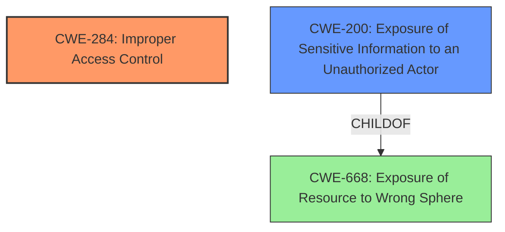

# Analysis Report for CVE-2021-25228

# Vulnerability Analysis Report: CVE-2021-25228

## Description


## Analysis (with Relationship Data)

# Summary
| CWE ID | CWE Name | Confidence | CWE Abstraction Level | CWE Vulnerability Mapping Label | CWE-Vulnerability Mapping Notes |
|---|---|---|---|---|---|
| CWE-284 | Improper Access Control | 0.9 | Pillar | Primary | Discouraged |
| CWE-200 | Exposure of Sensitive Information to an Unauthorized Actor | 0.7 | Class | Secondary | Discouraged |

## Evidence and Confidence

*   **Confidence Score:** 0.8
*   **Evidence Strength:** HIGH

## Relationship Analysis
The primary relationship that impacted the decision was the hierarchical structure, specifically that CWE-284 [Improper Access Control] is a Pillar, the highest level of abstraction. While the vulnerability description clearly indicates an access control issue, the broad nature of CWE-284 necessitates consideration of more specific descendants.
CWE-200 [Exposure of Sensitive Information to an Unauthorized Actor] is a Class-level CWE and a child of CWE-668. It was considered because the impact of the vulnerability is information exposure. However, it is also discouraged for use as a primary mapping because it describes the impact rather than the root cause.
The graph visualization helps to see that CWE-284 is a general category, and there may be more specific causes such as:
  - CWE-862 Missing Authorization
  - CWE-863 Incorrect Authorization
  - CWE-732 Incorrect Permission Assignment for Critical Resource
  - CWE-306 Missing Authentication
  - CWE-1390 Weak Authentication



## Vulnerability Chain
The vulnerability chain starts with the **improper access control** (**rootcause**), which allows an unauthenticated user to **obtain information about hotfix history** (**impact**).
The chain is relatively short and direct in this case:

1.  **Improper Access Control (CWE-284)**: The web console lacks proper access restrictions.
2.  **Information Exposure (CWE-200)**: Unauthenticated users can access hotfix history information.

## Summary of Analysis
The initial analysis identified **improper access control** as the root cause, making CWE-284 [Improper Access Control] a strong initial candidate. The **CVE Reference Links Content Summary** section provides further evidence, stating "The vulnerability is caused by a **lack of access control** on the Trend Micro OfficeScan web console, which enables remote, unauthenticated attackers to obtain sensitive information."

The retriever results also list CWE-284 as the top candidate. However, CWE-284 is a Pillar-level CWE, which, according to MITRE's guidance, is discouraged.

The impact of the vulnerability is the exposure of sensitive information, leading to the consideration of CWE-200 [Exposure of Sensitive Information to an Unauthorized Actor]. However, CWE-200 is also discouraged as it represents the impact rather than the root cause.

Ultimately, CWE-284 is chosen as the primary CWE because the description explicitly mentions **improper access control**. While discouraged due to its high level of abstraction, it accurately reflects the **rootcause** as described in the vulnerability. A more specific CWE would be preferable, but insufficient information is provided to narrow it down further.
CWE-200 is a secondary candidate because it represents the resulting impact of the **improper access control**.

Relevant CWE Information:
- Vulnerability Description Key Phrases
  - **rootcause:** **improper access control**
- CVE Reference Links Content Summary
  - Root Cause: **Improper access control** within the Trend Micro OfficeScan web console.

I am overriding the general mapping guidance to choose a high-level CWE due to the lack of specificity in the vulnerability description. More information would be needed to select a more specific Base or Variant level CWE.


## CWE Relationship Analysis

Current CWEs represent these abstraction levels: .


### Vulnerability Chain Analysis

**Chain starting from CWE-732:**
- 732 (Incorrect Permission Assignment for Critical Resource) - ROOT


**Chain starting from CWE-306:**
- 306 (Missing Authentication for Critical Function) - ROOT


### CWE Relationship Diagram

```mermaid
graph TD
    classDef primary fill:#f96,stroke:#333,stroke-width:2px
    classDef secondary fill:#69f,stroke:#333
    classDef tertiary fill:#9e9,stroke:#333
```


*Report generated on 2025-04-02 05:05:23*
