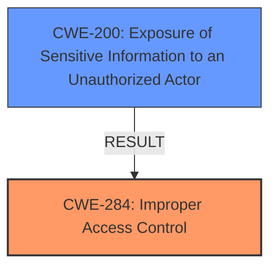

# Raw Analyzer Response for CVE-2021-25229

# Summary
| CWE ID | CWE Name | Confidence | CWE Abstraction Level | CWE Vulnerability Mapping Label | CWE-Vulnerability Mapping Notes |
|---|---|---|---|---|---|
| CWE-284 | Improper Access Control | 0.8 | Pillar | Discouraged | High-level, consider more specific descendants |
| CWE-200 | Exposure of Sensitive Information to an Unauthorized Actor | 0.7 | Class | Discouraged | Information exposure is the impact |

## Evidence and Confidence

*   **Confidence Score:** 0.75
*   **Evidence Strength:** MEDIUM

## Relationship Analysis
The primary relationship that influenced the selection was the high-level nature of CWE-284, which is a Pillar. This suggests that more specific CWEs should be considered. The vulnerability also results in the exposure of sensitive information (CWE-200) but that is an impact not the rootcause.

## Vulnerability Chain
The chain of events is as follows:
1.  **Root Cause:** **Improper Access Control** (CWE-284) is present in the Trend Micro Apex One web console.
2.  **Impact:** An unauthenticated user can obtain information about the database server (Exposure of Sensitive Information - CWE-200).

## Summary of Analysis
The initial analysis focused on the **improper access control** that led to the vulnerability. The description clearly states that an unauthenticated user can obtain information about the database server due to this **improper access control**. The retriever results also point to CWE-284 as a potential candidate, along with other related CWEs such as CWE-200.

The primary challenge was determining the appropriate level of abstraction for the CWE mapping. While CWE-284 directly reflects the **improper access control** mentioned in the vulnerability description, it is a high-level Pillar. The mapping guidance for CWE-284 discourages its use due to its high-level nature and suggests considering more specific descendants. The exposure of sensitive information (CWE-200) is an impact of the vulnerability, not the root cause. Therefore, while relevant, it is not the primary CWE.

The final decision was to assign CWE-284 as the primary CWE due to its direct relevance to the **improper access control** issue, but it should be noted that this is a high-level classification and more specific CWEs might be applicable if more details were available.

Relevant CWE Information:

# Enhanced Context (25 CWEs)

## CWE-284: Improper Access Control
**Abstraction:** Pillar
**Status:** Incomplete

### Description
The product does not restrict or incorrectly restricts access to a resource from an unauthorized actor.

### Extended Description
Access control involves the use of several protection mechanisms such as:

Authentication (proving the identity of an actor)
Authorization (ensuring that a given actor can access a resource), and
Accountability (tracking of activities that were performed)

When any mechanism is not applied or otherwise fails, attackers can compromise the security of the product by gaining privileges, reading sensitive information, executing commands, evading detection, etc.

### Mapping Guidance
**Usage:** Discouraged
**Rationale:** CWE-284 is extremely high-level, a Pillar. Its name, "Improper Access Control," is often misused in low-information vulnerability reports or by active use of the OWASP Top Ten, such as "A01:2021-Broken Access Control". It is not useful for trend analysis.

## CWE-200: Exposure of Sensitive Information to an Unauthorized Actor
**Abstraction:** Class
**Status:** Draft

### Description
The product exposes sensitive information to an actor that is not explicitly authorized to have access to that information.

### Mapping Guidance
**Usage:** Discouraged
**Rationale:** CWE-200 is commonly misused to represent the loss of confidentiality in a vulnerability, but confidentiality loss is a technical impact - not a root cause error. As of CWE 4.9, over 400 CWE entries can lead to a loss of confidentiality. Other options are often available.