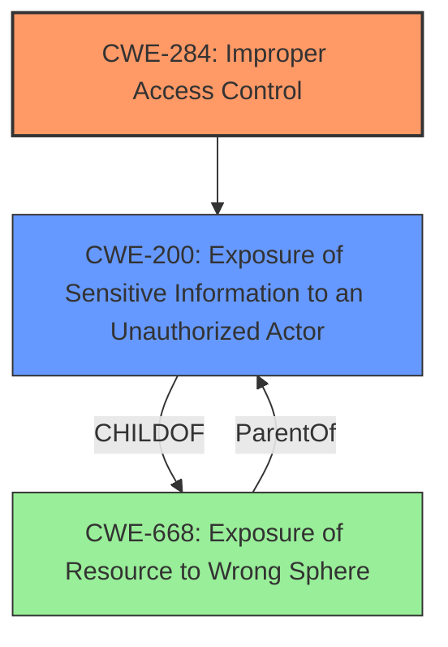

# Analysis for CVE-2021-25243

# Summary
| CWE ID | CWE Name | Confidence | CWE Abstraction Level | CWE Vulnerability Mapping Label | CWE-Vulnerability Mapping Notes |
|---|---|---|---|---|---|
| CWE-284 | Improper Access Control | 0.9 | Pillar | Discouraged | Root cause is **improper access control** |
| CWE-200 | Exposure of Sensitive Information to an Unauthorized Actor | 0.7 | Class | Discouraged | Impact is exposure of patch level information |

## Evidence and Confidence

*   **Confidence Score:** 0.8
*   **Evidence Strength:** HIGH

## Relationship Analysis
The primary CWE is CWE-284 (Improper Access Control), which is a high-level (Pillar) CWE. The vulnerability description clearly states "**improper access control**" as the root cause. CWE-200 (Exposure of Sensitive Information to an Unauthorized Actor) is a Class-level CWE, which describes the impact of the **improper access control**.

## Vulnerability Chain
The vulnerability chain starts with the **improper access control** (**rootcause**), which leads to the exposure of patch level information (**impact**).

## Summary of Analysis
The initial assessment identified CWE-284 as the primary weakness, based on the explicit mention of "**improper access control**" in the vulnerability description, vulnerability key phrases, and the CVE Reference Links Content Summary. The "Vulnerability Description Key Phrases" section clearly states "**rootcause:** **improper access control**". Also, the "CVE Reference Links Content Summary" section says "The root cause is improper access control within the web console of Trend Micro Apex One" and "Improper access control".

CWE-284 is a Pillar-level CWE and the MITRE mapping guidance discourages its use due to its high-level nature. However, given the evidence and lack of sufficient details to pinpoint a more specific Base or Variant CWE, CWE-284 remains the most appropriate primary mapping.

CWE-200 is the secondary weakness due to the impact of the **improper access control** which leads to information disclosure, and the CVE Reference Links Content Summary states "Remote attackers can disclose sensitive information from the application." CWE-200 is discouraged because it represents the impact rather than the root cause.

Relevant CWE Information:

# Enhanced Context (25 CWEs)

## CWE-274: Improper Handling of Insufficient Privileges
**Abstraction Level**: Base
**Similarity Score**: 0.75
**Source**: dense

**Description**:
The product does not handle or incorrectly handles when it has insufficient privileges to perform an operation, leading to resultant weaknesses.
**Rationale for not selecting:** This CWE doesn't accurately describe the vulnerability, as the issue is not about handling insufficient privileges but rather about incorrectly controlling access.

## CWE-653: Improper Isolation or Compartmentalization
**Abstraction Level**: Class
**Similarity Score**: 0.75
**Source**: dense

**Description**:
The product does not properly compartmentalize or isolate functionality, processes, or resources that require different privilege levels, rights, or permissions.
**Rationale for not selecting:** While this could be a contributing factor, the primary issue is the **improper access control** itself, not necessarily the lack of isolation.

## CWE-538: Insertion of Sensitive Information into Externally-Accessible File or Directory
**Abstraction Level**: Base
**Similarity Score**: 0.75
**Source**: dense

**Description**:
The product places sensitive information into files or directories that are accessible to actors who are allowed to have access to the files, but not to the sensitive information.
**Rationale for not selecting:** The vulnerability is about obtaining patch level information by an unauthenticated user, not about inserting sensitive information into files or directories.

## CWE-807: Reliance on Untrusted Inputs in a Security Decision
**Abstraction Level**: Base
**Similarity Score**: 0.75
**Source**: dense

**Description**:
The product uses a protection mechanism that relies on the existence or values of an input, but the input can be modified by an untrusted actor in a way that bypasses the protection mechanism.
**Rationale for not selecting:** The vulnerability is not about relying on untrusted inputs for security decisions but about **improper access control**.

## CWE-668: Exposure of Resource to Wrong Sphere
**Abstraction Level**: Class
**Similarity Score**: 0.75
**Source**: dense

**Description**:
The product exposes a resource to the wrong control sphere, providing unintended actors with inappropriate access to the resource.
**Rationale for not selecting:** While this is related, CWE-284 is a better fit for the provided **improper access control**.

## CWE-1390: Weak Authentication
**Abstraction Level**: Class
**Similarity Score**: 0.74
**Source**: dense

**Description**:
The product uses an authentication mechanism to restrict access to specific users or identities, but the mechanism does not sufficiently prove that the claimed identity is correct.
**Rationale for not selecting:** The provided text does not specify anything about weak authentication, only that an unauthenticated user can obtain patch level information.

## CWE-552: Files or Directories Accessible to External Parties
**Abstraction Level**: Base
**Similarity Score**: 0.74
**Source**: dense

**Description**:
The product makes files or directories accessible to unauthorized actors, even though they should not be.
**Rationale for not selecting:** The vulnerability is not about files and directories being accessible to external parties.

## CWE-639: Authorization Bypass Through User-Controlled Key
**Abstraction Level**: Base
**Similarity Score**: 0.74
**Source**: dense

**Description**:
The system's authorization functionality does not prevent one user from gaining access to another user's data or record by modifying the key value identifying the data.
**Rationale for not selecting:** The vulnerability does not involve user-controlled keys or access to another user's data.

## CWE-280: Improper Handling of Insufficient Permissions or Privileges
**Abstraction Level**: Base
**Similarity Score**: 0.74
**Source**: dense

**Description**:
The product does not handle or incorrectly handles when it has insufficient privileges to access resources or functionality as specified by their permissions. This may cause it to follow unexpected code paths that may leave the product in an invalid state.
**Rationale for not selecting:** This vulnerability is not about handling insufficient permissions but rather about **improper access control**.

## CWE-226: Sensitive Information in Resource Not Removed Before Reuse
**Abstraction Level**: Base
**Similarity Score**: 0.74
**Source**: dense

**Description**:
The product releases a resource such as memory or a file so that it can be made available for reuse, but it does not clear or "zeroize" the information contained in the resource before the product performs a critical state transition or makes the resource available for reuse by other entities.
**Rationale for not selecting:** The vulnerability does not relate to the reuse of resources or the handling of sensitive information in them.

## CWE-59: Improper Link Resolution Before File Access ('Link Following')
**Abstraction Level**: Base
**Similarity Score**: 6799.07
**Source**: sparse

**Description**:
The product attempts to access a file based on the filename, but it does not properly prevent that filename from identifying a link or shortcut that resolves to an unintended resource.
**Rationale for not selecting:** This vulnerability does not involve file access or link resolution.

## CWE-863: Incorrect Authorization
**Abstraction Level**: Class
**Similarity Score**: 6515.17
**Source**: sparse

**Description**:
The product performs an authorization check when an actor attempts to access a resource or perform an action, but it does not correctly perform the check.
**Rationale for not selecting:** While related to authorization, the vulnerability description is more generally about **improper access control**, not necessarily an incorrect authorization check.

## CWE-200: Exposure of Sensitive Information to an Unauthorized Actor
**Abstraction Level**: Class
**Similarity Score**: 6458.57
**Source**: sparse

**Description**:
The product exposes sensitive information to an actor that is not explicitly authorized to have access to that information.
**Rationale for selecting:** As stated earlier, this CWE describes the impact, but not the root cause, thus it is a secondary weakness.

## CWE-639: Authorization Bypass Through User-Controlled Key
**Abstraction Level**: Base
**Similarity Score**: 6449.75
**Source**: sparse

**Description**: