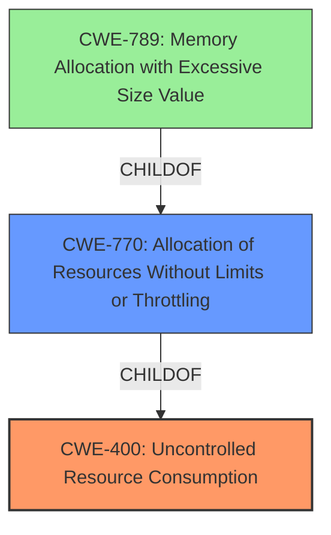

# Enhanced Analysis for CVE-2021-25252

# Summary
| CWE ID | CWE Name | Confidence | CWE Abstraction Level | CWE Vulnerability Mapping Label | CWE-Vulnerability Mapping Notes |
|---|---|---|---|---|---|
| CWE-400 | Uncontrolled Resource Consumption | 0.75 | Class | Discouraged | The primary issue is a memory exhaustion vulnerability, which falls under uncontrolled resource consumption. |
| CWE-770 | Allocation of Resources Without Limits or Throttling | 0.6 | Base | Allowed | Resources are allocated without limits, leading to potential memory exhaustion. |
| CWE-789 | Memory Allocation with Excessive Size Value | 0.5 | Variant | Allowed | Memory is allocated based on a crafted file, potentially leading to excessive memory allocation. |

## Evidence and Confidence

*   **Confidence Score:** 0.7
*   **Evidence Strength:** MEDIUM

## Relationship Analysis
The primary CWE is CWE-400, which is a class-level CWE representing uncontrolled resource consumption. CWE-770 (Allocation of Resources Without Limits or Throttling) and CWE-789 (Memory Allocation with Excessive Size Value) are more specific weaknesses that can lead to uncontrolled resource consumption. CWE-770 is a child of CWE-400. CWE-789 is a variant of CWE-770, making it more specific.



## Vulnerability Chain
The vulnerability chain starts with a specially crafted file provided by an attacker, leading to **memory exhaustion** in the Trend Micro products. This results in denial-of-service or system freeze.

*   Root Cause: **Memory exhaustion** due to processing a specially crafted file.
*   Weakness: Uncontrolled resource consumption (CWE-400), specifically memory.
*   Impact: Denial-of-service or system freeze.

## Summary of Analysis
The initial analysis identified **memory exhaustion** as the root cause, leading to a denial-of-service. The Retriever Results suggested CWE-400 (Uncontrolled Resource Consumption), CWE-772 (Missing Release of Resource after Effective Lifetime), CWE-770 (Allocation of Resources Without Limits or Throttling), and CWE-789 (Memory Allocation with Excessive Size Value) as potential mappings.

CWE-400 is a class-level CWE and is generally discouraged unless more specific mappings are unavailable. Given the nature of the vulnerability, where an attacker can cause **memory exhaustion** by providing a specially crafted file, CWE-770 and CWE-789 are more appropriate. CWE-770 describes allocation of resources without limits, while CWE-789 describes memory allocation with an excessive size value. Since the vulnerability involves a crafted file that likely triggers excessive memory allocation, both CWE-770 and CWE-789 are relevant.

The vulnerability description explicitly mentions **memory exhaustion**, which is a form of uncontrolled resource consumption. The evidence supports mapping to CWE-400 as a general classification, but CWE-770 and CWE-789 provide more specific details about the nature of the weakness.

The final decision is to map the vulnerability primarily to CWE-400, as the description clearly states **memory exhaustion**. Additionally, map to CWE-770 and CWE-789 as secondary CWEs to provide more context about the vulnerability.

Relevant CWE Information:

# Enhanced Context (25 CWEs)
The following CWEs were identified as potentially relevant to this vulnerability:

## CWE-1325: Improperly Controlled Sequential Memory Allocation
**Abstraction Level**: Base
**Similarity Score**: 0.78
**Source**: dense

**Description**:
The product manages a group of objects or resources and performs a separate memory allocation for each object, but it does not properly limit the total amount of memory that is consumed by all of the combined objects.

**Mapping Guidance**:
- Usage: Allowed
- Rationale: This CWE entry is at the Base level of abstraction, which is a preferred level of abstraction for mapping to the root causes of vulnerabilities.

## CWE-789: Memory Allocation with Excessive Size Value
**Abstraction Level**: Variant
**Similarity Score**: 0.77
**Source**: dense

**Description**:
The product allocates memory based on an untrusted, large size value, but it does not ensure that the size is within expected limits, allowing arbitrary amounts of memory to be allocated.

**Mapping Guidance**:
- Usage: Allowed
- Rationale: This CWE entry is at the Variant level of abstraction, which is a preferred level of abstraction for mapping to the root causes of vulnerabilities.

## CWE-404: Improper Resource Shutdown or Release
**Abstraction Level**: Class
**Similarity Score**: 0.76
**Source**: dense

**Description**:
The product does not release or incorrectly releases a resource before it is made available for re-use.

**Mapping Guidance**:
- Usage: Allowed-with-Review
- Rationale: This CWE entry is a Class and might have Base-level children that would be more appropriate

## CWE-191: Integer Underflow (Wrap or Wraparound)
**Abstraction Level**: Base
**Similarity Score**: 0.76
**Source**: dense

**Description**:
The product subtracts one value from another, such that the result is less than the minimum allowable integer value, which produces a value that is not equal to the correct result.

**Mapping Guidance**:
- Usage: Allowed
- Rationale: This CWE entry is at the Base level of abstraction, which is a preferred level of abstraction for mapping to the root causes of vulnerabilities.

## CWE-226: Sensitive Information in Resource Not Removed Before Reuse
**Abstraction Level**: Base
**Similarity Score**: 0.75
**Source**: dense

**Description**:
The product releases a resource such as memory or a file so that it can be made available for reuse, but it does not clear or "zeroize" the information contained in the resource before the product performs a critical state transition or makes the resource available for reuse by other entities.

**Mapping Guidance**:
- Usage: Allowed
- Rationale: This CWE entry is at the Base level of abstraction, which is a preferred level of abstraction for mapping to the root causes of vulnerabilities.

## CWE-131: Incorrect Calculation of Buffer Size
**Abstraction Level**: Base
**Similarity Score**: 0.75
**Source**: dense

**Description**:
The product does not correctly calculate the size to be used when allocating a buffer, which could lead to a buffer overflow.

**Mapping Guidance**:
- Usage: Allowed
- Rationale: This CWE entry is at the Base level of abstraction, which is a preferred level of abstraction for mapping to the root causes of vulnerabilities.

## CWE-805: Buffer Access with Incorrect Length Value
**Abstraction Level**: Base
**Similarity Score**: 0.75
**Source**: dense

**Description**:
The product uses a sequential operation to read or write a buffer, but it uses an incorrect length value that causes it to access memory that is outside of the bounds of the buffer.

**Mapping Guidance**:
- Usage: Allowed
- Rationale: This CWE entry is at the Base level of abstraction, which is a preferred level of abstraction for mapping to the root causes of vulnerabilities.

## CWE-125: Out-of-bounds Read
**Abstraction Level**: Base
**Similarity Score**: 0.74
**Source**: dense

**Description**:
The product reads data past the end, or before the beginning, of the intended buffer.

**Mapping Guidance**:
- Usage: Allowed
- Rationale: This CWE entry is at the Base level of abstraction, which is a preferred level of abstraction for mapping to the root causes of vulnerabilities.

## CWE-667: Improper Locking
**Abstraction Level**: Class
**Similarity Score**: 0.74
**Source**: dense

**Description**:
The product does not properly acquire or release a lock on a resource, leading to unexpected resource state changes and behaviors.

**Mapping Guidance**:
- Usage: Allowed-with-Review
- Rationale: This CWE entry is a Class and might have Base-level children that would be more appropriate

## CWE-190: Integer Overflow or Wraparound
**Abstraction Level**: Base
**Similarity Score**: 0.74
**Source**: dense

**Description**:
The product performs a calculation that can
         produce an integer overflow or wraparound when the logic
         assumes that the resulting value will always be larger than
         the original value. This occurs when an integer value is
         incremented to a value that is too large to store in the


## CWE Relationship Analysis

Current CWEs represent these abstraction levels: .


### Vulnerability Chain Analysis

**Chain starting from CWE-667:**
- 667 (Improper Locking) - ROOT


**Chain starting from CWE-805:**
- 805 (Buffer Access with Incorrect Length Value) - ROOT


### CWE Relationship Diagram

```mermaid
graph TD
    classDef primary fill:#f96,stroke:#333,stroke-width:2px
    classDef secondary fill:#69f,stroke:#333
    classDef tertiary fill:#9e9,stroke:#333
```