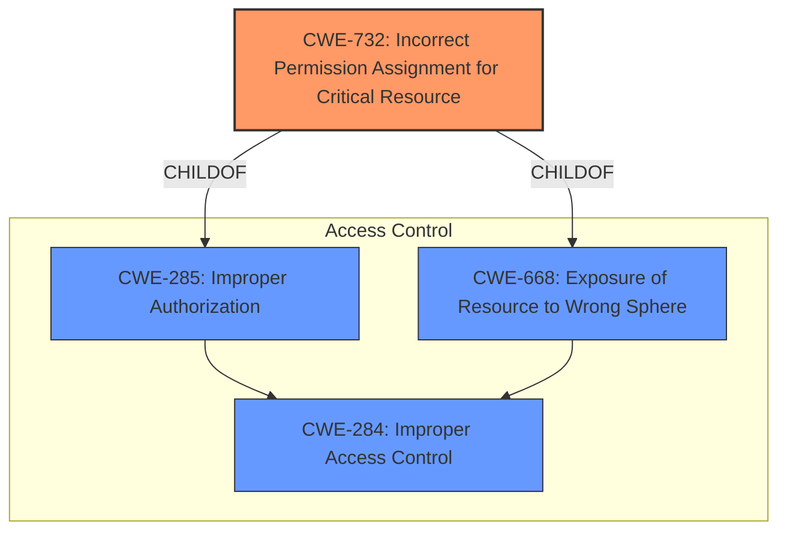

# Enhanced Analysis for CVE-2021-25253

# Summary
| CWE ID | CWE Name | Confidence | CWE Abstraction Level | CWE Vulnerability Mapping Label | CWE-Vulnerability Mapping Notes |
|---|---|---|---|---|---|
| CWE-732 | Incorrect Permission Assignment for Critical Resource | 1.0 | Class | Allowed-with-Review | Primary CWE |
| CWE-284 | Improper Access Control | 0.5 | Pillar | Discouraged | Secondary Candidate |

## Evidence and Confidence

*   **Confidence Score:** 1.0
*   **Evidence Strength:** HIGH

## Relationship Analysis
The primary CWE, CWE-732, is a child of CWE-285 (Improper Authorization) and CWE-668 (Exposure of Resource to Wrong Sphere). While CWE-284 (Improper Access Control) is a high-level pillar, CWE-732 provides a more specific classification by focusing on incorrect permission assignments for critical resources, which aligns directly with the vulnerability description.



## Vulnerability Chain
The chain of events for this vulnerability is as follows:
1.  **Root Cause:** **Improper access control** due to incorrect permission assignment on a critical resource.
2.  **Weakness:** The resource is accessible to a broader range of actors than intended.
3.  **Impact:** A local attacker can escalate privileges on affected installations.

## Summary of Analysis
The initial analysis focused on identifying the root cause of the vulnerability, which is an **improper access control** issue. The vulnerability description and CVE reference links content summary both point to incorrect permissions set on a resource used by the Trend Micro Apex One Security Agent service. The primary CWE match from similar CVE descriptions is CWE-732 (Incorrect Permission Assignment for Critical Resource), which aligns perfectly with the vulnerability details.

The retriever results also list CWE-732 as a candidate, though with a lower score than CWE-250 (Execution with Unnecessary Privileges). However, CWE-250 focuses on executing operations with higher privileges than necessary, which isn't the primary issue here. The core problem is the incorrect assignment of permissions, making CWE-732 the most accurate classification.

CWE-284 (Improper Access Control) is a high-level pillar and is discouraged for use when more specific CWEs are available. Given the specific nature of the vulnerability—incorrect permission assignments—CWE-732 is the preferred choice.

The decision to use CWE-732 is supported by the evidence provided:
- Vulnerability Description Key Phrases: "**improper access control**"
- CVE Reference Links Content Summary: "Incorrect permissions set on a resource used by the Trend Micro Apex One Security Agent service."

CWE-732 is at the Class level, but it is the most specific and appropriate classification based on the available information.

Relevant CWE Information:

# Enhanced Context (25 CWEs)
The following CWEs were identified as potentially relevant to this vulnerability:

## CWE-732: Incorrect Permission Assignment for Critical Resource
**Abstraction:** Class
**Similarity Score**: 7073.13
**Source**: sparse

**Description**:
The product specifies permissions for a security-critical resource in a way that allows that resource to be read or modified by unintended actors.

**Mapping Guidance**:
- Usage: Allowed-with-Review
- Rationale: While the name itself indicates an assignment of permissions for resources, this is often misused for vulnerabilities in which "permissions" are not checked, which is an "authorization" weakness (CWE-285 or descendants) within CWE's model [REF-1287].


## CWE Relationship Analysis

Current CWEs represent these abstraction levels: .


### Vulnerability Chain Analysis

**Chain starting from CWE-732:**
- 732 (Incorrect Permission Assignment for Critical Resource) - ROOT


**Chain starting from CWE-284:**
- 284 (Improper Access Control) - ROOT


### CWE Relationship Diagram

```mermaid
graph TD
    classDef primary fill:#f96,stroke:#333,stroke-width:2px
    classDef secondary fill:#69f,stroke:#333
    classDef tertiary fill:#9e9,stroke:#333
```